# Architecture

wRPC is a handful of pieces with narrow seams between them: a client, a wire,
a server core, and the hosts and carriers that connect the two. This page is
the map. Each diagram shows where two pieces meet, and each section points to
the page that owns the details. For the one-picture version, see
[Getting Started](./getting-started#how-it-fits-together).

## The layers {#layers}

A call crosses the same layers in both directions, and each layer has one job:

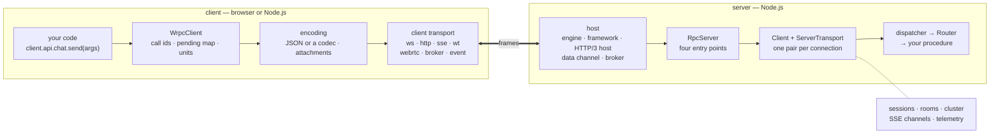

| Layer | Owns | Swapped by | Details |
| --- | --- | --- | --- |
| `WrpcClient` | call ids and the pending map, units scaffolded from introspection, subscriptions and their `lastEventId`, streams, reconnect, heartbeat | — | [Client](./client) |
| Client transport | one wire: opening it, writing to it, reporting `open`, `close` and `message` | a registered transport, `WrpcClient.transport[name]` | [Client › Transports](./client#transports) |
| Encoding | JSON or an injected packet codec; bytes as attachments frames under revision 2; optional compression and encryption | the `codec`, `compression` and `encryption` options | [Wire codec](./codec), [Compression](./compression), [Encryption](./encryption) |
| Host | the network: listening, parsing HTTP, the WebSocket handshake and frames | an engine, a framework adapter, an injected HTTP/3 or WebRTC stack, a broker | [Server](./server), [Engine port](../reference/engine) |
| `RpcServer` | the four entry points, a `Client` per connection, sessions, rooms, the cluster, SSE channels | — (it is the core) | [Server › Using the core directly](./server#using-the-core-directly) |
| Dispatcher and `Router` | routing packets, hooks, validation, timeouts, queues | — | [Router](./router), [Hooks](./hooks) |

Nothing above the transport knows which wire it is on, and nothing below the
dispatcher knows what a procedure does. Every other section of this page
depends on that.

## Life of a call {#life-of-a-call}

One `call` over a WebSocket, through every layer of the picture above:

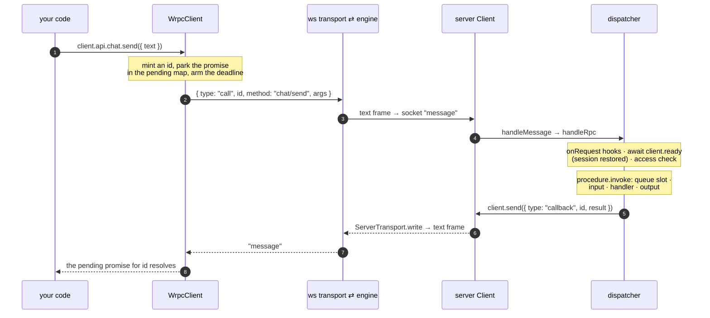

The hook phases at steps 5 and 6 are on [Hooks](./hooks#the-pipeline),
and the deadline and the queue slot on
[Router › Timeouts and queues](./router#timeouts-and-queues). What a timeout
or a `cancel` does to a call in flight is in the
[protocol reference](../reference/protocol#packets).

## Four ways in {#entry-points}

`RpcServer` never listens on anything. Every host hands it connections
through one of four methods, and all four end in the same place: a
server-side `Client` that the dispatcher talks to.

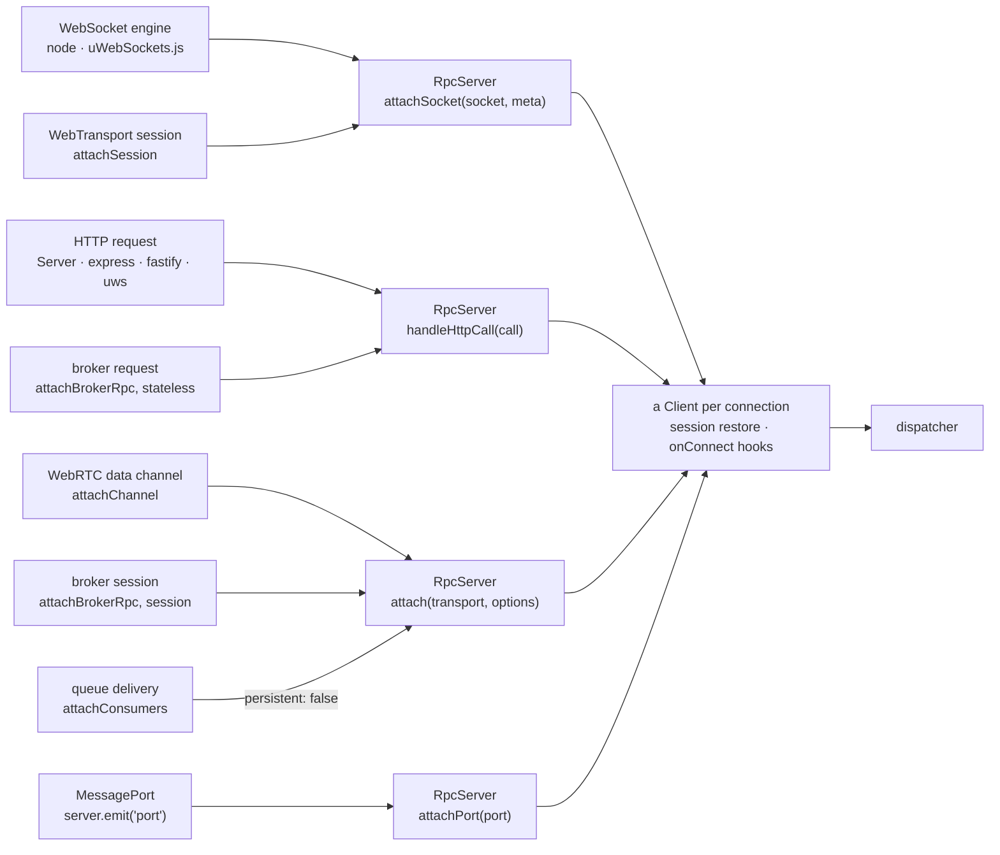

| Entry point | Takes | Used by |
| --- | --- | --- |
| `attachSocket(socket, meta)` | anything shaped like the engine port's `WrpcSocket`: `send`, `close`, `'message'` and `'close'` events | every WebSocket engine; WebTransport, whose session becomes a `WtSocket`; under [session encryption](./encryption#session), a `SealedSocket` wrapped around either |
| `handleHttpCall(call)` | an abstract `{ method, url, headers, body, respond, stream? }`, never a node `req`/`res` pair | the `Server` shell, the express middleware, the fastify routes, the uWebSockets.js engine's `onHttpCall`, a stateless broker request; SSE channels open here too |
| `attach(transport, options)` | any transport that announces inbound text as `'packet'` and bytes as `'chunk'` | a WebRTC data channel, a broker session, a queue consumer (`persistent: false`: it runs calls, never receives events) |
| `attachPort(port)` | a `MessagePort` | a worker thread, an embedded peer, a test harness |

From there every connection takes the same steps. A `Client` is created, its
session is restored from whatever the connection presented, and the router's
`onConnect` hooks run. Both of those make up `client.ready`, which the
dispatcher awaits before the first access check. Every packet after that goes
through one dispatcher. A procedure cannot tell a WebSocket client from a
broker message, except by asking `ctx.client.transportKind`.

## One connection on the server {#connection}

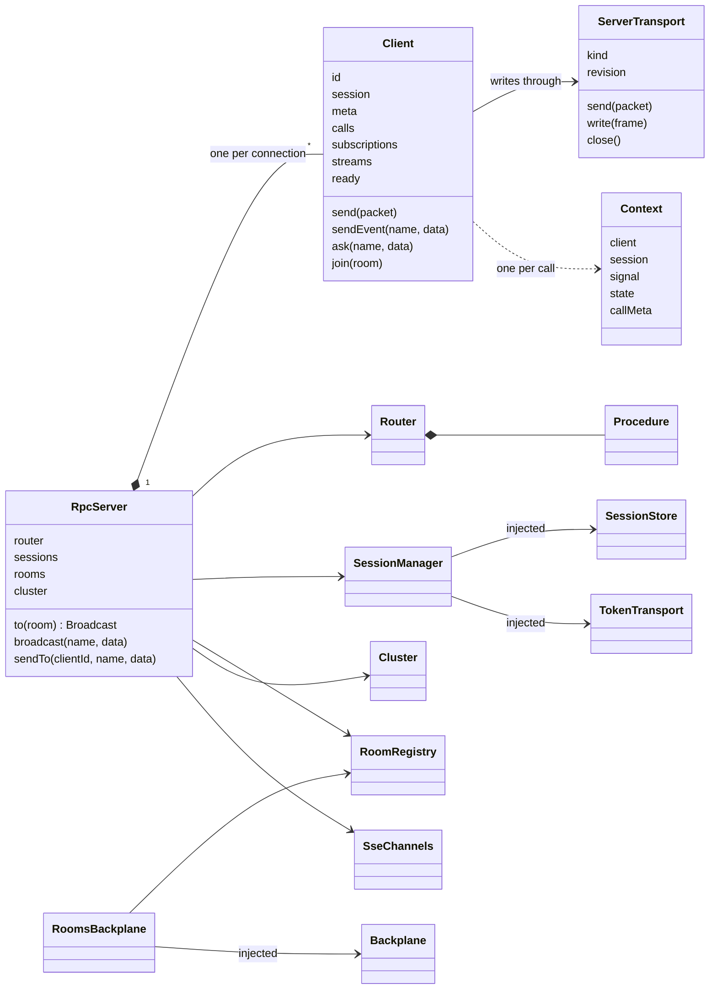

- **`Client.id` is an address.** It is `<instanceId>.<generated id>`, so a
  cluster command or `server.sendTo(id, …)` goes straight to the instance
  that holds the client, with no broadcast.
- **A `Client` keeps what a peer can take back.** `calls` holds an
  `AbortController` per call in flight, which `cancel` and a disconnect both
  reach (it is `ctx.signal`). `subscriptions` and `streams` are capped by
  `maxSubscriptions` and `maxStreams`.
- **`ServerTransport` is the only piece that knows the wire.** There is one
  subclass per kind: `http`, `ws` (WebTransport extends it), `event`, `sse`,
  WebRTC's `RtcPeerTransport` and the broker's session transport. The
  `Client` above it is the same for all of them.
- **A `Context` lives for one call.** It reads `session` and `meta` through
  its `Client` and reaches the server as `ctx.server`. That is how
  `ctx.server.to(room)` works with no server captured in a closure.
- **Three things are injected**: the session store and the token transport
  ([Sessions](./sessions), [Authentication](./auth)), and the backplane under
  rooms and the cluster ([Scaling](./scaling)).

## The receive path {#receive}

What the core does with one inbound WebSocket message. The other entry points
join this path at `handleMessage` (or at the chunk branch), so the dispatcher
below is the only one.

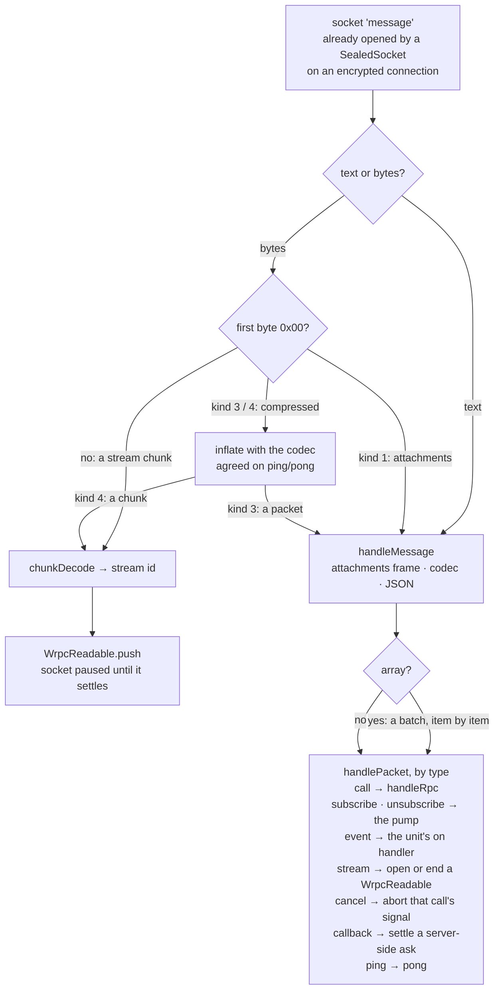

Pausing the socket while a chunk is being consumed is what lets
backpressure reach the peer through TCP. See
[Binary streams › Backpressure](./streams#backpressure). The frame kinds are
in the [protocol reference](../reference/protocol#binary-chunks).

## The send path {#send}

A packet is encoded **once**, in exactly one of four ways, and handed to its
transport. Everything below that is the carrier's business:

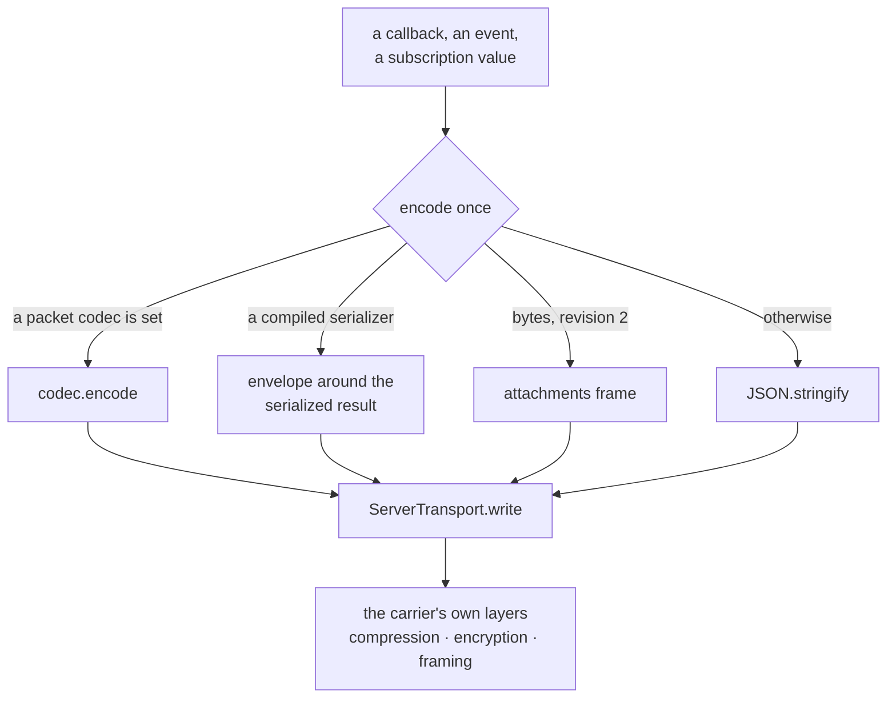

What happens below `write` is per carrier, and some layers exclude others:

| Carrier | Below `write`, in order |
| --- | --- |
| WebSocket, server → client | sealed when the connection is encrypted (then sent with `compress: false`: ciphertext does not deflate) → engine frame → permessage-deflate when negotiated |
| WebSocket, Node client → server | compressed when the ping/pong agreed a codec → sealed when encrypted. **Compress, then seal** |
| WebTransport | five-byte length and kind header, compressed when the capabilities agreed a codec → the control stream. Under session encryption there is no compression, no stream mux and no datagram |
| WebRTC | compressed when the description agreed a codec → fragmented to the channel's message size → the data channel, which is DTLS already |
| HTTP, SSE | the response body or the SSE event → `Content-Encoding` when the request accepts one. A sealed request carries no content coding inside |
| Broker session | compressed if smaller (`wrpc-enc` names the codec) → sealed under the keyring → the broker |

[Compression](./compression) and [Encryption](./encryption) explain each
layer.

A room broadcast reuses the single encoding:

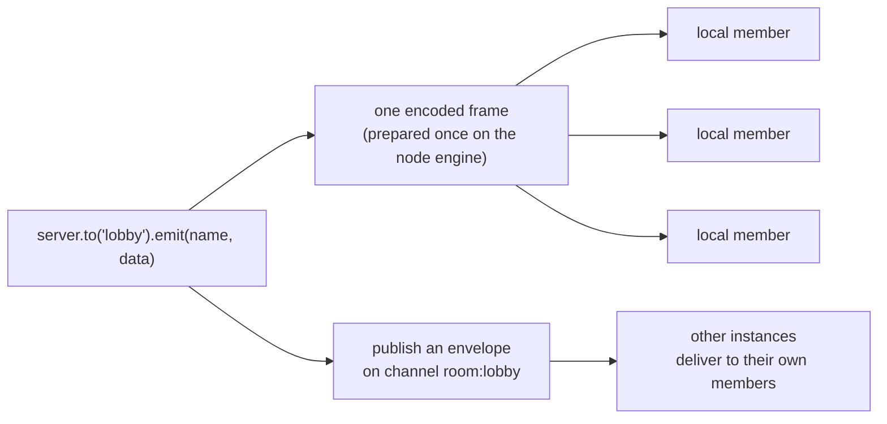

A sealed connection is the exception: it gets the shared plaintext frame
and seals it for itself, so a broadcast to *n* sealed clients costs *n*
seals.

## The client {#client}

Outbound, a call leaves through one queue and one encoder:

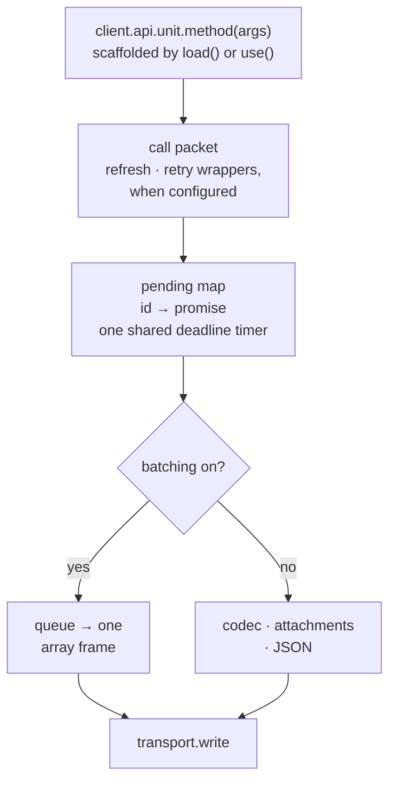

Inbound, everything is sorted by what arrived:

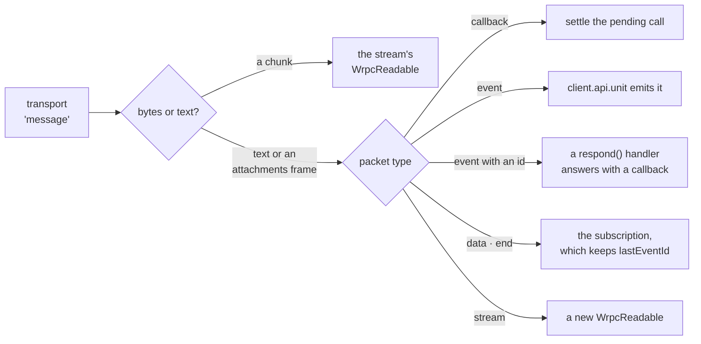

`client.api` is built from what the server says about itself
(`system/introspect`) or from a generated artifact
([Typed client › Static introspection](./typed-client#static-introspection)).
That is why a unit is `undefined` until `load()` resolves. The connection's
own lifecycle (connecting, authenticating, restoring, waiting for the next
attempt) is a state machine on [Client › Reconnecting](./client#reconnecting).

## Plugging in {#extension-points}

Each subpath plugs into one of a few seams. There are two registries that a
subpath fills in when it is required, the four entry points above, and a few
options that take a structural contract.

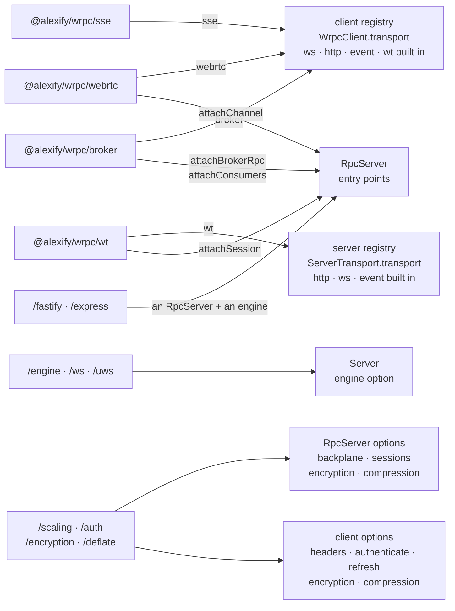

Every contract is checked by shape (`isEngine`, `isBackplane`,
`isCompressor`, `isWtSession`, …), never by `instanceof`. That is why no
framework, broker client or WebRTC stack is a dependency of the package. Each
one is injected. Requiring a subpath is enough to
register its transport. The registries are plain objects on purpose, so a
transport of your own registers the same way.

## Across instances {#instances}

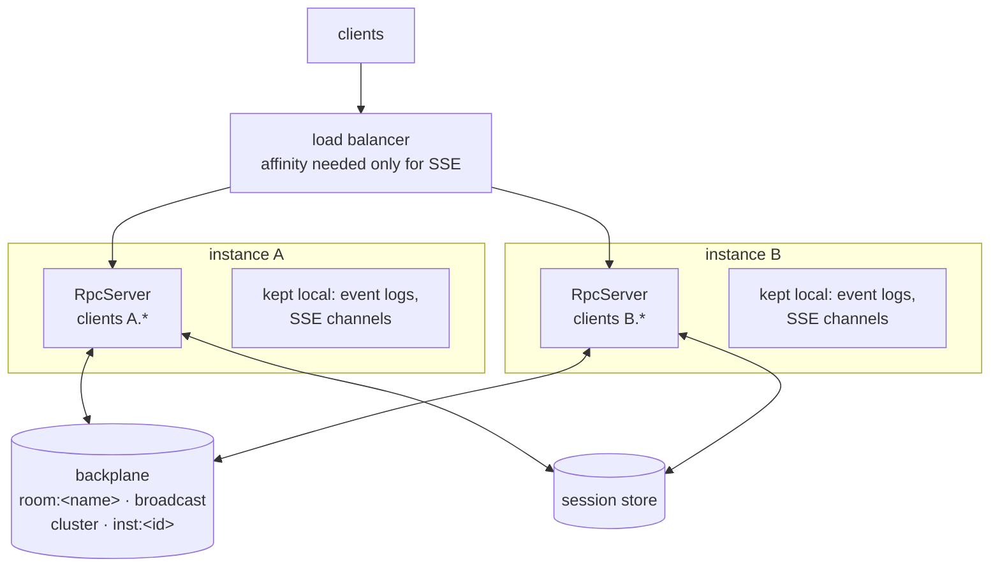

| Channel | Carries | Subscribed by |
| --- | --- | --- |
| `room:<name>` | an emit to exactly one room | instances that hold a member of that room |
| `broadcast` | `server.broadcast()` and multi-room emits | every instance |
| `cluster` | presence snapshots and deltas, cluster-wide commands and questions | every instance |
| `inst:<id>` | one instance's inbox: `sendTo` a client it holds, answers to its questions | that instance |

The backplane carries events and requests, never connections. A client that
reconnects to another instance gets its session back from the shared store,
its rooms back when an `onConnect` hook re-joins them
([Rooms › Rooms and reconnects](./rooms#rooms-and-reconnects)), and resumes
its subscriptions from `lastEventId`. [Scaling](./scaling) covers the contract
and delivery guarantees, [Cluster](./cluster) the presence protocol, and
[Running in production](./production#sticky-routing) what still needs
affinity.
