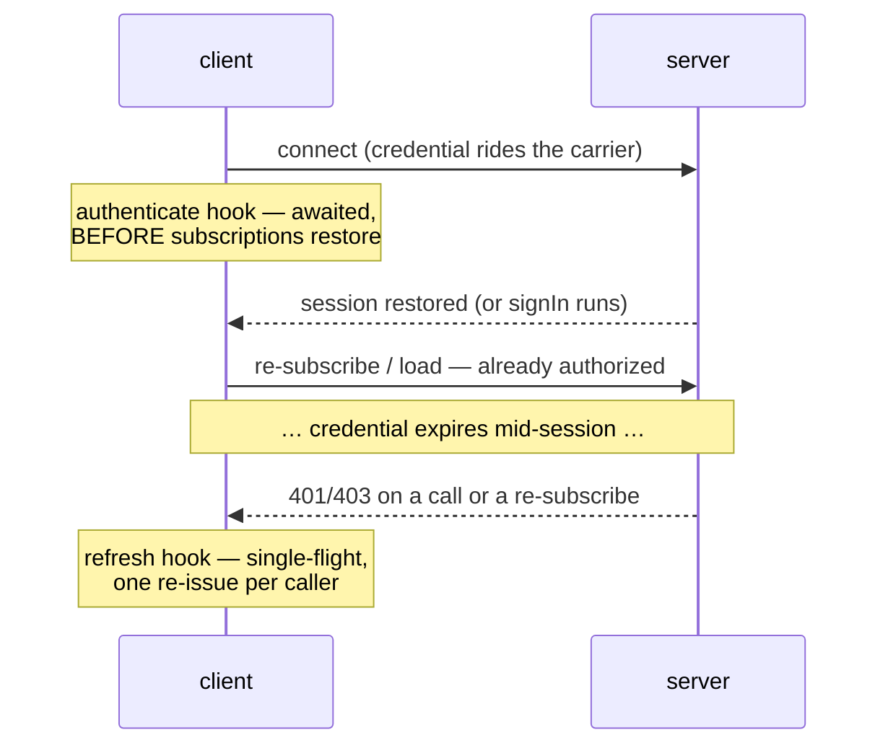

# Authentication

wrpc's auth story is three seams and one subpath that pre-wires them. This
page is the map; the deep material lives where each seam is defined —
[Sessions](./sessions) for the server half, the
[client guide](./client#authenticating) for the hooks.

## The lifecycle



Three client options make it work end to end:

| Option | When it runs | What it is for |
| --- | --- | --- |
| [`headers`](./metadata#declared-headers-the-headers-client-option) | resolved on **every** open | presents the stored credential, so the server restores the session before any packet is dispatched |
| [`authenticate`](./client#authenticating) | awaited on first connect and on every reconnect, **before** the restore re-sends subscriptions | signs in when there is nothing to present |
| [`refresh`](./client#refreshing-a-credential) | on a refusal with a listed code (calls **and** re-subscribes) | single-flight credential renewal with a one-shot retry |

## The server half: token carriers

*Where* the token lives on the wire is the injected
[`sessions.transport`](./sessions#pluggable-token-carriers) — the HttpOnly
cookie is the byte-identical default. Two ready-made strategies ship in
**`@alexify/wrpc/auth`**:

- **`bearerTransport()`** — `Authorization: Bearer <token>` on http/sse; on
  browser ws the token rides a `wrpc.bearer.<token>` **subprotocol offer**,
  a real upgrade header, so it never lands in the connect URL or the access
  logs that keep URLs.
- **`payloadTransport({ field })`** — a field of the declared
  [`meta`](./metadata) bag, either `x-wrpc-meta` spelling.

Both are non-ambient (`ambient: false`): the credential is script-attached,
so the safe-method CSRF rule the cookie needs does not apply to them.

## The client half: stores and `bearerAuth()`

The same subpath carries token **stores** (`get`/`set`/`delete`, sync or
async — a `Map` qualifies): `memoryStore()`, `webStorage(localStorage)`,
`cookieStorage(document)` (Secure by default). `bearerAuth()` composes a
store with your `signIn`/`refresh` calls into the three options above:

```js
const { bearerAuth, webStorage } = require('@alexify/wrpc/auth');

const client = await connect(url, {
  ...bearerAuth({
    store: webStorage(localStorage),
    signIn: (c) => c.call('auth/signIn', credentials()),
    refresh: (c, tokens) => c.call('auth/refresh', { token: tokens.refresh }),
  }),
});
```

See [the full walk-through](./sessions#the-client-half-stores-and-bearerauth)
for the store contract, rotation and the server procedures these calls pair
with.

## What heals what

| Failure | What handles it |
| --- | --- |
| First connect, nothing stored | `authenticate` → `signIn` |
| Reconnect with a live stored token | the carrier restores the session before the re-subscribe — no hook code runs |
| A call refused 401/403 mid-session | `refresh`, single-flight; the call re-issues once |
| A **re-subscribe** refused after a long outage | the same `refresh`, then the subscription re-opens once — feeds heal exactly like calls |
| The refresh's own call refused | surfaces its refusal (never deadlocks the run it belongs to); a **throwing** refresh clears the store, so the next connect signs in fresh |

Observability: a failing run logs `refresh.failed`, emits `'refresh-failed'`
and counts on `wrpc.client.refreshes` — see [Telemetry](./telemetry).
