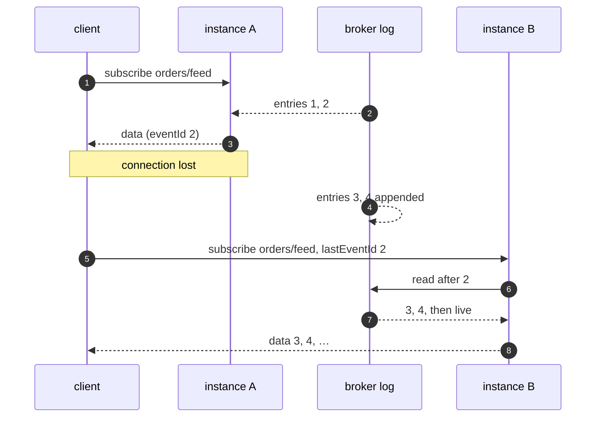

# Durable feeds

A [subscription](../subscriptions) resumes from `lastEventId`, but only as far
back as the server remembers — and `createEventLog()` remembers in one
process's memory. A client that reconnects to **another** instance, or to a
restarted one, presents a foreign epoch and gets a snapshot instead of what it
missed.

A broker log does not have that limit: it is shared by every instance and it
already keeps positions. `brokerFeed` turns one into a subscription handler.

```js
const { defineRouter, procedure } = require('@alexify/wrpc');
const { brokerFeed } = require('@alexify/wrpc/broker');

const router = defineRouter({
  orders: {
    feed: procedure.subscription({
      access: 'session',
      handler: brokerFeed(broker, 'orders'),
    }),
  },
});
```

Every value is [`tracked()`](../subscriptions#resuming) with the log's resume
token. The client stores it as `lastEventId` and sends it back when it
re-subscribes after a reconnect — to whichever instance it reached — and the
feed continues from there, without a gap and without a duplicate:



Appending is plain `log.append` — or a [publisher](./consumers#publishing)
— from anywhere that holds the broker:

```js
await broker.log.append('orders', JSON.stringify(order));
```

## Options

| Option | Default | |
| --- | --- | --- |
| `from` | `'latest'` | What a **fresh** subscription reads: new entries only, or `'earliest'` for everything retained |
| `decode` | `'json'` | `'json'`, `'text'`, or `(text) => value` |
| `map` | — | `(value, entry, context) => value`; answer `undefined` to skip an entry |
| `onGap` | — | `(context, args, { lastEventId, code }) => snapshot` — see below |
| `secret` | — | HMAC-sign the ids the feed hands out |
| `maxIdLength` | `512` | Longer `lastEventId`s are refused with `400` |

The topic may depend on the caller — a function of the context and the
arguments. Authorization stays where it always is: the procedure's `access`,
and whatever the resolver checks before answering.

```js
handler: brokerFeed(broker, (ctx, { tenant }) => {
  if (!ctx.session.state.tenants.includes(tenant)) throw Object.assign(new Error('Forbidden'), { code: 403 });
  return `orders.${tenant}`;
}, {
  map: (order) => (order.internal ? undefined : order),
}),
```

An entry that does not decode is logged as `feed.decode` and skipped; one bad
entry does not end every subscriber's feed.

## Gaps and snapshots

A `lastEventId` the log cannot resume from ends the subscription with a coded
error:

| Code | When |
| --- | --- |
| `400` | Malformed, longer than `maxIdLength`, not signed by `secret`, or past the end of the log |
| `410` | Older than the retained history, or minted by another log |

A `410` also happens **mid-stream**: a reader that stopped pulling while the
retention overtook it. With `onGap`, both become a snapshot instead — a value,
an iterable, an async iterable, or nothing — after which the feed continues:

```js
handler: brokerFeed(broker, 'orders', {
  onGap: async (ctx, args, { code }) => loadRecentOrders(ctx.session.state.user),
}),
```

The live read is positioned **before** `onGap` runs, so an entry appended while
the snapshot is being assembled is delivered after it rather than lost.
Snapshot values are not tracked, so a client that disconnects before the
first live entry resumes with its old id and gets the snapshot again — the
same behaviour as [`EventLog.since()`](../subscriptions#resuming) answering
`null`.

## Signed ids

`lastEventId` comes from the peer. The feed checks its length and syntax before
it reaches the broker, but a well-formed id is still a position the client
chose — `0`, say, to replay a whole topic. With `secret`, every id the feed
hands out carries an HMAC and an id it never issued is refused:

```js
handler: brokerFeed(broker, 'orders', { secret: process.env.FEED_SECRET }),
```

Every instance serving the feed needs the same secret. Rotating it invalidates
the ids clients hold: pair a rotation with `onGap`.

## One broker read per topic, not per subscriber

A thousand browsers subscribed to one feed on one instance share **one** live
read of the topic: the adapters build on [`TopicTails`](../brokers#writing-an-adapter),
which fans one tail out to every local reader and catches a resuming reader up
through a range read. A subscriber that stops reading does not grow memory
without bound — past a high-water mark it drops its buffer and catches up from
the log when it reads again.
