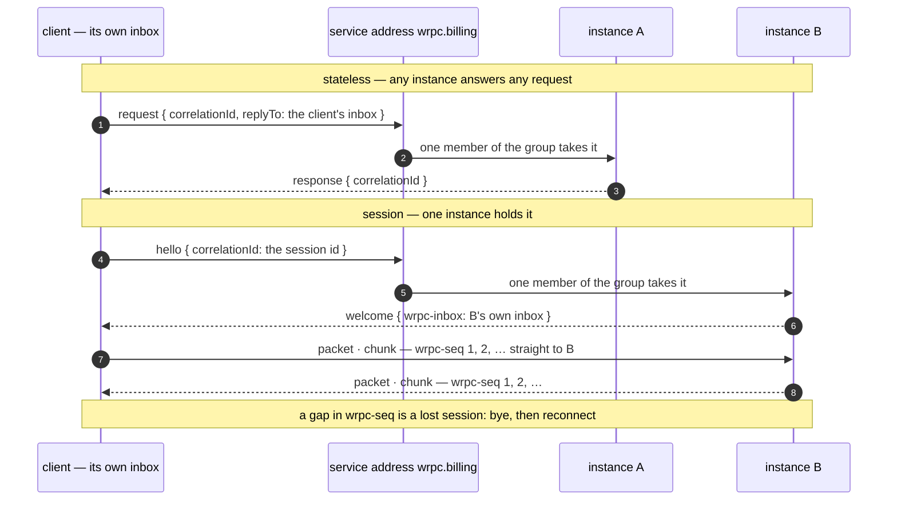

# RPC over a broker

Services that already share a broker can call each other through it, with no
HTTP or WebSocket between them and no service discovery: every instance of a
service listens on one address, the broker load-balances, and a caller only
needs the broker and the service's name.

```js
// the billing service
const { attachBrokerRpc } = require('@alexify/wrpc/broker');
await attachBrokerRpc(server, broker, { service: 'billing' });

// a caller
const { connect } = require('@alexify/wrpc');
require('@alexify/wrpc/broker');           // registers the 'broker' transport

const billing = await connect('broker://billing', { transport: 'broker', broker });
await billing.load('invoices');
await billing.api.invoices.create({ orderId });
```

The packets on the wire are ordinary wRPC packets — the same router, hooks,
sessions, validators and telemetry serve a WebSocket client and a broker one
side by side. The carrier is specified in
[the protocol reference](../../reference/protocol#broker-binding).

::: warning Experimental
Part of the [`@alexify/wrpc/broker`](../brokers) family, which may change in a
minor release until every adapter has shipped. Needs a broker with the
`direct` capability: the in-process, Redis, NATS and RabbitMQ adapters have
one; Kafka does not.
:::

## Two modes

| `mode` | Like | Carries | Instances |
| --- | --- | --- | --- |
| `'stateless'` (default) | the `http` transport | calls and batches | any instance answers any call |
| `'session'` | the `ws` transport | calls, events, subscriptions, cancellation, streams | one instance per session, found at connect |

**Stateless** is the one to reach for between services: nothing to keep alive,
nothing to lose when an instance goes away, and a request is handled on the
server exactly like a packet-mode HTTP POST — sessions come from its headers,
batches work, and a subscription is refused with `400`.

**Session** is the whole protocol. The client's `hello` reaches one instance,
which answers with its own inbox; every later frame goes there, numbered in
both directions. It is what you want when a service subscribes to another's
feed, or streams a file to it.

```js
const reports = await connect('broker://reports', {
  transport: 'broker',
  broker,
  mode: 'session',
  headers: { authorization: `Bearer ${serviceToken}` },
});
for await (const row of reports.api.export.rows.iterate({ since })) handle(row);
```



Every instance listens on the service address as one competing group, so
each `request` and each `hello` reaches exactly one of them. After the
`welcome`, the broker's load balancing is out of the session's path.

## What happens when an instance goes away

A session lives on one instance, so losing it is a lost connection, and the
client's ordinary [reconnect](../client#reconnecting) takes it from there:

- An instance that **closes** (`server.close()`) says `bye` to every session it
  holds; the client reconnects, its `hello` is taken by another instance, and
  subscriptions resume from `lastEventId`.
- An instance that **dies** says nothing. The client's heartbeat stops getting
  `pong`s and the client reconnects the same way.
- A **frame the broker dropped** shows up as a gap in the frame numbers, on
  whichever side receives the next one. The session is treated as lost rather
  than continuing with a call nobody will ever answer.
- A client that dies holds a server-side session until `idleTimeout`
  (default 90 s, three client heartbeats) ends it.

Stateless requests have none of this: a request nobody took fails its calls
with `503` when the broker can tell (the in-process broker, Redis with
neither a subscriber nor a live group member on the address, RabbitMQ
returning the message unrouted), or with
the call timeout otherwise — NATS core publishes without knowing whether
anyone listens.

## What the broker's ACL is the boundary for

The binding trusts the broker to deliver a message to the address it names
and nobody else. A stateless `response` is matched to its `request` by the
correlation id on the client's **own inbox**: whoever can publish to that
inbox can answer a request, and whoever can publish to the service address
can make one — the same trust a socket places in the network. A session id is
chosen by the client (`generateId`), names the session in every frame, and is
never handed to a second sender: a `hello` naming a session that has seen a
frame, or coming from another inbox, is ignored. Where the broker's ACL is
not enough — a shared cluster, a topic others can read or write —
[`encryption`](../encryption#brokers) binds every frame to its address, kind,
correlation id and sequence number, so a frame does not open anywhere else.

## Draining

A server that starts [draining](../production#graceful-shutdown) stops
consuming the service address — new requests and new sessions go to the
other instances — while the sessions already here keep running until the
close.

## Server options

| Option | Default | |
| --- | --- | --- |
| `service` | — | Served at `wrpc.<service>` |
| `address` | — | The service address outright, instead of `service` |
| `idleTimeout` | `90000` | A session silent this long is ended |
| `highWaterMark` | `1024` | Unconfirmed frames per session before `write()` reports backpressure |
| `maxSessions` | `10000` | Sessions one instance holds at once; a `hello` past it gets `bye` (`too many sessions`), reported as `broker.rpc.capacity`. `0` lifts the cap |
| `sessions` | `true` | `false` serves stateless requests only |
| `compression` | off | Per-message deflate on the binding — see [Compression](#compression) |
| `maxMessage` | 16 MiB | The largest inflated frame accepted; past it the session ends |

`attachBrokerRpc` resolves with `{ address, inbox, sessions, healthy, stop() }`
and stops by itself when the server closes.

Wire `healthy` into readiness next to `server.rpc.healthy`. It is `false` once
the binding stopped, and while either of its two listeners — the shared
service address, this instance's own inbox — says it is not receiving:

| Broker | A listener is not receiving when |
| --- | --- |
| Redis | the service's `BLPOP` is failing (`broker.redis.blpop`) or its presence lease cannot be renewed (`broker.redis.presence`), until the next one works; the listener's connection reports itself down (`status` on ioredis, `isReady` on node-redis) |
| NATS | the subscription reported an error (`broker.nats.subscription`); the connection is closed |
| RabbitMQ | the server cancelled the consumer (`broker.amqp.cancelled`); its channel closed; the connection is lost |
| memory, a custom broker | never — the adapter reports nothing, and that reads as healthy |

A Redis listener recovers by itself and turns healthy again. A NATS
subscription that erred and a RabbitMQ listener that lost its consumer or
channel do **not** come back: `healthy` stays `false`, which is the signal to
restart the instance — the binding does not re-listen on its own. What
`healthy` cannot see is a broker that accepts the listener and delivers
nothing: that is the client's timeout, and the broker's own metrics.

## Client options

`connect('broker://<service>', { transport: 'broker', ... })` takes the usual
[client options](../client) plus:

| Option | Default | |
| --- | --- | --- |
| `broker` | — | A broker with `direct`, or the capability |
| `mode` | `'stateless'` | `'session'` for the full protocol |
| `address` | `wrpc.<service>` | Where the service listens |
| `requestTimeout` | `30000` | How long the broker may hold a request nobody took |
| `compression` | off | Per-message deflate — connect()'s own option, shared with the socket transports |
| `maxMessage` | 16 MiB | The largest inflated frame accepted |

`headers` and `meta` travel on every stateless request and on a session's
`hello`, where the server reads them as a WebSocket upgrade's.

## Compression {#compression}

A broker carries the bytes it is handed — and NATS and Kafka cap a message
at 1 MiB, Redis' `direct` wraps a binary body in base64. Per-message
compression is **off by default**, like every compression knob in wRPC,
and negotiated so a client and a service can be upgraded in any order:

```js
await attachBrokerRpc(server, broker, { service: 'billing', compression: true });
const billing = await connect('broker://billing', { transport: 'broker', broker, compression: true });
```

- A **session** names its codecs on `hello` (`wrpc-enc: zstd,deflate-raw`,
  in its [order of preference](../compression#list)); a server that holds
  one of them answers its own list on `welcome`, and from then on every frame
  past the threshold (1 KiB) travels compressed in both directions —
  packets, events, subscription values and stream chunks alike — with
  `wrpc-enc` naming the codec on the frames that are. `{ compress: false }` on an emit
  sends that one plain. A server without the option answers no `wrpc-enc`
  and the session runs plain.
- A **stateless request** lists the codecs it accepts and travels plain
  itself (the client cannot know which instance takes it); the answer
  comes back compressed — with the instance's first codec on that list —
  when the body is past the threshold — the shape of HTTP's `Accept-Encoding`.
- A frame marked compressed that the receiver cannot inflate (no codec
  agreed, another codec, a body past `maxMessage`) ends the session like a
  sequence gap, and the client reconnects.

Node↔Node by construction, so the codec must answer synchronously: the
platform codec (raw deflate through `node:zlib`) does; `{ codec }` injects
another — `'zstd'` for large answers, the router
[dictionary](../compression#dictionary) for small ones, best as a
[list](../compression#list) with `'deflate-raw'` behind it — and a
promise-answering one is refused at construction. What it costs,
`bench/broker.js` over the in-process `MemoryBroker`: a session call
answering a 9 KB result runs at 8,273/sec plain and 6,029/sec compressed —
about 45 µs per round trip for the deflate and the inflate, against ~10×
fewer bytes through the broker. On a real broker the bytes are the part
that costs; the [WebTransport page](../wt#compression) has the codec's own
numbers, since the seam is shared.

A session's id is what its client speaks under, so it is a credential: log
lines and the transport's `source` carry a 12-character fingerprint of it,
enough to correlate a session across lines and never enough to speak on it.

## Tracing across the broker

Both halves are instrumented by the ordinary paths, not by anything special
to this transport: a stateless request reaches the server through
`handleHttpCall` and a session through `attach`, and the client's own call
bracket runs whatever carrier is underneath. So a call over a broker produces
a CLIENT span on one side and a SERVER span on the other, joined into one
trace by the `tp`/`ts` fields the packet already carries.

Pass [`telemetry`](../telemetry) to both ends and the broker hop is visible
the same way a WebSocket one is — with `wrpc.transport` naming the carrier.

The session id doubles as the correlation id, and the server holds each
session's frame state under it, so it is worth minting with a generator of
known strength — see [Identifiers](../production#identifiers).
