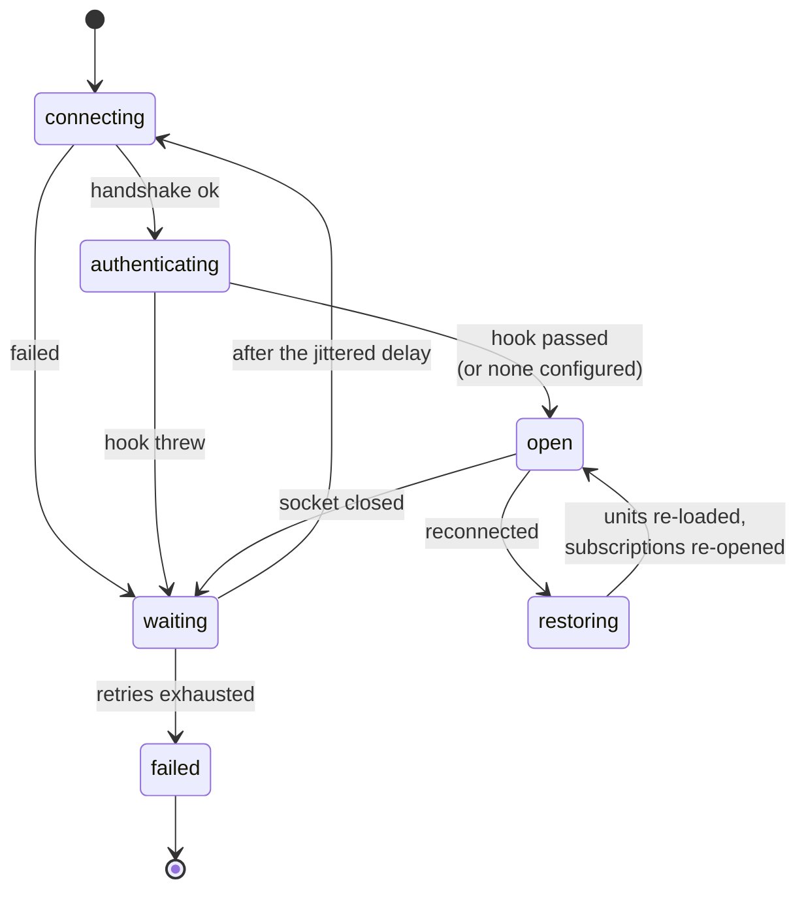

# Client

```js
const { WrpcClient } = require('@alexify/wrpc');

const client = await WrpcClient.connect('wss://host/api');
await client.load('chat');

const { id } = await client.api.chat.send({ text: 'hi' });
```

`load()` fetches the unit's shape from `system/introspect` and scaffolds
`client.api.chat` out of it: each method becomes a function, each subscription
a `{ subscribe, iterate }` object, and the unit itself is an `Emitter` where
server → client [events](./rooms) arrive.

::: warning `api` exists after `load()`
`client.api.chat` is `undefined` until `load('chat')` resolves, and every unit
is rebuilt on reconnect. Do not capture `client.api.chat.send` in a long-lived
variable — call through `client.api` each time.
:::

## Transports

The URL scheme picks the transport; `options.transport` overrides it.

| Transport | Scheme | Calls | Events, subscriptions, cancel | Binary streams |
| --- | --- | --- | --- | --- |
| `ws` | `ws:` / `wss:` | ✅ | ✅ | ✅ |
| `http` | `http:` / `https:` | ✅ | ❌ (code 400) | ❌ |
| `sse` | `http:` / `https:` | ✅ | ✅ | ❌ |
| `event` | — | ✅ | ✅ | ✅ |
| `wt` | `https:` | ✅ | ✅ | ✅ |

`wt` is [WebTransport](./wt) (experimental), in the base entry so that
`transport: ['wt', 'ws']` — WebTransport where the browser has it, a WebSocket
otherwise — needs no import. `sse` has to be registered before it can be
named — see [Server-Sent Events](./sse):

```js
require('@alexify/wrpc/sse');
const client = await WrpcClient.connect('https://host/api', { transport: 'sse' });
```

Anything HTTP cannot carry is an **error**, not a silent no-op: asking for a
subscription over HTTP is answered with code `400` rather than hanging.

::: tip Compression is the server's decision — and, in Node, one-directional
`ws` frames are compressed only when the server enables `perMessageDeflate`
(off by default). A browser then compresses both directions itself; a Node
client does not — its built-in `WebSocket` inflates but never deflates, so
client→server frames from Node are always sent as-is. See
[performance](./performance#compression-is-off-by-default).
:::

### Injecting `fetch` (http/sse)

The `http` and `sse` transports call `fetch` for every request; `options.fetch`
lets you hand in your own implementation instead of the runtime's global one —
re-resolved on every open, like `headers`. The intended use is a Node process
that talks wrpc to another wrpc server (a microservice calling a sibling
service) and wants undici's connection pooling, proxying, or caching tuned for
that traffic, without wrpc depending on undici itself:

```js
const { Agent, fetch: undiciFetch } = require('undici');

const agent = new Agent({ keepAliveTimeout: 10_000, connections: 128 });
const client = await WrpcClient.connect('http://internal-service/api', {
  transport: 'http',
  fetch: (url, init) => undiciFetch(url, { ...init, dispatcher: agent }),
});
```

This is **not** a way to reach arbitrary third-party REST APIs through wrpc —
the http/sse transports only ever call the one connected wrpc server (packet
POSTs, or a [mapped REST leg](./rest) against that same server's own base
URL). Calling another service's API is still a plain, direct `fetch`/undici
call; `options.fetch` only tunes the transport wrpc itself uses.

## Options

```js
await WrpcClient.connect(url, {
  callTimeout: 7000,
  reconnect: { minDelay: 2000, maxDelay: 30000, factor: 2, jitter: true, retries: Infinity },
  heartbeat: { interval: 30000, timeout: 10000 },
  batch: { flush: 'microtask', maxSize: 16, maxBytes: 65536 },
});
```

| Option | Default | Meaning |
| --- | --- | --- |
| `callTimeout` | `7000` | Milliseconds a call waits for its answer; expiry rejects with a coded **408** `WrpcError`. |
| `connectTimeout` | `30000` | Cap on the transport handshake; expiry rejects with a coded **408** and the normal backoff continues. `false`/`0` disables. |
| `reconnect` | see below | `false` disables reconnection entirely. |
| `reconnectTimeout` | — | Shorthand for `reconnect.minDelay`. |
| `heartbeat` | `{ interval: 30000, timeout: 10000 }` | `false` disables it. |
| `batch` | off | `true` takes the defaults. |
| `retry` | off | Opt-in per-call retry: `{ attempts, on: [503], minDelay, maxDelay, factor, jitter }`, `true` for the defaults. Coded failures re-issue with a fresh packet id after a jittered backoff — never a silent offline buffer. |
| `transport` | from the URL | `'ws'`, `'http'`, `'sse'`, or anything registered. |
| `worker` | — | A worker to proxy through: a `ServiceWorker`, a `SharedWorker`, a dedicated `Worker` or a raw `MessagePort` — see [Workers](#workers). |
| `authenticate` | — | Presents the connection's credential; awaited before the reconnect restore — see [Authenticating](#authenticating). |
| `refresh` | — | Single-flight credential refresh with a one-shot retry — see [Refreshing a credential](#refreshing-a-credential). |
| `headers` | — | Connection-phase headers, re-evaluated per open; validated by `schema.headers` — see [Metadata](./metadata). |
| `meta` | — | Connection-phase metadata (unvalidated); per-call twin via `{ meta }` / `withMeta()` — see [Metadata](./metadata). |
| `fetch` | global `fetch` | http/sse only — see [Injecting `fetch`](#injecting-fetch-http-sse). |
| `random` | `Math.random` | Jitter source; injectable so tests can pin the schedule. |
| `generateId` | uuid v4 | Packet/subscription/stream ids, and the [broker transport's](./brokers/rpc) session and correlation ids — bring your own (cuid/ulid/a test counter). Correlation ids, not secrets; every id must stay within 255 UTF-8 bytes. |
| `protocols` | `['wrpc.v1']` | WebSocket subprotocols to offer; the server echoes the wire revision back. `[]` offers nothing. |
| `logger` | off | A Console or pino-shaped logger; observes errors in addition to the `'error'` event. |
| `telemetry` | off | OTel tracer/meter/api — see [Telemetry](./telemetry). |

## Calls

```js
const result = await client.api.unit.method(args, { signal });
```

Slot 0 is always the procedure's arguments and slot 1 is always the client's
options — even for a procedure that takes nothing:
`client.api.system.ping(undefined, { signal })`.

The options slot also takes a per-call **`timeout`** (ms), overriding
`callTimeout` for this call and riding the packet so the server shortens the
procedure's own budget to match — the gRPC-deadline shape. Expiry rejects
with a coded **408**.

Aborting `signal` sends `{ type: 'cancel', id }` and rejects the call with a
`WrpcError` carrying code **499**. Cancellation is best-effort by nature — a
handler that never looks at `context.signal` runs to completion — but the
caller is rejected immediately and whatever the handler eventually returns is
dropped rather than delivered late.

Failures reject with a `WrpcError` whose `code` is the server's:

```js
try {
  await client.api.chat.send({ text: '' });
} catch (error) {
  error.code;      // 400 invalid input, 403 no session, 404 unknown method,
                   // 408 timeout, 499 cancelled, 503 queue overflow, 500 …
  error.message;
}
```

## Batching

```js
const client = await WrpcClient.connect(url, { batch: true });

const [a, b] = await Promise.all([
  client.api.math.double({ n: 1 }),
  client.api.math.double({ n: 2 }),
]);   // one frame, two answers
```

Calls issued in the same tick travel as one JSON array — one frame on a
WebSocket, one request on HTTP. `flush` is `'microtask'` or a delay in
milliseconds; `maxSize` and `maxBytes` force an early flush. `client.flush()`
sends whatever is waiting, right now.

Only `call` packets batch. A ping, a cancel or an unsubscribe is a control
packet whose entire point is to arrive immediately.

The server caps a frame at `maxBatch` packets (128 by default) — one frame
asking for unbounded work would otherwise be a denial of service.

## Reconnecting

The client reconnects on its own, with truncated exponential backoff and full
jitter:

```
delay = random(0, min(maxDelay, minDelay * factor ** attempt))
```



`waiting → failed` emits `reconnect-failed`; `restoring → open` emits
`reconnect`. A `restore-failed` on the way through `restoring` means a unit or
subscription could not be rebuilt, and is reported rather than swallowed.

Jittering the **whole window** rather than adding a small offset is what breaks
up the thundering herd: after a server restart, a thousand clients that
disconnected in the same millisecond would otherwise all come back in the same
millisecond.

The attempt counter resets only after the connection has **survived**
`reconnect.stableAfter` milliseconds (default: `minDelay`) — a TCP open by
itself proves nothing. A peer that accepts the upgrade and immediately drops
it (a server shedding load mid-restart, a proxy that resets after the
handshake) therefore keeps climbing the backoff, exhausts `retries` and
reaches the fallback transport, instead of hammering the struggling server
at `minDelay` forever. `stableAfter: 0` restores the old reset-on-open
behavior.

On a successful reconnect the client reloads every unit it had loaded — the new
connection is a new server-side client, so its introspected method list has to
be rebuilt — re-opens every subscription from the last eventId it saw, and then
emits `reconnect`. The `api` unit objects themselves are reused, so event
listeners registered on them survive the outage.

## Authenticating

A reconnected socket is a **new server-side client**: whatever a login call
established belongs to the connection that died. The restore machinery
re-sends its `subscribe` packets *synchronously, before any await*, so an
`'open'` listener — whose body past its first `await` resumes a microtask
later — structurally cannot present a credential first. The `authenticate`
option is the seam that can:

```js
const client = await connect(url, {
  authenticate: async (client, { reconnected }) => {
    await client.call('auth/signIn', { token: readToken() });
  },
});
```

The hook is awaited in two places:

- **Inside `open()` on the first connect** — `await connect(...)` resolves an
  already-authenticated client. A throw here rejects `connect()` and leaves
  nothing behind (no reconnect timer, no registered connection).
- **On every reconnect, BEFORE the restore** — the subscriptions are
  re-opened and the units re-loaded only after the hook resolved, so a
  `session`-gated feed resumes instead of being refused with a terminal 403.
  This also unblocks `introspection: 'session'` servers, whose reconnect
  `load()` would otherwise 403 forever.

Inside the hook, address methods as `client.call('unit/name', args)` — `api`
is built by `load()`, which runs after auth. With a hook configured, `'open'`
fires **after** a successful authentication: "open" means usable.

A throw on a reconnect terminates the transport, emits
**`'authenticate-failed'`** (`{ error, attempts, reconnected }`), and hands
control to the normal backoff — retries grow, `retries` exhausts, a
[fallback transport](#transport-fallback) gets its turn (the hook runs there
too). A credential that will not fix itself (a revoked account, a bad
password) should not retry: call `client.close()` inside the hook before
throwing, and the cycle stops.

### Refreshing a credential

`authenticate` heals a **new** connection; `refresh` heals a **live** one
whose credential expired mid-session:

| | `authenticate` | `refresh` |
|---|---|---|
| Runs | on open / reconnect, before restore | when a call is refused with a listed code |
| Concurrency | one connection, one run | **single-flight**: N concurrent refusals, one run |
| On success | `'open'`, then restore | each refused call retried **exactly once**, fresh packet id |
| On failure | terminate + backoff | the **original** refusal surfaces, never the refresh's error |

```js
const client = await connect(url, {
  authenticate: (c) => c.call('auth/signIn', { token: tokens.access }),
  refresh: {
    on: [401, 403], // wrpc's own "no session" refusal is 403; app-level is usually 401
    handler: async (c) => {
      tokens = await c.call('auth/refresh', { token: tokens.refresh });
    },
  },
});
```

The retry path covers both the packet leg and the REST leg of mapped
methods, **and the subscribe leg**: a subscription refused with a listed
code runs the same single-flight refresh and is re-opened exactly once —
the case that matters is the reconnect after an outage longer than the
credential, where every re-subscribe would otherwise earn a terminal 403
while plain calls quietly heal. Guard rails, by construction: the retry
calls the wire directly, so a second refusal surfaces as-is (no loop);
calls made *inside* the `authenticate` hook never trigger a refresh (no
recursion); and a call made *by the refresh handler itself* that is refused
surfaces its refusal instead of joining the run that is awaiting it (no
deadlock). A subscription refused with a code **outside** `refresh.on`
stays terminal — re-subscribe from the handle's `onError` if such a feed
can outlive its session.

## Transport fallback

`transport` also accepts an **ordered list** of candidates:

```js
require('@alexify/wrpc/sse');   // 'sse' must be registered to be named
const client = await WrpcClient.connect('wss://host/api', {
  transport: ['ws', 'sse', 'http'],
});
```

There is deliberately **no default order** — the list is yours. Every name
is validated up front (a fallback that fails at fall-back time is a fallback
nobody tested), and `'event'` cannot appear in one (it is selected through
`worker`, not by URL). Neither can `'webrtc'` in practice: that transport,
registered by [`@alexify/wrpc/webrtc`](./webrtc), speaks over a `link` (or a
raw data `channel`) given in the options rather than to a URL, and `WrpcPeer`
constructs it for you.

The semantics:

- `reconnect.retries` applies **per candidate**. When one exhausts its
  budget, the next takes over with a fresh counter and an immediate first
  try — the backoff was guarding the old endpoint, not the new one.
- Each hand-over emits `'transport-fallback', { from, to }`; only the LAST
  candidate exhausting emits `'reconnect-failed'`. There is no wrap-around,
  and no automatic upgrade back — reconnect the client if you want `ws`
  again.
- The URL is re-spelled per candidate (`wss:` ⇄ `https:`), so one URL
  serves the whole list.
- **Capability loss is loud.** Falling onto a non-persistent transport
  (plain `http`) fails every live subscription immediately with code `400`
  — not one refused re-`subscribe` at a time. Prefer `sse` ahead of `http`
  in the list if feeds matter: it carries events, subscriptions and cancel
  (everything but binary streams).

A fallback list is several ways to reach **one** backend. Talking to several
*different* backends at once — a REST service, a realtime one, a local
worker — is a separate concern; see [Multiple backends](./multiple-backends).

## Heartbeat

A browser `WebSocket` exposes no protocol-level ping, so a connection that died
without a close frame — a dropped NAT mapping, a suspended laptop, a proxy that
stopped forwarding — looks perfectly open from JavaScript until the first call
times out.

The client therefore sends an application-level `{ type: 'ping' }` every
`interval` and expects a `{ type: 'pong' }` within `timeout`; a miss emits
`heartbeat-timeout` and forces a reconnect.

Each transport decides whether it wants one: the WebSocket and
[SSE](./sse) transports do, and the plain HTTP transport does not — a
request/response transport has no connection to keep alive.

## Events

```js
client.on('open', () => {});
client.on('close', () => {});
client.on('reconnecting', ({ attempt, delay }) => {});
client.on('reconnect', ({ units, attempts, subscriptions }) => {});
client.on('reconnect-failed', ({ attempts }) => {});
client.on('restore-failed', ({ error, attempts }) => {});
client.on('authenticate-failed', ({ error, attempts, reconnected }) => {});
client.on('heartbeat-timeout', () => {});
client.on('unhandled-event', ({ name, data }) => {});
client.on('error', (error) => {});
```

Server → client events for a **loaded** unit arrive on the unit itself
(`client.api.chat.on('message', …)`); anything that reaches no listener
surfaces as `unhandled-event` rather than vanishing.

`client.attempt` is how many reconnect attempts have been made since the last
successful open, and `client.active` is whether the transport is up.

## Answering the server

The server can [ask](./rooms#asking-a-room) — an event that expects an
answer. The client registers exactly one responder per event name:

```js
client.respond('chat/confirm', async (data) => ({ ok: true }));
client.unrespond('chat/confirm');
```

The responder's return value (or thrown error, with its `code`) travels
back as the answer. An ask with no responder is answered `501` immediately
and still surfaces as `unhandled-event`. Registration is client-level, not
per-unit — unit objects carry server-named methods, where a method called
`respond` would collide — and works before `load()`.

## Offline and online

```js
WrpcClient.offline();   // close every client's transport
WrpcClient.online();    // reopen them
```

Static, because connectivity is a property of the machine rather than of one
connection. `WrpcClient.initialize()` wires them to the browser's `online` /
`offline` events; `WrpcClient.connections` is the live set.

## Workers

A worker can hold the connection while every page talks to the worker over a
`MessagePort` — one socket for all tabs, and (with a Service Worker) a peer
that survives a page reload. In the worker:

```js
const { WrpcClientProxy } = require('@alexify/wrpc');

const proxy = new WrpcClientProxy({ callTimeout: 7000 });
await proxy.open();
```

…and in the page, hand `worker` whatever holds the proxy:

```js
// a Service Worker
const client = await WrpcClient.connect(url, { worker: navigator.serviceWorker.controller });

// a SharedWorker — reached through its port
const shared = new SharedWorker('/wrpc-worker.js', { name: 'wrpc' });
const client = await WrpcClient.connect(url, { worker: shared });
```

A dedicated `Worker` or a raw `MessagePort` work the same way. The proxy takes
every client option plus `url`, the server it connects to; without it the URL
is derived from the worker's own `location` — right for a Service Worker on
the site it serves, and what a SharedWorker proxying to another origin
overrides.

The packets are identical on both hops, so nothing above the transport
changes. Each `connect()` gets its own `MessageChannel` to the worker — two
workers from one page are two independent clients; the
proxy routes answers back to the port that asked and broadcasts events to
every port, and lets go of a port when its page closes it.

This is also how a purely local backend — one fronting `IndexedDB`, say —
joins a client that otherwise talks to remote services over `ws`/`http`/`wt`;
see [Multiple backends](./multiple-backends#a-local-backend-behind-a-worker)
for the combined picture, including a sharp edge in `getInstance`'s
per-page singleton worth knowing about before you reach for two worker
targets from one page.

## In a browser bundle

The package ships a browser entry (`browser.js`), resolved automatically by any
bundler that honours the `browser` field — webpack, Vite, esbuild with
`platform: 'browser'`, Rollup (with `@rollup/plugin-node-resolve` and
`browser: true`), Parcel, Bun. It contains the client, the streams and the
chunk helpers, and **no Node builtins** — the server half is not in it.

The main entry is ~18 KB min+gzip in that build; `scripts/size.js` enforces a
budget on it in CI. See [Browser & bundling](./browser) for the full table, the
`browser` field map, and what is deliberately missing from that entry.
