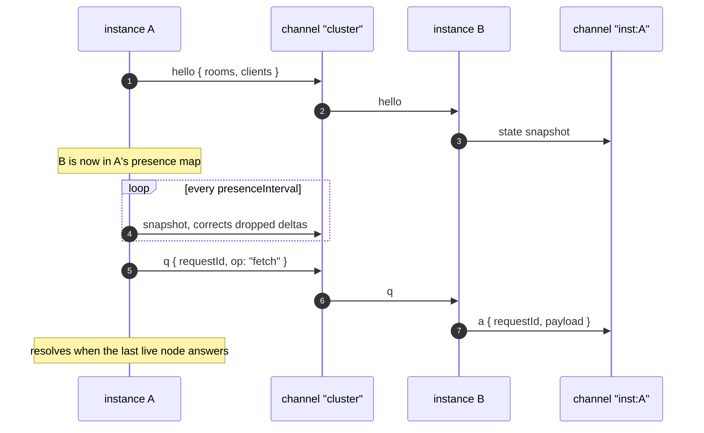

# Cluster

[Rooms](./rooms) reach the clients one process holds; a [backplane](./scaling)
makes a room span every process. The **cluster layer** is what sits on top of
that same backplane and answers the questions a multi-instance deployment
actually asks: *how many are connected — everywhere?* *which node holds this
client?* *ask every node something and collect the answers.*

```js
server.cluster.presence('chat');                         // { total, instances: { … } }
const clients = await server.cluster.fetchClients({ room: 'chat' });
server.cluster.disconnect({ room: 'banned' });
```

It is always present. Without a backplane every operation degrades to its
local half — `presence()` reports this instance, `ask()` asks nobody — so
application code never branches on the deployment shape.

::: info Built on the contract, not into it
`Cluster` uses only `publish`/`subscribe`/`close`, so every backplane —
`MemoryBackplane`, Redis, your own — gets presence, requests and commands
without implementing correlation, timeouts or aggregation itself.
:::

## Two channels



Both are held for the life of the process: `cluster`, which every instance
subscribes to (presence, wide requests, commands), and `inst:<instanceId>`,
one instance's own inbox for answers and addressed commands. The envelopes
are an implementation detail of wrpc's cluster layer, not part of the frozen
[wire protocol](../reference/protocol#cluster-channels) — they never reach a
client connection.

## Presence: replicated, read locally

```js
server.cluster.count('chat');     // cluster-wide membership — no network
server.cluster.presence('chat');  // { total, instances: { 'node-1': 2, … } }
server.cluster.instances();       // live instance ids, this one first
```

`count()` and `presence()` are **local sums**. Every join and leave publishes a
±1 delta, and a periodic snapshot corrects whatever the at-most-once broker
dropped, so a lost delta heals within one interval rather than skewing forever.
`rooms.count(room)` and `rooms.members(room)` stay the LOCAL numbers — a
zero-cost read for code that wants exactly this instance.

Liveness counts **every** message a node sends; the snapshot only fills
silence. A node quiet for `presenceTimeout` is evicted, a graceful `close()`
says goodbye and is evicted immediately, and a restart arrives with a fresh
**epoch** — which is how a receiver tells "restarted, replace its counters"
from "same process, merge them".

| Option (`cluster.…`) | Default | What it controls |
| --- | --- | --- |
| `presenceInterval` | `5000` ms | How often this node publishes its presence **digest** (a hash, not the room table — see below). Raising it also delays eviction: `presenceTimeout` defaults to 3× it. |
| `presenceTimeout` | `3 ×` interval | Silence after which a node is evicted. |
| `requestTimeout` | `2000` ms | Backstop for `fetchClients`/`ask`; resolves `incomplete`, never rejects. |
| `rooms` | all | Which rooms replicate: an array, predicate or RegExp. See the cardinality note below. |
| `maxFetch` | `1000` | Per-node ceiling on one `fetchClients` reply; a node over it answers its first `maxFetch` descriptors and the result carries `truncated: true` (never silent). `0` disables. |
| `secret` | — | Opt-in HMAC-SHA256 envelope authentication — see [Trusting the backplane](#trusting-the-backplane). |

`cluster: false` opts out of the cluster layer entirely: presence, commands
and asks degrade to their local halves while the [rooms
backplane](./scaling) keeps working. `server.cluster` still exists, so
application code never branches on the deployment.

::: warning Presence cost scales with ROOM cardinality
Presence replicates a `room → count` table per node. With topic rooms
(`'lobby'`, `'ticker:AAPL'`) that is small; with the per-user
`user:<id>` pattern it is one entry per connection, and every node holds
every other node's table — O(nodes × rooms) heap. The periodic corrective
message is a **digest** (a 32-bit hash), so steady-state backplane traffic
stays O(nodes²) *bytes*, and the full table travels only to a node whose
view actually drifted (it asks with an addressed `sync`). If you never call
`presence()`/`count()` on a family of rooms, exclude it with
`cluster: { rooms }` — deltas and digests then skip it entirely.
:::

### Trusting the backplane

The backplane is a **trust peer** of every node: anything that can publish
on the `cluster` channel can disconnect every client or join anyone to any
room on every instance at once. Isolate the broker on its own network and
ACL it. Where that is not enough, set the same `cluster: { secret }` on
every node: envelopes are HMAC-SHA256-signed and an unsigned or mis-signed
message is dropped and logged (`cluster.unsigned` / `cluster.badsig`).
Room *events* travel on separate channels and are not signed — the secret
guards the command surface, the broker ACL guards the rest.

### Health

`cluster.healthy` (and the aggregate `server.rpc.healthy`) is `false` while
a backplane channel subscribe is failing and being retried with capped
backoff — the node can publish but cannot hear. `'degraded'` and
`'recovered'` fire on the transitions; wire them to a readiness probe so a
half-connected node is drained instead of serving with silent gaps.

```js
const server = new Server({ router, backplane, instanceId: 'node-1', cluster: { presenceInterval: 2000 } });
```

`instanceId` may be **stable** across restarts (`'node-1'` from your
orchestrator); the epoch never is, and that is the pair that makes restart
detection work.

## Finding clients

```js
const clients = await server.cluster.fetchClients({ room: 'chat' });
// [{ id, instance, rooms, data, transport, session }, …]

if (clients.incomplete) log.warn('a node did not answer in time');
```

A descriptor is deliberately small and serializable:

| Field | What it is |
| --- | --- |
| `id` | The client id, instance-prefixed (`<instanceId>.<generateId()>`). |
| `instance` | Which node holds the connection. |
| `rooms` | Its room memberships on that node. |
| `data` | `client.data` — the application's own bag; wrpc never reads it. |
| `transport` | `'ws'`, `'http'`, `'sse'` or `'event'`. |
| `session` | Whether a [session](./sessions) is attached — never the session itself. |

Only **persistent** clients are enumerated: a per-request HTTP client is not a
peer anyone means to list, join or disconnect.

`fetchClients` knows its respondent set from presence and resolves the moment
every live node has answered. When one never does, the partial array carries a
non-enumerable `incomplete: true` and the miss is logged — the timeout is a
backstop, never a silent truncation.

On this instance, the same lookup is synchronous and free:

```js
const client = server.getClient(id);   // undefined if it is on another node
if (client) client.sendEvent('system/notice', { text: 'hi' });
```

## Commands

```js
server.cluster.join(clientId, 'ops');           // addressed: ONE node hears it
server.cluster.leave({ room: 'chat' }, 'x');    // selector: applied on every node
server.cluster.disconnect({ room: 'banned' });
```

Because `client.id` is instance-prefixed, an id-addressed command travels as
**one message to one node** rather than a cluster-wide filter. A selector
(`{ room }`, or `{}` for everyone) is applied on every node instead.

Commands are fire-and-forget with the backplane's at-most-once delivery: they
are the right tool for "kick these connections", and the wrong one for
anything that must be exactly-once.

## Node-to-node messaging

```js
server.cluster.sendEvent('cache/invalidate', { key });        // fire-and-forget
server.cluster.on('cache/invalidate', ({ key }) => cache.delete(key));  // on OTHER nodes

server.cluster.respond('stats', async () => ({ load: cpu() }));
const { answers, errors, incomplete } = await server.cluster.ask('stats');
```

As everywhere in wrpc, `emit` is the local `Emitter` emit and the wire send is
`sendEvent`. One responder per name — two answers to one question are
ambiguous, so a duplicate `respond()` throws. A node **without** a responder
contributes an entry in `errors`, not silence.

## Acks: asking clients

The cluster asks nodes; `ask()` on a room or a client asks the **peers**. On
the wire it is the ordinary `event` packet plus an `id`, answered by the
ordinary `callback` — no new packet type.

```js
// Browser
client.respond('chat/poll', async ({ question }) => ({ vote: 'yes' }));

// Server — one peer
const answer = await context.client.ask('chat/poll', { question: 'ready?' }, { timeout: 5000 });

// Server — a whole room, across every instance
const { answers, errors, expected, incomplete } =
  await server.to('chat').ask('chat/poll', { question: 'ready?' });
```

A room `ask()` **never rejects**: a question with many answerers has no single
failure. It resolves with:

| Field | Meaning |
| --- | --- |
| `answers` | What the responders returned. |
| `errors` | Per-client failures — `501` no responder, `408` timeout, `503` disconnected mid-question. |
| `expected` | How many clients were asked, across every instance. `local()` keeps the question here. |
| `incomplete` | `true` only when a remote instance never reported back. |

A single-peer `client.ask()` does reject, with those same codes. Under both
sits the pair `client.expectAnswer(id, timeout)` / `client.settleAnswer(packet)` —
the bookkeeping half, which `Broadcast.ask()` uses so it can write one
pre-serialized packet to many peers instead of building one per recipient.

## What the cluster does not do

- **It does not move connections.** SSE channels live on the instance that
  created them and need sticky routing; see [scaling](./scaling#what-stays-per-instance).
- **It does not make delivery exactly-once.** Presence self-heals because it is
  a replicated counter with a correcting snapshot; events and commands do not.
- **It does not share event logs.** `createEventLog()` is per-process memory,
  and its epoch-stamped ids make that *visible* to a resuming client rather
  than silently lossy — see [subscriptions](./subscriptions#event-log-ids-carry-an-epoch).
