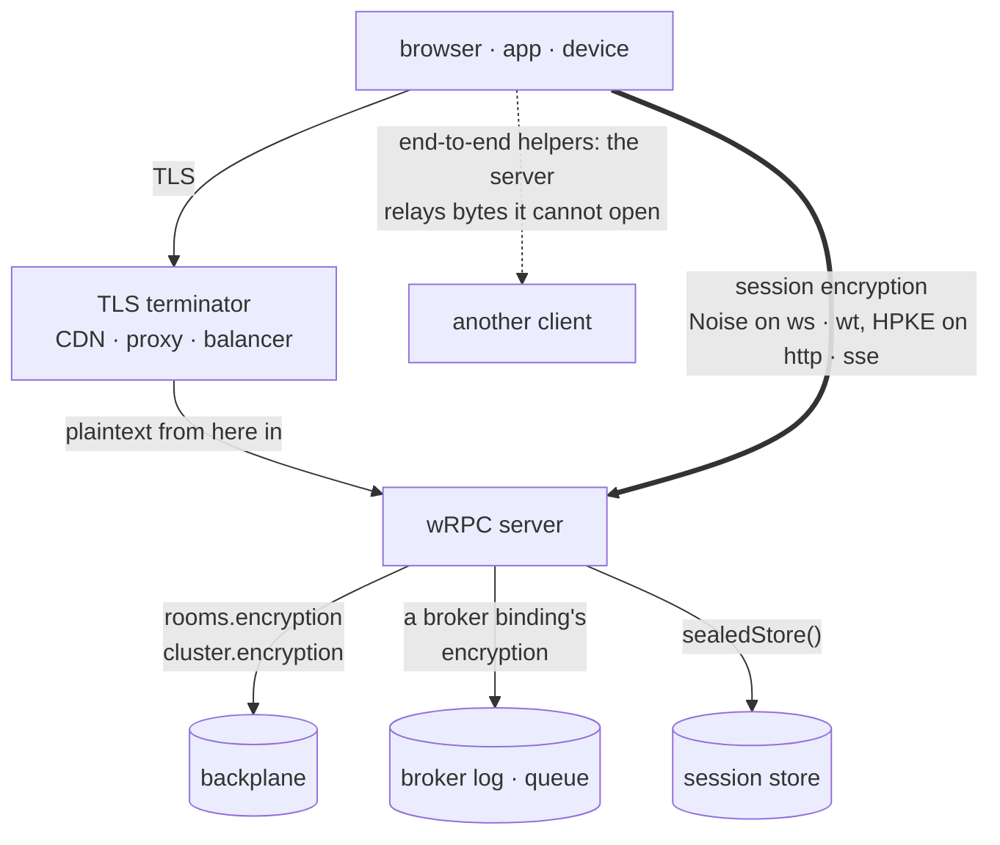
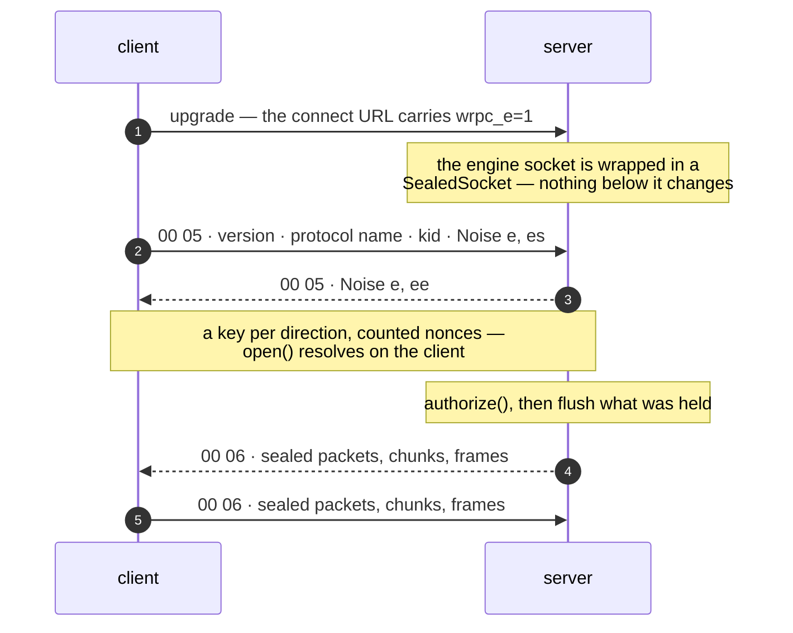
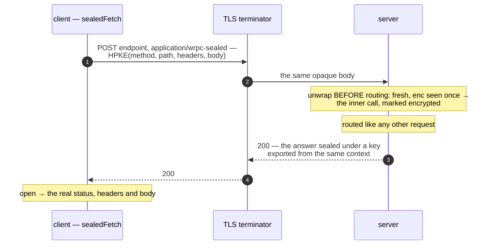

# Encryption

wRPC encrypts nothing by default, and the first thing to turn on is not on
this page: **TLS**. `protocol: 'https'` with a `key` and `cert`, or a proxy
that terminates it — `wss://` and `https://` are what protect a connection
from the network, and nothing here replaces them. A page served over HTTPS
cannot even open a `ws://` socket.

This page is for where TLS **ends before the data does**.

::: warning Experimental
The whole of `@alexify/wrpc/encryption` — the subpath, every `encryption`
option it feeds and the wire formats — is `@experimental`: it may change in a
minor release until the formats have been reviewed against real deployments.
See [Stability](../reference/stability#experimental-carve-outs).
:::

## Do you need it?

| Where the data goes | What TLS leaves readable | The knob |
| --- | --- | --- |
| The rooms backplane and the cluster channels (Redis) | every room event, presence delta, `sendTo` payload and `fetchClients` reply, as JSON — to the operator, a `MONITOR` session, a neighbour on a shared instance | [`rooms.encryption`, `cluster.encryption`](#backplane) |
| A message broker (Kafka, RabbitMQ, NATS, Redis Streams) | every RPC packet and published event, **at rest for the topic's retention** — and the bearer token in a client's headers | [`encryption` on every broker binding](#brokers) |
| A shared session store | each session's state, keyed by the bearer token itself | [`sealedStore()`](#sessions) |
| A TLS terminator you do not run — a CDN, a corporate proxy, a body-logging balancer | everything, from that box inward | [session encryption](#session) |
| `ws://` where no certificate can be had — a LAN device, two services on a private network | everything | [session encryption](#session) |
| The server itself, for a payload it only relays | the payload | [end-to-end helpers](#end-to-end) |

Each row is a hop where TLS has already ended, and each layer covers one of
them:



If none of those rows is yours — a browser talking `wss://` to a server you
run — you do not need this, and it would only cost you: CPU per message, 16
to 60 bytes of overhead, asynchronous WebCrypto in the page, and the shared
frame of every broadcast.

Everything below is **off by default and stays off** until you turn it on,
on both ends, like [compression](./compression).

```js
const encryption = require('@alexify/wrpc/encryption');
```

## What it is built from

Only what the platform already has — `node:crypto` on a server, WebCrypto in
a page — under their standard names, checked against the published test
vectors. wRPC adds no cryptography of its own and depends on no package.

| Piece | Standard | Notes |
| --- | --- | --- |
| AEAD | **AES-256-GCM** (the default), ChaCha20-Poly1305 | ChaCha20-Poly1305 is Node-only: no browser's WebCrypto has it. Nonces are always counters, never random. |
| Key agreement | **X25519** (RFC 7748) | Chrome 133, Firefox 130, Safari 17, Node 22. |
| Key derivation | **HKDF-SHA256** (RFC 5869) | one label per use; a configured key is never used directly. |
| Session handshake | **Noise** — `Noise_{NN,NK,XX,NNpsk0}_25519_{AESGCM,ChaChaPoly}_SHA256` | the framework behind WireGuard and WhatsApp; verified against the cacophony vectors. |
| Per-request sealing | **HPKE** (RFC 9180), base / psk / auth modes | the construction of Oblivious HTTP (RFC 9458); verified against the RFC's vectors. |

What wRPC does **not** build in, and takes by injection instead:

| You want | Inject |
| --- | --- |
| XChaCha20-Poly1305 / NaCl / libsodium, AES-GCM-SIV, AEGIS | a [`Cipher`](#contracts), on the keyring layers and in HPKE (a Noise session names a built-in) |
| Post-quantum key exchange — ML-KEM, X-Wing, a hybrid | a [`Kem`](#contracts) for HPKE. Node 24.7+ has ML-KEM natively; no browser's WebCrypto does yet, which is why it is not a built-in. |
| Keys that live in a KMS or Vault | a [key provider](#keys) |
| Double Ratchet, MLS, JWE | nothing — they produce bytes, and wRPC [carries bytes](#end-to-end) |

Deliberately absent: AES-CBC with a separate MAC, AES-CTR without one, RSA
for sessions.

## Keys {#keys}

Every symmetric use takes the same `keys` option: 32 bytes as a
`Uint8Array`, 64 hex characters or base64.

```js
const { generateKey } = require('@alexify/wrpc/encryption');
// once, into your secret store:
Buffer.from(generateKey()).toString('base64url');
```

**Rotation** is a ring. The key id travels in the clear beside the
ciphertext and *selects* the key — nothing is ever tried until it fits:

```js
keys: { current: 'k2', ring: { k1: process.env.KEY_1, k2: process.env.KEY_2 } }
```

Add the new key everywhere, make it `current` everywhere, drop the old one —
three deploys, no flag day. A key id is 1–32 of `A-Z a-z 0-9 . _ -`.

On a **broker log or queue** the third deploy waits. A backplane message is
gone the moment it is delivered, but what a publisher sealed under the old key
stays in the topic for its retention and in the queue until it is consumed —
retries and dead letters included — and a service that dropped that key can
open none of it. Keep a retired key in `ring` for at least the topic's
retention plus the longest retry backoff, until the backlog sealed under it
has drained, and only then drop it; a key you dropped too early goes back
into the ring, no harm done.

A **provider** puts the keys somewhere else. Both methods are synchronous —
they are read where a backplane message is opened, and that path cannot
wait — so unwrap your data keys at boot and refresh them on your own clock:

```js
keys: { current: () => vault.currentKid, get: (kid) => vault.keys.get(kid) ?? null }
```

A provider is asked every time — `get(kid)` once per backplane message,
handshake or sealed request, ahead of anything derived from the key and
remembered — so a kid it stops answering is refused **from that lookup on**,
without a restart: the lever for a key that leaked. A kid names one key;
putting other bytes under a kid already in use is not a rotation.

## The backplane {#backplane}

```js
new Server({
  router,
  backplane,
  rooms: { encryption: { keys: process.env.WRPC_ROOMS_KEY } },
  cluster: { secret, encryption: { keys: process.env.WRPC_CLUSTER_KEY } },
});
```

Redis carries `wrpc-sealed:<kid>:<base64>` and its operator reads nothing —
not the payload, not the event name, not the room list. About 3.5 µs per
1 KB envelope each way. The full story — what it binds, the three-deploy
rollout, what it cannot hide (the channel name *is* the room name) — is on
the [scaling page](./scaling#encryption).

## Brokers {#brokers}

A broker keeps what it carries. The same option, on every binding:

```js
const encryption = { keys: process.env.WRPC_BROKER_KEY };

await attachBrokerRpc(server, broker, { service: 'billing', encryption });
const client = await connect('broker://billing', { transport: 'broker', broker, encryption });

createPublisher(server, broker, table, { encryption });
brokerFeed(broker, 'orders', { encryption });
await attachConsumers(server, broker, {}, { encryption });
```

**The headers move inside with the body** — so the `authorization` a client
presents, which used to ride as a plaintext broker header on every request,
no longer rests in the topic. What stays readable is what the broker routes
by (`wrpc-kind`, `wrpc-seq`, a partition `key`), and the first two are bound
into the seal. A message that does not open is dropped (RPC), skipped (a
feed — `broker.feed.refused`, one warning per reason per ten seconds with the
count) or dead-lettered with `400` (a consumer) — logged, never answered,
and counted in `wrpc.broker.refused` by reason. One reason is transient: a
message under a key id this service does not hold (`kid`) is what a
rotation in progress looks like, so a consumer retries it like a `503`, to
the binding's `attempts`, before dead-lettering.
Rolled out like the backplane: `{ keys, seal: false, acceptPlaintext: true }`,
then `{ keys, acceptPlaintext: true }`, then `{ keys }` — and a key is
[dropped from the ring](#keys) only once the backlog sealed under it has
drained, which a backplane never made you wait for.

This is a shared key: every service that holds it reads every message.

The RPC binding has one more concern the log and queue layers do not: the
service address is consumed by every instance, and the envelope's replay
window lives in one process, so a captured `request` replayed later reaches
an instance that never saw it. A sealed `request` or `hello` therefore
carries the sender's clock inside the seal — refused past
`encryption.maxSkew` (five minutes) as `stale` — and behind more than one
instance you inject `encryption.replay`, a shared "seen once" memory with the
same `seen(id, ttl)` method `createReplayCache()` has (`SET id 1 NX PX ttl`
in Redis). A memory that cannot be asked serves nothing.

The built-in memory is bounded, and the bound is a capacity to size: it must
hold every sealed request of the last `2 · maxSkew`, so
`max ≥ rps × 2·maxSkew/1000` — the default (100 000 entries, five minutes
of skew) holds about 167 requests a second. Past it, full of live entries,
it **refuses** (`503`, said once per ten seconds as
`encryption.replay.overflow`) rather than forget an entry and accept its
request twice; `encryption: { replay: { max, overflow: 'evict' } }` sizes it
and trades that for availability if you would rather. A traffic that
outgrows one process's memory is the case for the shared memory above.

The memory is filled by **anyone who holds the public key** — and the key is
public by design (`GET <basePath>/encryption-key`). A sealed request is
checked fresh before anything else is known about its sender, so one client
can fill the memory and the next is refused: put a rate limit per client
address in front of the server (the proxy's, or the framework's), sized
under `max / (2·maxSkew)`. A client refused this way hears `503`, never the
`409` of a stale or replayed request, whose message points at the device's
clock.

## Sessions at rest {#sessions}

```js
const { sealedStore } = require('@alexify/wrpc/encryption');

sessions: { store: sealedStore(createRedisSessionStore({ client }), { keys }) }
```

Rows are keyed by an HMAC of the token and hold the state sealed; a rotation
signs nobody out. See [Sessions](./sessions#sealed).

## Session encryption {#session}

For a client and a server with something in between that you do not trust.

```js
// server
const server = new Server({ router, encryption: { keys: process.env.WRPC_KEY } });
await server.listen();
console.log(await server.rpc.encryptionKey()); // "0:pQ3…:9fX…" — public; ship it with the client
```

```js
// client
const { createEncryption } = require('@alexify/wrpc/encryption');

const client = await connect(url, {
  encryption: createEncryption({ serverKey: '0:pQ3…:9fX…' }),
});
```

The client **pins** the server's key: only the holder of the matching
private key can finish the handshake, whatever certificate the TLS in between
presented. From then on every frame of the connection is sealed — packets,
stream chunks, attachments, compressed frames alike.

| Transport | How |
| --- | --- |
| WebSocket, WebTransport | a Noise handshake inside `open()` (one round trip, ~0.4 ms of CPU under NK, the default; ~0.3 under NN), then a key per direction, counted nonces, a rekey every 2²⁰ messages, a new handshake on every reconnect |
| HTTP, SSE | no connection to hold a session, so **each request** is sealed to the server key with HPKE, and the answer under a key exported from the same context (~0.2 ms). The real method, path, headers and status are inside — except `Cookie` and `Set-Cookie`, which stay on the outer request and response (script cannot set an HttpOnly cookie, so the browser has to see it) — and an observer sees `POST <endpoint>` and `200`. An SSE stream comes back sealed frame by frame, the channel id included. |
| WebRTC | nothing to add — a data channel is already DTLS end to end, and [assertions](./webrtc-trust) bind identity to it |
| worker (`event`) | nothing to add — the port never leaves the process; give `encryption` to the `WrpcClientProxy` in the worker |

On a socket the handshake is the first thing on the connection, inside
`open()`. Under `NK`, the default, it looks like this:



`XX` adds a third message, which the client sends only after it has checked
the server's static key against its pin, and which carries the client's own.
The prologue mixes the transport kind and that cleartext first header into
the handshake hash, so neither can be altered on the way without the
handshake failing. The
byte layout is in the [protocol reference](../reference/protocol#session-encryption).

HTTP and SSE have no connection to hold a key, so each request is its own
HPKE exchange, and whatever sits in between sees one shape of request:



### Patterns

| Pattern | Who is authenticated | Use it for |
| --- | --- | --- |
| `NK` (the default) | the server, by the pinned key | a browser or an app talking to your server — what TLS gives, minus the CA |
| `XX` | both: the client has a `staticKey`, and the server's `authorize(peer)` sees it | devices and services with an identity of their own |
| `NNpsk0` | whoever holds the pre-shared key | two Node processes and a secret, no PKI |
| `NN` | nobody | never by default: it has to be named on both sides |

```js
// XX — mutual
createEncryption({ pattern: 'XX', staticKey: deviceSeed, serverKey });
new Server({ router, encryption: { keys, authorize: (peer) => allowed.has(hex(peer.remoteStatic)) } });
```

A client names its protocol and the server holds it or closes the
connection. **Nothing is negotiated down** — a reply of "try this instead"
would be the downgrade.

### Rekeying

Every 2²⁰ messages in a direction, both ends replace that direction's key
(Noise `REKEY`): a key that leaks later opens less. The interval is
`rekeyAfter`, on `createEncryption()` and on the server's `encryption`,
and it is a **per-deployment constant, not a negotiated one** — it travels
in no handshake message, so a client and a server that disagree find out at
the first rekey: exactly that many messages in, one end rekeys and the
other does not, and the next frame is a plain decrypt failure
(`encryption.refused`, close `1002`). Leave the default on both ends
unless they deploy together; a client can read its own `rekeyAfter` to
compare with what the server was built with. A server's value applies to
every client it serves.

### Before the handshake

What the server sends to a client whose handshake has not finished is held,
in order, and sealed once it has. Direct sends — an `onConnect` hook's
events, an answer — are held up to 256, past which the connection is closed
(`1008`, reason `queue`): a server that says that much to a client that
cannot hear yet is not worth the memory. Room and broadcast events are held
up to 256 as well, but past that they are **dropped for that client only**,
counted, and said once when its handshake completes
(`encryption.queue.dropped`): a busy room must not cost every connecting
client its connection. A client is a member of nothing before `open()`
resolves anyway — a broadcast during its handshake is best effort.

### `required`

```js
encryption: { keys, required: true }
```

Without it, encryption is optional per client: a plaintext client still
connects, and `context.client.encryption` tells the two apart. With it
nothing plaintext is served on any transport — sockets close `1008`, HTTP
answers `426` (the fastify adapter's native REST routes included: a
plaintext request there is refused before a client is added), and a
transport the core cannot see into (`attach`, the broker binding) must be
one that seals: `attachConsumers` refuses to bind at all without
`encryption` and dead-letters a plaintext delivery its `acceptPlaintext`
let through, `attachBrokerRpc` serves sealed sessions only, and
`attachChannel` vouches for a data channel (DTLS end to end) unless told
`encrypted: false`. `rpc.encryptionRequired` is the flag a binding of your
own reads.

### Bind your credentials to the channel

Both ends hold `client.encryption.handshakeHash` — unique to the handshake,
identical on both sides. Send `HMAC(token, handshakeHash)` instead of the
token and a credential relayed onto another connection is worthless there:

```js
authenticate: async (client) => {
  const proof = await hmac(token, client.encryption.handshakeHash);
  await client.call('auth/prove', { proof });
},
```

And move credentials *into* the channel: whatever the upgrade request
carried — the URL, headers, a `wrpc.bearer.` subprotocol token, a cookie —
was sent before any handshake and is as readable as ever.

Under a terminator you do not trust, that rules the **cookie** out as the
session credential: it stays on the outer request by construction, on
every transport — a sealed HTTP request carries it outside the seal too,
because script cannot set an HttpOnly cookie — so the party the
encryption exists to keep out reads it on every call. Use
[`bearerAuth()` with `bearerTransport()`](./auth) (or
`payloadTransport()`): the token is sent through `authenticate`, after
the handshake, on a WebSocket, and inside the sealed request on HTTP. A
server built with `encryption` and the cookie transport says so once, at
construction (`encryption.ambient-session`).

### Rotating the server key

`Server.encryption.keys` is the same ring, with one difference in who holds
the other half: a client **pinned** a key id. Make the new key `current` —
`encryptionKey()` and the discovery endpoint publish it from then on — and
keep the old one on the ring for as long as a client pinned to it is out
there: a mobile app nobody updated, a bundle in a cache. Dropping it is not
housekeeping, it is the moment those clients stop connecting (a session
handshake is closed `1008`, a sealed request answered `400`; the client's
error is `ENCRYPTION_REFUSED` and says the pinned key may be retired).

A key that **leaked** is the opposite case: take it off the ring now — with
a provider that takes effect at once, on the next handshake and the next
request — and get the new bundle to the clients out of band, in a release.
Sessions already established run on under their own keys; close them if
the leak is recent enough to matter (`server.rpc.cluster.disconnect({})`).

### Discovering the key

`GET <basePath>/encryption-key` answers `{ "key": "<bundle>" }`, and
`fetchServerKey(url)` reads it. That is **trust on first use**: it is only as
trustworthy as the connection it came over. Ship the bundle with the client
wherever you can — a Node service, a mobile app, a build-time constant — and
turn the endpoint off with `discovery: false`.

### What it costs

Measured by `bench/encryption.js` on one core:

| | |
| --- | --- |
| Seal or open a 1 KB packet, Node | ~3.6 µs (the AEAD itself is 2.4 µs) |
| The same through WebCrypto | ~14 µs — asynchronous, which is why the Node half uses `node:crypto` |
| A Noise handshake, both ends | ~0.4 ms under NK (the default, one more DH each side), ~0.3 ms under NN |
| A 64 KB stream chunk sealed | ~27 µs — the inner frame is a copy of the bytes, then the seal |
| A sealed HTTP request, both ends | ~0.2 ms |
| **A broadcast to N sealed clients** | **N seals.** Plain wRPC builds one frame for the whole fan-out; under session encryption every recipient has its own key and its own nonce. What the recipients of one emit do share is the plaintext they seal, built once. 10 000 recipients × 1 KB ≈ 32 ms per emit, ≈ 99 ms at 16 KB — the AEAD alone is 26 ms at 1 KB; the counter nonce and the header are the rest (`bench/encryption.js`, the sealed fan-out rows; the shared frame of a plain fan-out is 6 µs). |

On a WebSocket it also ends `permessage-deflate` for that connection —
ciphertext does not compress — so server→client compression is gone;
client→server [message compression](./compression) still applies, *inside*
the sealed frame.

::: warning Compression and secrets
Compress-then-encrypt leaks length. When one message holds both a secret and
something an attacker can influence, the size tells them about the secret
(CRIME, BREACH). Send such messages with `compress: false`.
:::

## End to end {#end-to-end}

For a payload the **server** should not read — a chat message it only relays.

```js
const { createIdentity, createSealer, createOpener } = require('@alexify/wrpc/encryption');

const me = await createIdentity();          // keep me.seed; publish me.publicKey
const sealer = createSealer({ recipientPublicKey: bob.publicKey, senderKey: me.keyPair, info: 'room:lobby' });
await client.api.chat.relay({ sealed: await sealer.seal('hello') });
```

```js
// the server: an ordinary handler, forwarding bytes it cannot open
relay: procedure({ handler: async (ctx, { sealed }) => ctx.server.to('lobby').except(ctx.client).emit('chat/message', { sealed }) }),
```

```js
const opener = createOpener({ keyPair: bob.keyPair, senderPublicKey: me.publicKey, info: 'room:lobby' });
client.api.chat.on('message', async ({ sealed }) => render(await opener.open(sealed)));
```

`sealed` is a `Uint8Array`, and wRPC carries bytes as they are — through the
call, the room broadcast, and across the backplane to members on other
instances; a 1:1 message relayed with `server.sendTo(id, …)` crosses to the
instance that id lives on the same way. With `senderKey` the recipient learns *who* sealed it; a message
from anybody else does not open.

::: warning What this is not
Not a messaging protocol: no forward secrecy for the recipient (a stolen seed
opens everything ever sealed to it — and, with `senderKey`, lets its holder
**forge** messages to that recipient from anyone, since the recipient's key
is on both sides of the authentication), no group key, no replay memory. For
those, run Double Ratchet or MLS and hand wRPC their bytes. **Whoever hands
out the public keys is in the middle**: a server that answers "Bob's key"
can answer with its own and read everything — pin keys, show a fingerprint
users compare, or exchange them out of band; TOFU is the least you do. And
**in a browser it protects against a server that reads, not one that serves
the page a different script** — the origin that ships your code can ship
other code.
:::

The seed exists for portability — the same identity again, on another
device, from 32 bytes. A browser that never needs that keeps no seed at
all: `x25519().generateKeyPair()` answers a pair whose private half is a
non-extractable `CryptoKey`, storable in IndexedDB as it is, and
`createOpener({ keyPair })` / `senderKey: keyPair` take it directly.

## Bring your own {#contracts}

Everything is a structural contract, as a `Compressor` or a `Backplane` is:

```js
// A Cipher — XChaCha20-Poly1305 from @noble/ciphers, say
const cipher = {
  id: 'xchacha20-poly1305', keyLength: 32, nonceLength: 24, tagLength: 16,
  key: (raw) => ({
    seal: (nonce, plaintext, aad) => xchacha20poly1305(raw, nonce, aad).encrypt(plaintext),
    open: (nonce, sealed, aad) => xchacha20poly1305(raw, nonce, aad).decrypt(sealed),
  }),
};

rooms: { encryption: { keys, cipher } }   // the keyring layers: must answer synchronously on a backplane or a broker
createHpke({ kem, kdf, cipher });         // your own HPKE — may answer promises
```

From `key(raw)` on the bytes are the cipher's: wRPC neither reuses nor
wipes them, so keeping the reference, as above, is fine. A **Noise
session** is the one place an injected cipher has nowhere to go for now:
the server's `encryption.ciphers` is a list of the two built-in names, so a
`Cipher` handed to `createEncryption` meets nothing on the other side —
name `'aes-256-gcm'` or `'chacha20-poly1305'` there.

A **client transport** of your own says how it carries the option with a
static: `static encrypts = true` for a session transport — it runs
`options.encryption.secure(link)` inside `open()` and has
`this.encryption` set before it emits `'open'`; the client closes one that
says `'open'` without it, before a hook or a packet goes out — or
`'request'` for one that seals each request through
`options.encryption.fetch`, which exists only for an option made with a
`serverKey` (checked for every fallback candidate before the first is
tried). Without the static the option is refused for that transport:
plaintext is never what a client that encrypts falls back to.

`isCipher`, `isDh`, `isKem` and `isKeyProvider` are the checks the options
run. A `Kem` (`createHpke({ kem, kdf, cipher })`) is where ML-KEM or a hybrid
goes; a `Dh` is what Noise and DHKEM run over.

## What it does not protect

- **Metadata.** Sizes, timing, who talks to whom, the Redis channel name
  (which is the room name), a broker's partition key, a key id. `padTo` is
  not a thing yet; pad in your payload if length is a secret.
- **A compromised end.** Every instance holding a backplane key reads every
  room. A session key lives in the process that uses it.
- **Replay, everywhere.** A session counts its messages and a sealed request
  is accepted once — per process, unless you inject a shared `replay` memory.
  A backplane window is per sender, in memory: empty after a restart, and
  gone with a sender forgotten past `maxSenders` (1024) — a sealed envelope
  carries no time, so that is the whole memory (a signed cluster adds a
  clock, see [Trusting the backplane](./cluster#trusting-the-backplane)).
  A log is *meant* to be re-read: make consumers idempotent.
- **A browser from its own origin.** Said above; worth saying twice.

The wire formats are in the [protocol reference](../reference/protocol#session-encryption).
