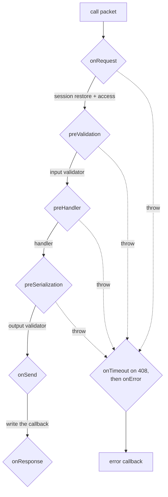

# Hooks

Cross-cutting behavior — authorization beyond `access`, tenancy, audit,
rate limits — lives in **hooks**: named lifecycle phases, in the fastify
tradition. There is deliberately no `(ctx, next)` middleware chain: a hook
runs and either returns (the pipeline continues) or throws a coded error
(the call ends with that code). "After the handler" is a **later phase**,
not code after a `next()` call — which is what keeps every hook a plain
awaited function, the order explicit, and the empty case a skipped `if`
rather than a chain of closures.

```js
const router = defineRouter(units, {
  hooks: {
    onRequest: async (context, packet) => {
      if (blocked.has(context.client.source)) {
        const error = new Error('Blocked');
        error.code = 403;
        throw error;
      }
    },
    preHandler: async (context) => {
      context.state.user = await loadUser(context.session);
    },
  },
});
```

## The pipeline



Diamonds are hook phases; the labels on the arrows are the machinery that runs
between them. Everything on the solid path can end the call by throwing —
`onResponse` runs after the write and cannot.

## Phases

| Phase | When | Payload | Typical use |
| --- | --- | --- | --- |
| `onRequest` | packet accepted, before session restore and access | the packet | rate limit, IP block |
| `preValidation` | after access, before `input` validation | raw args | roles, tenant, ACL |
| `preHandler` | after `input` validation | validated args | load the user, open a transaction |
| `preSerialization` | after the handler, before `output` validation | the result | redact fields (return a value to replace) |
| `onSend` | before the callback packet is written | the packet (mutable) | last-chance reshaping |
| `onResponse` | after the write | the packet | audit, metrics |
| `onError` | any failure | the error | reporting |
| `onTimeout` | a 408 specifically (before `onError`) | the error | timeout-specific signals |
| `onSubscribe` | after access, before a subscription starts | the packet | subscription quotas |
| `onUnsubscribe` | after a subscription ended, **whatever ended it** | the terminal packet | quota release |
| `onConnect` / `onDisconnect` | a client attached / went away (router-level only) | `null` / `{ rooms }` — the pre-destroy room snapshot | per-connection state |

Rules that hold everywhere:

- **A throw ends the call.** The error's numeric `code` becomes the wire
  code, and (for 4xx or `error.expose = true`) its message travels.
- **The observational phases are contained**: a throwing
  `onResponse`/`onError`/`onTimeout`/`onUnsubscribe`/`onConnect`/`onDisconnect`
  is logged and never breaks what it observes.
- **`context.state` is the hand-off**: what `onRequest` or `preHandler`
  loads is what the handler (and every later phase) reads.
- **The context knows its call**: `context.method` is the wire target
  (`'unit/name'`, `'unit.vN/name'`, or the event name for an inbound event)
  and `context.procedure` is the resolved [`Procedure`](./router#procedures)
  — so a cross-cutting logging or tracing hook reads the identity instead of
  re-deriving it from the packet. `context.procedure.meta` is the natural
  place for per-procedure hook configuration.
- **`onDisconnect` receives `{ rooms }`** — a snapshot of the client's rooms
  taken before teardown emptied the registry; by the time the hook runs,
  `client.rooms` is already empty (see [Rooms](./rooms#joining-and-leaving)).
- **Inbound events** run the invocation phases (`preValidation`,
  `preHandler`, `onError`); there is no packet to answer, so
  `onRequest`/`onSend` do not apply.
- **Subscriptions** run `preValidation`/`preHandler` around their setup and
  never per value — the value loop is the hottest path in the library and
  stays hook-free by design.
- `system/introspect` is a procedure like any other: router-level hooks
  apply to it (that is also why `introspection: 'session' | false` exists).

## Three levels, one flat pipeline

```js
const router = defineRouter(
  {
    billing: {
      hooks: { preHandler: requireTenant },   // this unit only
      charge: procedure({
        access: 'session',
        preHandler: requireRole('admin'),      // this procedure only
        handler: async (context, args) => { /* ... */ },
      }),
    },
  },
  { hooks: { onRequest: rateLimit } },         // every procedure
);

router.addHook('onError', reportToSentry);     // additive, after the fact
```

The levels flatten **once**, when the router is built: dispatch walks one
frozen array per phase — `router` hooks first, then the unit's, then the
procedure's — and a phase nobody registered costs a single length check.
`merge()` carries all three levels with it (router-level lists concatenate,
this router's first).

Like fastify's route-level hooks, a unit or procedure hook scopes behavior
to exactly the surface that owns it; `hooks` and `on` are the two reserved
keys inside a unit definition.

## Recipe: a rate limit

The `onRequest` phase plus a token bucket is a per-connection rate limit in
a dozen lines — no core option needed:

```js
const buckets = new WeakMap();

const rateLimit = (limit = 50, windowMs = 1000) => async (context) => {
  const key = context.client;
  let bucket = buckets.get(key);
  const now = Date.now();
  if (!bucket || now - bucket.start >= windowMs) {
    bucket = { start: now, used: 0 };
    buckets.set(key, bucket);
  }
  if (++bucket.used > limit) {
    const error = new Error('Rate limit exceeded');
    error.code = 429;
    error.expose = true;
    throw error;
  }
};

const router = defineRouter(units, { hooks: { onRequest: rateLimit(50) } });
```

Keyed by the `Client` (a `WeakMap`, so state dies with the connection);
key by session token or a header instead when limits should survive
reconnects. The built-in `maxCalls` cap bounds *concurrency* per
connection; this bounds *rate* — production deployments usually want both.

## Recipe: subscription quotas

`onSubscribe` refuses, `onUnsubscribe` releases — and because
`onUnsubscribe` fires on every ending (completion, error, unsubscribe,
disconnect), the quota cannot leak:

```js
const held = new WeakMap();

const hooks = {
  onSubscribe: async (context) => {
    const used = held.get(context.client) ?? 0;
    if (used >= 10) {
      const error = new Error('Subscription quota exceeded');
      error.code = 429;
      error.expose = true;
      throw error;
    }
    held.set(context.client, used + 1);
  },
  onUnsubscribe: async (context) => {
    held.set(context.client, (held.get(context.client) ?? 1) - 1);
  },
};
```
