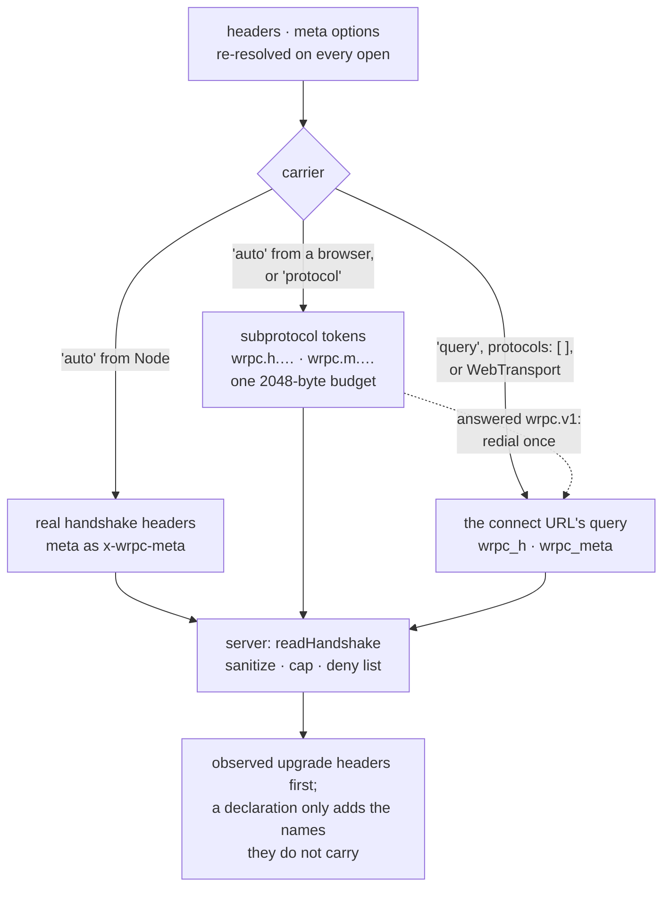

# Connection & call metadata

Three different things answer to the word "meta" in wRPC. They are deliberately
separate channels with separate contracts:

| Channel | Phase | Validated? | Read as |
| --- | --- | --- | --- |
| `headers` (client option) | connection only | **yes** — a procedure's [`schema.headers`](./rest#the-schema-option) | `client.meta.headers` / `context.meta.headers` |
| `meta` (client option + per call) | connection **and** every call | **no** — deliberately outside `validation` | `client.meta.data` (connection), `context.callMeta` (call) |
| [`procedure({ meta })`](./router#procedures) | declared by the router | — | `context.procedure.meta` |

Everything on this page is a **label**: something to log, meter, gate a
feature on, or route a support ticket by. None of it is an authorization
input — authorization is the [session's](./sessions) job, and nothing here
substitutes for one.

## What the server always observes

Every `Client` carries a frozen snapshot of what the peer presented when the
connection was made, whether or not the client declared anything:

```js
client.meta = {
  headers,       // request/upgrade headers ({} on a worker port)
  data,          // the client's declared `meta` option ({} when none)
  url,           // the request/upgrade URL with its query string
  remoteAddress,
  protocol,      // the negotiated WebSocket subprotocol ('' off ws)
};
```

`context.meta` mirrors it, the way `context.session` mirrors the session.
The whole object and both nested bags are frozen; `headers` and `data` are
null-prototyped, so a peer-chosen name like `toString` reads as `undefined`
rather than a real function.

## Key casing

Both declared bags — `headers` and `meta` — have their **keys normalized to
kebab-case**, on every transport and in both directions:

| You write | It arrives as |
| --- | --- |
| `userId` | `user-id` |
| `xAppVersion` | `x-app-version` |
| `XMLHttpRequest` | `xml-http-request` |
| `x-app-version` | `x-app-version` (already kebab, untouched) |
| `user_id` | `user_id` (underscores are left alone) |

One rule exists because HTTP forces it. A header name is case-insensitive
and every stack lowercases it, so `xAppVersion` would otherwise reach the
server as the unreadable run-on `xappversion` — while the same key over
WebSocket kept its capitals. Kebab-casing gives one spelling that survives
every carrier, and it is the spelling to write in
[`schema.headers`](./rest#the-schema-option).

::: warning Two consequences worth knowing
**Keys that differ only in acronym casing become the same key.** `userId`
and `userID` both reduce to `user-id`; the last one written wins. Normalize
at the source rather than relying on the difference.

**An external caller must write kebab themselves.** wRPC can only normalize
what its own client produced. By the time a hand-written
`-H 'x-wrpc-meta-userId: 1'` reaches the server, HTTP has already lowercased
it to `userid` and the word boundary is gone for good — no transform can
recover it.
:::

## Declared headers: the `headers` client option

```js
const client = await connect(url, {
  headers: () => ({ 'x-app-version': pkg.version, 'x-device': deviceId }),
});
```

Re-evaluated on **every** open — function form included — so a reconnect
presents fresh values instead of ones frozen at construction. How they
travel depends on the transport:

| Transport | Carrier |
| --- | --- |
| `http` | real request headers, on every packet POST and REST leg |
| `sse` | real request headers, on the stream GET and every POST |
| `ws` from Node | real request headers on the upgrade |
| `ws` from a browser | a **subprotocol offer**, `wrpc.h.<base64url>`, in `Sec-WebSocket-Protocol` |
| `event` (worker) | a field in the `wrpc:connect` message |
| `wt` | the connect URL's query (`wrpc_h` / `wrpc_meta`) — WebTransport has neither headers nor subprotocols |
| `broker` | message headers, on every stateless request and on a session's `hello` ([broker RPC](./brokers/rpc)) |
| `webrtc` | no request to carry them: over a raw channel the side that attaches it declares what it knows, `attachChannel(rpc, channel, { headers, data })`; over a `WrpcPeer` link, a peer's `data` is what it joined the signaling room with ([WebRTC](./webrtc#your-own-connection)) |

The browser row exists because a page cannot set a header on a WebSocket
handshake — not with the `WebSocket` constructor (its second argument is the
subprotocol list and nothing else), not with `fetch` (`Upgrade`,
`Connection` and `Sec-WebSocket-Key` are forbidden header names), and not
with a library: `ws` refuses to load in a browser, and socket.io's
`extraHeaders` reach only its polling requests there. The one handshake
header a page does control is the subprotocol offer, so that is what carries
the bag:

```
Sec-WebSocket-Protocol: wrpc.v2, wrpc.v1, wrpc.h.eyJ4LWFwcC12ZXJzaW9uIjoiMS4yLjMifQ
```

The server selects `wrpc.v2`, reads the token, and never selects or echoes
it. (A 1.0 server reads no token — it took the bag from the connect URL — and
answers `wrpc.v1`; the client then dials once more with the query, so the
labels arrive there too — and in the URL every access log keeps, which the
client says with `declared.exposed`. `carrier: 'query'` saves that second
handshake.)

::: warning A `wrpc.v1` answer is ambiguous
A 2.x server that sends no frames (`attachments: false`, a packet codec)
answers `wrpc.v1` too — and does read the tokens. The redial cannot tell the
two apart, so behind such a server a page still dials twice and still puts
its labels in the URL. The other way round, a page that offers `wrpc.v1`
alone — its own `attachments: false` — is never redialled: against a 2.x
server the tokens were read, against a 1.0 server they were not, and the
client can only say so (`handshake.ambiguous`, once). Either way the answer
is to choose the carrier: `carrier: 'query'` for a 1.0 server,
`carrier: 'protocol'` to keep the labels out of URLs.
:::
Node's built-in `WebSocket` has no such limit — it takes
`{ protocols, headers }` — so from Node the same option is simply real
headers, and the server needs nothing special to read them. Either way the
connect URL stays clean, and the server's read order is unchanged:
**observed upgrade headers first, a declaration only for names they do not
carry.**

### Choosing the ws carrier: `carrier`

| `carrier` | Node | Browser |
| --- | --- | --- |
| `'auto'` (default) | real headers | subprotocol tokens |
| `'protocol'` | subprotocol tokens | subprotocol tokens |
| `'query'` | `wrpc_h` / `wrpc_meta` on the connect URL | the same |



Wherever the client sends subprotocol offers at all (every case but `'auto'`
from Node and an empty `protocols` list, `'query'` included), a `Bearer`
authorization is lifted into an offer of its own, `wrpc.bearer.<token>`,
outside the budget.

`'query'` is the escape hatch for an intermediary that strips or rewrites
`Sec-WebSocket-Protocol`; it is also what happens under `protocols: []`,
because a token needs a protocol the server can answer next to it (a client
fails a handshake whose offers all went unanswered). WebTransport has neither
headers nor subprotocols and always uses the query.

A declaration is sanitized server-side, and every rule is a refusal, never
an error — an oversize or malformed label leaves the connection with no
label, not without a connection:

- capped on the **encoded** length (`metaMaxBytes`, default 2048). The two
  subprotocol tokens (`headers` + `meta`) share **one** budget, headers
  first; the query is measured whole, so application query parameters share
  it. Encoded means **after base64url**: a token is a third longer than the
  JSON it carries, so the default holds about 1.5 KB of JSON for headers and
  meta together — a large value (a JWT) belongs in [`bearerAuth`](./auth),
  whose Bearer rides outside the budget. The client applies the same cap and
  refuses an oversize bag with a `meta.oversize` warning instead of sending
  what the server would drop — **visible only with a `logger`**, which is off
  by default on the client: a bag that never arrives is a silent client until
  you turn it on (`meta.oversize`, `declared.unsendable`, `declared.exposed`,
  `handshake.fallback` are the lines to look for).
  Mind the host too: a handshake is an HTTP request, and uWebSockets.js
  allows **4096 bytes for all request headers** (`UWS_HTTP_MAX_HEADERS_SIZE`)
  where node allows 16 KB — a Bearer token rides outside the budget, so a
  large JWT plus two full bags can reach that limit;
- a flat `string → string` map only; names normalized to
  [kebab-case](#key-casing);
- reserved names dropped: `cookie`, `host`, `origin`, `forwarded`, `via`,
  `x-real-ip`, `x-client-ip`, `true-client-ip`, `cf-connecting-ip`,
  `fastly-client-ip`, `fly-client-ip`, `remote-user`, and the `sec-`,
  `content-`, `proxy-`, `x-wrpc-`, `x-forwarded-`, `x-auth-request-`
  (oauth2-proxy), `x-amzn-oidc-` (ALB), `x-goog-authenticated-user-` /
  `x-goog-iap-` (IAP) and `x-ms-client-principal` (Azure) prefixes — the
  names an identity-aware proxy sets about the user it authenticated, exact,
  so an application's own `x-auth-token` is not caught. A name that is not a
  header name at all (a space in it) is dropped too, and `_` counts as `-`
  against the list — `remote_user` is `remote-user` to nginx, CGI and the
  frameworks that fold one into the other. The list is about a
  hostile **page**: it controls exactly the connect URL and the subprotocol
  offers while the victim's cookie rides along by itself, so without the list
  it could forge a `cookie`, an `origin`, or the address a rate limiter
  reads when no proxy has set one. Real request headers are not filtered —
  `fetch` already refuses the dangerous ones on http/sse, and a peer outside
  a browser can send anything regardless. Beside the list, an **allowlist**
  narrows what may be declared at all: `new Server({ declaredHeaders:
  ['authorization'] })` keeps only those names from a declaration (`cookie`
  is never declarable, allowlisted or not). And `context.meta.declared`
  names which of `meta.headers` came from the declaration — a label the
  client attached, as opposed to a header the connection carried — so a
  handler that must not trust a label can tell;
- an own `__proto__` key never carried over.

::: warning Labels, not secrets
Neither default carrier touches the connect URL, which is what proxy access
logs and the browser's network panel keep — only `carrier: 'query'` and
`protocols: []` do — or the redial above — and the client warns
(`declared.exposed`) when an `authorization` header ends up there, and names
every declared header when the redial put them there. A subprotocol token is still a request
header anyone on the path can read and some proxies can log, so treat the
bags as labels. For credentials use [`bearerAuth`](./auth) — its token rides
as `wrpc.bearer.<token>` from a browser and as a real `Authorization` header
from Node — or the [`authenticate` hook](./client#authenticating) and the
session cookie.
:::

### Gating the handshake

Declared headers arrive with the upgrade request, so `verifyClient` can
refuse a client **before** the connection exists. No `Client` exists yet, so
the gate reads the request through `readHandshake` — the same function the
server runs a moment later, whichever carrier the client used:

```js
const { Server, readHandshake } = require('@alexify/wrpc');

const server = new Server({
  router,
  ws: {
    verifyClient: ({ req }) => {
      const { headers, meta } = readHandshake(req);
      return supported(headers['x-app-version']) && !banned(meta['device-id']);
    },
  },
});
```

`headers` is what `context.meta.headers` will be — declared names under the
observed ones, kebab-cased, reserved names dropped — and `meta` is what
`context.meta.data` will be. Both are peer-controlled labels: gate on them,
do not authenticate with them. Pass `{ metaMaxBytes }` when the server sets
its own.

For per-procedure requirements, declare [`schema.headers`](./rest#the-schema-option)
instead — it validates `context.meta.headers` with the injected ajv and
answers 400 with `/headers`-prefixed issues.

### CORS for custom names

`x-wrpc-meta` is already on the default `Access-Control-Allow-Headers` list.
A **custom** declared header on http/sse is a real request header, so a
cross-origin client's preflight fails until you name it:

```js
cors: { origins: [...], headers: 'Content-Type, x-wrpc-channel, last-event-id, x-wrpc-meta, x-app-version' }
```

The per-key meta spelling has its own option, because it adds a *set* of
names rather than one — `metaHeaders` appends to the list instead of
replacing it, so the defaults cannot be dropped by accident:

```js
cors: { origins: [...], metaHeaders: ['userId', 'locale'] }  // grants x-wrpc-meta-user-id, x-wrpc-meta-locale
```

Forget either and the metadata silently never arrives — the browser refuses
the request before it is sent.

## Unvalidated `meta`: connection and per call

The `meta` channel never runs through the `validation` option — by design.
It is a label for cross-cutting hooks (an idempotency key, a per-call trace
tag, an A/B cohort), and a schema on it would turn a cross-cutting concern
into something every procedure has to know about. A hook that wants checks
writes them in its own `onRequest`.

**Connection phase** — the option mirrors `headers`, lands on
`client.meta.data`:

```js
const client = await connect(url, { meta: { v: pkg.version, locale } });
```

Carried by the `x-wrpc-meta` request header (http/sse, and ws from Node;
percent-encoded JSON), a `wrpc.m.<base64url>` subprotocol offer (ws from a
browser — [the same carrier rules](#choosing-the-ws-carrier-carrier) as
`headers`, under the same shared budget), the `wrpc:connect` message
(worker), the connect URL's `wrpc_meta` query (wt), or a message header on
the broker binding.

### Choosing a spelling: `metaFormat`

```js
const client = await connect(url, { meta: { userId, locale }, metaFormat: 'prefixed' });
```

| | `'json'` (default) | `'prefixed'` |
| --- | --- | --- |
| http / sse wire | one `x-wrpc-meta` header | `x-wrpc-meta-user-id: 7`, one per key |
| ws from Node | one `x-wrpc-meta` header | `x-wrpc-meta-user-id: 7`, one per key |
| ws from a browser / worker wire | one JSON bag (`wrpc.m.` token, `wrpc:connect` field) | **unchanged** — one JSON bag |
| Value types | JSON (numbers stay numbers) | strings on **every** transport |
| CORS | one stable allowlist name | one entry per key — see [`cors.metaHeaders`](./server#cors) |

Reach for `'prefixed'` when something between your client and your handler
needs to read a single key: an API gateway routing on it, a WAF rule, an
access log. That is what the per-key spelling buys, and it is the same
`x-amz-meta-*` idiom S3 uses.

::: tip The guarantee is about the bag, not the wire
`'prefixed'` does not change the ws or worker wire — neither has headers.
What it changes on *every* transport is the **values**: they flatten to
strings everywhere, so the bag your handler observes never depends on which
carrier brought it. Objects are JSON-stringified; `null` and `undefined`
drop the key, because a header cannot say "absent".
:::

**Per call** — an optional `meta` field on `call`, `subscribe` and `event`
packets, surfaced as `context.callMeta`:

```js
// The escape-hatch spelling...
await client.call('orders/create', args, { meta: { idem: key } });
// ...and the bound variant on a scaffolded method.
await client.api.orders.create.withMeta({ idem: key })(args);
```

```js
// Server side — a frozen EMPTY object when the packet carried none:
onRequest: async (context) => {
  context.log.info({ idem: context.callMeta.idem, method: context.method });
},
```

A REST caller (curl, another service) passes the same thing over headers —
for a per-request client the connection *is* the call, so they double as
`context.callMeta`. Both spellings are accepted, the same two the wRPC
client chooses between with [`metaFormat`](#choosing-a-spelling-metaformat):

```bash
# The prefixed form — the S3 x-amz-meta-* idiom, one header per key,
# nothing to encode. Values arrive as STRINGS (the same by-design
# semantics as REST query args). Write the key in kebab-case: HTTP has
# lowercased the name before wrpc sees it, so `userId` arrives as the
# run-on `userid` and no transform can recover the boundary.
curl -H 'x-wrpc-meta-user-id: 9f3c' -H 'x-wrpc-meta-locale: de-CH' …

# The canonical form — percent-encoded JSON in ONE header. Type-faithful
# (numbers stay numbers) and one stable name on the CORS allowlist, which
# is why it is the client's default and why it wins a key collision with
# the prefixed form. Both spellings normalize to the same key, so that
# collision is real rather than two lookalike entries.
curl -H "x-wrpc-meta: $(node -p 'encodeURIComponent(JSON.stringify({ idem: \"9f3c\" }))')" …
```

The prefixed form exists for humans and infrastructure — gateways can
inject, strip or route on individual keys without JSON surgery. Its cost is
CORS: there are no header wildcards there, so a cross-origin caller needs
every key named in [`cors.metaHeaders`](./server#cors), where the canonical
header needs one entry forever.

On the client's **mapped REST leg** (a procedure with `http` called over the
http transport) the two channels are the same one, because there is no
packet for the field to ride: `withMeta` merges over the connection bag and
travels as request headers, the per-call half winning a key collision. A
REST request carries exactly one call, so nothing has to be aggregated.

### Per-call meta under batching

Over the http transport with [`batch`](./client#batching) enabled, several
calls share one POST — and one POST has one header block. So the headers
carry an **aggregate**: every call's meta merged in order, last write
winning. The two channels do different jobs:

| Channel | Carries | Under a batch |
| --- | --- | --- |
| the packet's `meta` field → `context.callMeta` | each call's exact meta | **untouched** — the source of truth |
| request headers → `context.meta.data` | the request's aggregate | lossy summary |

Nothing is lost by this: the exact per-call meta is in each packet, which
batching never rewrites. The header aggregate exists for what sits *between*
the two ends — a gateway routing on a tenant id, a WAF rule, an access log —
none of which will parse a JSON body to find it. Read `context.callMeta` in
a handler; read `context.meta.data` when you want what the request as a
whole was labelled with.

If the aggregate would exceed `metaMaxBytes`, the client drops it with a
`meta.oversize` warning — through its `logger`, off by default — and sends
the connection bag alone. That refusal is deliberate: the server's own cap
discards the *entire* bag, which would look like metadata that silently
stopped arriving.

Sanitizing is shared with the connection phase: a plain object or nothing,
capped by `metaMaxBytes` on the serialized size, own `__proto__` dropped
(so application code can spread the bag safely), frozen. A refused label
yields the empty default — the call itself always proceeds.

## Sharing metadata across a cluster

`client.meta` is **not** replicated into cluster
[`ClientDescriptor`s](./cluster) — descriptors travel per selected client on
every `fetchClients`, and replicating an arbitrary peer-controlled object
would multiply cross-node message size by the fan-in. `client.data` is the
replicated application bag; copy the two fields you care about, bounded and
explicit:

```js
hooks: {
  onConnect: (client) => {
    client.data.appVersion = client.meta.headers['x-app-version'] ?? null;
  },
},
```
