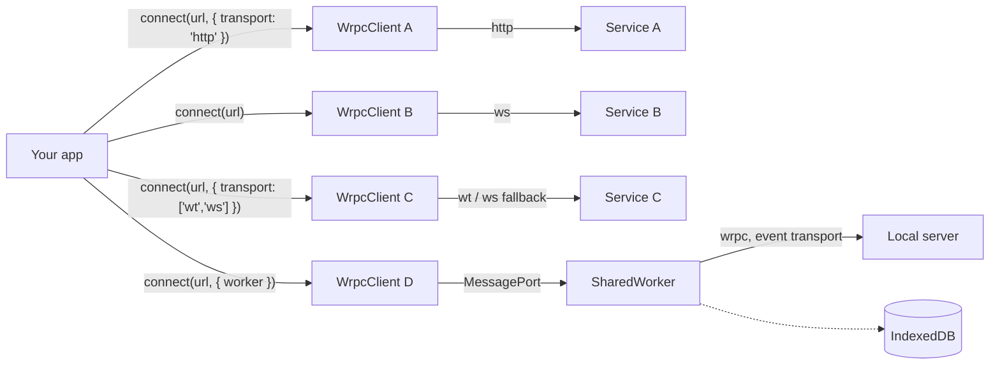

# Multiple backends

An app talking to several independent backends — a REST-ish service, a
realtime one, an edge service reachable only over WebTransport, plus a local
worker fronting IndexedDB — does not need a different hand-rolled client for
each. It needs one `WrpcClient` **instance per backend**.



## The model: one instance, one connection, one backend

`WrpcClient.connect()` (the `connect()` alias too) always resolves **one**
transport for **one** URL and returns **one** client
([Client](./client#transports)). There is no multi-endpoint client and no
built-in router that dispatches a call to "whichever backend owns this unit" —
composing several backends means holding onto several independent
`WrpcClient` values, exactly as you would hold onto several `fetch` base URLs
today.

That is a feature, not a gap to work around: each instance carries its own
transport, its own [reconnect backoff](./client#reconnecting), its own
[heartbeat](./client#heartbeat), and its own
[`authenticate`/`refresh`](./client#authenticating) hooks. A service that
needs a bearer token and one that doesn't never have to share a code path,
and a slow reconnect on one backend never blocks calls to another.

```js
const { connect } = require('@alexify/wrpc');

const svcA = await connect('https://svc-a.example.com/api', { transport: 'http' });
const svcB = await connect('wss://svc-b.example.com/api');                 // ws: the wss: default
const svcC = await connect('https://svc-c.example.com:4433/api', {
  transport: ['wt', 'ws'],                                                 // WebTransport, falling back to ws
  wt: { serverCertificateHashes: [{ algorithm: 'sha-256', value: hash }] },
});

await Promise.all([svcA.load('orders'), svcB.load('chat'), svcC.load('feed')]);
```

::: tip Not the same thing as transport fallback
`transport: ['wt', 'ws']` on `svcC` is [transport
fallback](./client#transport-fallback) — several ways to reach **one**
backend, tried in order. It is unrelated to running `svcA`/`svcB`/`svcC` side
by side, which is just three separate `connect()` calls. Don't reach for a
fallback list to talk to three different services; reach for three clients.
:::

## Typed, one contract per instance

Each `connect<Api>()` call takes its own type argument, so three backends
with three unrelated [contracts](./typed-client) coexist without conflict:

```ts
import { connect } from '@alexify/wrpc';
import type { ServiceAApi } from './contracts/service-a';
import type { ServiceBApi } from './contracts/service-b';
import type { ServiceCApi } from './contracts/service-c';

export const svcA = connect<ServiceAApi>('https://svc-a.example.com/api', { transport: 'http' });
export const svcB = connect<ServiceBApi>('wss://svc-b.example.com/api');
export const svcC = connect<ServiceCApi>('https://svc-c.example.com:4433/api', { transport: ['wt', 'ws'] });
```

A module per backend, exporting the pending client, is enough structure:
consumers `await` the export they need and the module caches the promise —
no registry or DI container required. Generate each contract independently
with the [codegen CLI](./cli) — `npx wrpc types https://svc-a.example.com/api
--out contracts/service-a.d.ts` — one run per backend, since each is its own
running server with its own `system/introspect`.

If these clients feed [`@alexify/wrpc/query`](./query), give each its own
`prefix` so their cache keys never collide in one `QueryClient`:

```js
const qa = createQueryUtils(await svcA, { queryClient, prefix: ['svcA'] });
const qb = createQueryUtils(await svcB, { queryClient, prefix: ['svcB'] });
```

## A local backend behind a worker

The [`event` transport](./client#workers) is what makes a fourth kind of
backend possible: one that isn't across the network at all, but behind a
`SharedWorker` (or a Service Worker) living on the same page. The worker
holds one real connection and every tab reaches it over a `MessagePort` —
useful for a backend backed by `IndexedDB`, where you want exactly one
writer, not one per tab.

```js
// idb-worker.js — runs inside the SharedWorker
const { WrpcClientProxy } = require('@alexify/wrpc');

const proxy = new WrpcClientProxy({ url: 'ws://localhost:4000/api', callTimeout: 7000 });
await proxy.open();
```

```js
// the page — one more client, alongside svcA/svcB/svcC. The URL is not used
// to open anything here (the worker already knows where to connect) — it
// only labels the client, so any string that names the backend will do.
const shared = new SharedWorker('/idb-worker.js', { name: 'wrpc-idb' });
const svcD = await connect('local:idb', { worker: shared });
```

::: warning `WrpcClientProxy` relays; it does not host your router
The proxy is a forwarder: it opens its own `WrpcClient` to a real
[`RpcServer`](./server) and shuttles packets between that connection and
every page's `MessagePort`. `RpcServer`/`attachPort` require Node built-ins
(`node:crypto` for [cluster](./cluster) auth, among others) and are not part
of the [browser bundle](./browser) — a `SharedWorker` cannot run one
in-process. If "local IndexedDB" means logic that never leaves the browser
(no server process behind it), keep that worker as a plain
`postMessage`/`IndexedDB` module; reach for the `event` transport when there
*is* a real wrpc server the worker should hold one shared connection to —
typically `localhost` in a desktop shell (Electron, Tauri) or during
development.
:::

::: warning One active `event` worker per page at a time
`ClientEventTransport` is cached as a **class-level singleton**
(`ClientEventTransport.getInstance`), keyed by nothing — not by `url`, not by
`worker`. The first `connect({ worker })` on a page opens the
`MessageChannel`; while that transport is still open, a **second**
`connect({ worker: otherWorker })` call in the *same page* reuses it as-is
and never reaches `otherWorker`. This does not affect the diagram above (one
`event` target, `svcD`), and it does not affect separate tabs each proxying
to the *same* worker — each page is its own singleton. It only bites if a
single page needs two different worker-backed backends at once; today that
needs two separate pages/frames, or a single worker that itself fans out to
both.
:::

## Independent lifecycles, one exception

Reconnection, heartbeats and auth are per-instance — a dropped `svcB`
reconnects on its own schedule without touching `svcA` or `svcC`. The one
shared surface is connectivity: [`WrpcClient.offline()` /
`WrpcClient.online()`](./client#offline-and-online) act on
`WrpcClient.connections`, the process-wide set of every live client,
so a browser `offline`/`online` event (wired up by
`WrpcClient.initialize()`) suspends and resumes **all four** backends
together — which is normally exactly what you want when the machine itself
lost its network.

Tear down the same way you set up — one `close()` per instance:

```js
await Promise.all([svcA.close(), svcB.close(), svcC.close(), svcD.close()]);
```
