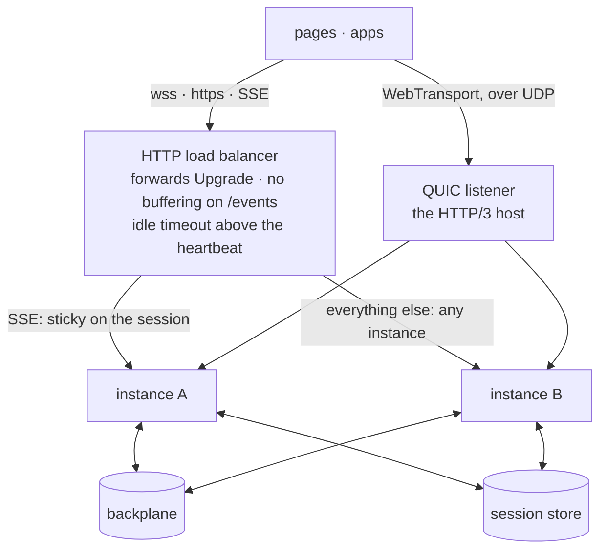

# Running in production

Everything on this page is about the boundary between your process and the
infrastructure around it: how a deploy drains, what a load balancer needs to
know, and which options stop being defaults once there is more than one
instance.

For the threat-model side, see [Security](./security). For what to watch, see
[Logging](./logging) and [OpenTelemetry](./telemetry).

## Graceful shutdown

A deploy that closes sockets mid-call turns a rollout into a burst of errors.
`close({ drain })` sequences the shutdown instead:

```js
const stop = async () => {
  await server.close({ drain: 10_000 });
  await backplane.close();   // yours to close — wrpc never closes an injected one
  process.exit(0);
};

process.on('SIGTERM', stop);
process.on('SIGINT', stop);
```

What that does, in order:

1. **Intake stops.** The listener closes, so the next health check fails while
   in-flight work is still finishing.
2. **`rpc.draining` flips true** and `rpc` emits `'draining'` once. New calls
   answer `503` — the code that tells a well-behaved client to reconnect
   somewhere else — and anything that pulls work on its own (a
   [broker](./brokers) consumer) stops fetching.
3. **In-flight calls get up to `drain` ms.** It resolves early the moment
   nothing is in flight.
4. **Every peer gets a `1001` "going away" close frame**, before the core
   evicts anyone. A client that receives 1001 reconnects on its own with
   [backoff](./client#reconnecting).
5. **What remains is torn down**, and open connections are closed hard.

::: warning Subscriptions are not waited for
A live feed has no natural end, so `drain` deliberately does not wait for one —
it is ended by the close that follows. Size `drain` against your slowest
**call**, not your longest subscription.
:::

Without `drain`, the same sequence runs with a zero-length window.

## Health checks

Point liveness at the process and readiness at the listener. Because intake
stops first, a readiness probe against the bound port fails as soon as the
shutdown begins — which is exactly when you want the load balancer to stop
sending new connections.

```js
await server.listen();
const { port } = server.address();
```

::: warning Read the address through `server.address()`
With a [standalone engine](../reference/engine#hosted-vs-standalone)
(uWebSockets.js) there is no `node:http` server at all: `server.httpServer` is
`null`, and `server.httpServer.address()` throws. `server.address()` covers
both shapes.
:::

## Naming the instance

```js
const server = new Server({
  router,
  backplane,
  instanceId: process.env.POD_NAME,   // stable across restarts, no '.' allowed
});
```

`instanceId` defaults to an id minted by `generateId`. Setting it to something
your orchestrator already knows makes [cluster](./cluster) presence,
descriptors and logs readable — `node-1` instead of a UUID.

It must not contain a `.`, because a client id is `<instanceId>.<generateId()>`
and the dot is the separator an addressed command splits on. That rule applies
to a generated id too: a `generateId` answering `a.b` is refused the same way a
hand-passed `instanceId` would be. Restart detection does not depend on the id
being fresh: every boot carries a new **epoch**.

## Identifiers

`generateId` replaces the default UUID everywhere ids are minted:

```js
let counter = 0;
const generateId = () => `${counter++}`;      // dense, short, per process

new Server({ router, generateId, instanceId: 'node-1' });
```

Two rules: it must return a **non-empty string of at most 255 characters**, and
ids must be unique within an instance — the `instanceId` prefix is what makes
them unique across the cluster. Short ids measurably shrink per-packet bytes on
chatty connections; UUIDs are the safe default when you have not thought about
it.

The option is checked once, at construction, by calling it. That first id is
not thrown away — it becomes the `instanceId` when you did not pass one — so a
counter-based generator still starts where you expect.

### What each generator owns

| Id | Generator | Notes |
| -- | --------- | ----- |
| `instanceId`, client ids, context uuids, server stream ids, REST packet ids | `generateId` on the server | One option covers all of them |
| Cluster boot epoch | `generateId` on the server | Fresh per boot; that is the point |
| [SSE](./sse) channel id | `generateId` on the server | Server-minted and never read from the request. An *identifier*, not a credential: the channel's secret is drawn by the server separately, so a counter is fine here |
| Packet, subscription and stream ids on the client | `generateId` on the [client](./client) | Also the [broker transport's](./brokers/rpc) session and correlation ids |
| Peer ids and the signaling `instance` | `generateId` on [`wrpcSignaler`](./webrtc) / `PeerHost` | |
| Consumer names, inboxes, message ids, group ids | `generateId` on each [broker adapter](./brokers) | Used verbatim — wRPC never truncates it |
| **Session token** | **`sessions.generateToken`** | A credential, not a correlation id. Deliberately a separate option so that widening one never widens the other |
| Subscription event ids | *not pluggable* | Monotonic by design: resume depends on their order |
| Rooms/event-log epochs | `rooms.epoch`, or random per boot | Short by design — an epoch prefixes every event id |

### When a generator is rejected

A generator that is not a function, or that answers something other than a
non-empty string of at most 255 characters, is a `TypeError` at construction —
on every option that takes one, `Server`/`RpcServer`, the client and `PeerHost`
included. (Those three shipped in 1.0 ignoring a bad value, so 1.x could only
report it through the logger under `event: 'options.generateId'` and fall back
to the default; 2.0 makes them throw like the options added since.)

The one-shot check cannot see a generator that only *sometimes* misbehaves, so
stream ids are re-checked every time one is minted.

## Behind a proxy

The list below, in one picture:



- **TLS.** Either run `protocol: 'https'` with `key`/`cert`, or terminate TLS
  at the proxy and run `'http'` behind it. Both are normal. If the box that terminates
  it is not yours, see [session encryption](./encryption#session).
- **Idle timeouts.** wRPC's own app-level
  [heartbeat](./client#heartbeat) is 30 s by default; keep the proxy's idle
  timeout above it or the proxy will close connections the client believes are
  healthy.
- **Upgrade headers.** The proxy has to forward `Upgrade`/`Connection` for
  WebSockets. This is the single most common "it works locally" failure.
- **Buffering.** SSE needs the proxy's response buffering **off** for
  `{basePath}/events`, or frames arrive in clumps.
- **WebTransport is UDP.** Its sessions reach the HTTP/3 host on a UDP port,
  not through the HTTP/1.1 proxy in front of the WebSocket: the load balancer
  needs a UDP (QUIC) listener for it, or the client's `['wt', 'ws']` fallback
  quietly lands every page on the WebSocket. See [Hosting](./wt#hosting).
- **Compression.** Nothing is compressed unless you turn it on, on any
  wire — a deliberate [performance choice](./performance#compression-is-off-by-default);
  [Compression](./compression) has the knob for each. For the WebSocket
  (`ws.perMessageDeflate`), a proxy that terminates WebSockets itself has to
  forward the `Sec-WebSocket-Extensions` offer, or the negotiation quietly
  ends at the proxy and no frame is ever compressed.

## Sticky routing

Two things live on the instance that created them, and both need affinity when
you run more than one:

- **[SSE](./sse) channels.** A misrouted request answers `409`; the built-in
  transport recovers by starting a fresh channel, so the failure mode is
  reconnect churn rather than breakage — but route on the session cookie and it
  will not happen.
- **[Event logs](./subscriptions#event-log-ids-carry-an-epoch).**
  `createEventLog()` is per-process memory. Its ids are epoch-stamped so a
  client resuming against a different instance presents a foreign epoch,
  `since()` answers `null`, and the handler sends a snapshot — visibly degraded
  instead of silently lossy.

Plain WebSocket calls, events, rooms and subscriptions need **no** affinity
once a [backplane](./scaling) is configured.

## Backpressure and buffering

The engine limits decide when a slow peer stops being your problem:

| Option | What it does |
| --- | --- |
| `maxBackpressure` | Outbound bytes buffered for one connection before it is dropped — the engine's for a socket, `attachSession`'s for a WebTransport session, a `WrpcPeer`'s `host` (or `attachChannel`) for a data channel. |
| `maxBuffer` | Inbound assembly buffer per connection. |
| `fragmentThreshold` | Above this, an outbound message is sent fragmented. |
| `maxPayload` | Largest inbound message (16 MiB default). |

For streams, honour `write()`'s return value and `'drain'` — that is what
carries backpressure all the way into TCP; see [Binary streams](./streams#backpressure).

## A deploy checklist

- [ ] `cors.origins` set, `credentials: true` if sessions are used
- [ ] Session store is not `MemorySessionStore`
- [ ] `SIGTERM` calls `close({ drain })`; the backplane is closed after
- [ ] `instanceId` comes from the orchestrator
- [ ] Readiness probe hits the bound port; `server.address()` is how it is read
- [ ] Proxy forwards upgrades, idle timeout > heartbeat, SSE buffering off
- [ ] Compression decided — it is off by default; `perMessageDeflate` with a `filter` for the peers that need it, `compression` on the other wires
- [ ] [Encryption](./encryption) decided for whatever leaves the process past TLS — the backplane, a broker, the session store
- [ ] WebTransport, if used: a UDP listener for the HTTP/3 host, and a certificate a browser accepts
- [ ] Sticky routing on the session cookie if SSE or event logs are used
- [ ] A [logger](./logging) is injected — the default writes to `console`
- [ ] `introspection` decided; per-connection limits reviewed
