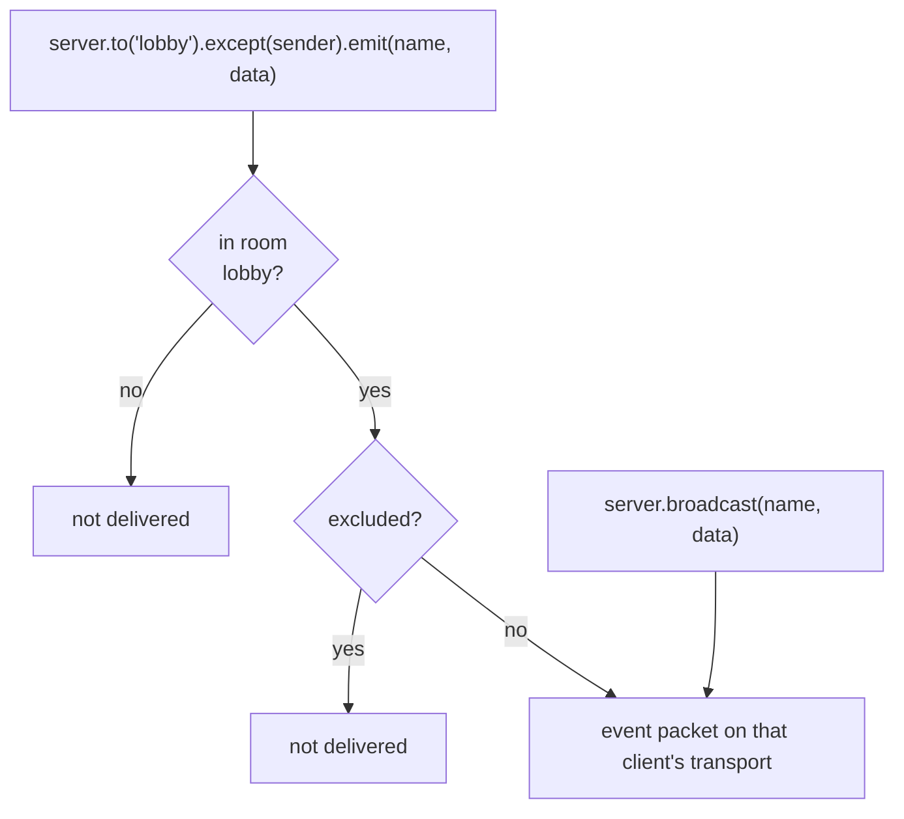

# Rooms & events

An **event** is a fire-and-forget message: no id, no acknowledgement, no
answer. That is what makes it cheap, and it travels in both directions. A
**room** is a named set of clients to send one to.

Neither is a new packet type — a room broadcast is the ordinary `event` packet,
delivered to every member.

## Server → client

```js
// one client
context.client.sendEvent('chat/message', { text: 'hi' });

// a room
context.server.to('lobby').emit('chat/message', { text: 'hi' });

// a room, minus the sender
context.server.to('lobby').except(context.client).emit('chat/message', { text: 'hi' });

// everyone connected
context.server.broadcast('system/announce', { up: true });
```



An event name is `unit/name`. The client dispatches on the `unit` half:

```js
await client.load('chat');
client.api.chat.on('message', ({ text }) => console.log(text));
```

Anything that reaches no listener — an event for a unit the client never
loaded, or a name nothing subscribed to — surfaces as `unhandled-event` on the
client itself rather than vanishing:

```js
client.on('unhandled-event', ({ name, data }) => console.warn('nobody listened to', name));
```

Events need a connection that stays open, so they are refused on plain HTTP
with code `400` — an unanswerable packet on a request/response transport would
leave the request hanging forever.

## Client → server

```js
client.sendEvent('chat/typing', { who: 'ada' });
```

Handled by the unit's reserved `on` map in the [router](./router#units-and-versions):

```js
defineRouter({
  chat: {
    on: {
      typing: procedure({
        access: 'session',
        handler: async (context, data) => { /* ... */ },
      }),
    },
  },
});
```

Handlers are procedures, so `access`, `input` and `queue` all apply. What they
cannot do is answer: there is no id to answer on. A rejected inbound event —
unknown handler, missing session, failing handler, invalid input — is recorded
in the server log and nothing comes back. If you need an answer, it is a call.

## Joining and leaving

```js
context.client.join('lobby');      // true when it was not already a member
context.client.leave('lobby');
context.client.in('lobby');        // boolean
context.client.rooms;              // Set<string>, a copy
```

Rooms are released automatically when a client disconnects — there is no
cleanup to forget. The registry owns both directions (which clients a room
holds, which rooms a client joined), so a disconnect is one `leaveAll` call.
That release runs **before** the router's `onDisconnect` hook, so inside the
hook `client.rooms` is already empty — the hook's payload carries a
`{ rooms }` snapshot taken just before teardown, which is how a presence
hook learns what the client was in:

```js
defineRouter(units, {
  hooks: {
    onDisconnect: (client, { rooms }) => {
      for (const room of rooms) server.to(room).emit('presence/left', { id: client.id });
    },
  },
});
```

Inspect the registry through `server.rooms`:

```js
server.rooms.has('lobby');       // boolean
server.rooms.count('lobby');     // number of members here
server.rooms.members('lobby');   // Set<Client>
server.rooms.list();             // every non-empty room
server.rooms.size;               // how many of those there are
```

## The Broadcast object

`to()`, `except()` and `local()` all return a **new** `Broadcast`. A stored
target cannot be mutated from somewhere else later:

```js
const lobby = server.to('lobby');
lobby.except(someone).emit('a', {});   // this call only
lobby.emit('b', {});                   // still the whole lobby
```

Three rules worth committing to memory:

- **`to()` unions.** `to('a').to('b')` reaches either room, and a client in
  both gets exactly one copy.
- **`to()` with no rooms reaches nobody.** A computed room list that came back
  empty must never fall back to every connected client.
- **`emit()` returns the number of LOCAL recipients.** With a
  [backplane](./scaling), other instances are reached too — that number says
  nothing about them.

`local()` suppresses the backplane publish, keeping an event on this instance.
It exists for cases where an event is already being fanned out by something
else; without a backplane it does nothing.

## Asking a room

`ask()` is `emit()` that waits for answers. Each receiving client registers
one responder per event name; the broadcast collects every answer and every
failure — it never rejects, because a question with many answerers has no
single failure:

```js
// Browser
client.respond('chat/poll', async ({ question }) => ({ vote: 'yes' }));

// Server
const { answers, errors, expected, incomplete } =
  await server.to('chat').ask('chat/poll', { question: 'ready?' }, { timeout: 5000 });
```

- `answers` — what the responders returned; `errors` — per-client failures
  (`501` no responder, `408` timeout, `503` disconnected mid-question).
- `expected` — how many clients were asked, across every instance with a
  [backplane](./scaling); `local()` keeps the question here.
- `incomplete` — `true` only when a remote instance never reported back.

One peer is asked directly with `client.ask(name, data, { timeout })`, which
resolves with that answer or rejects with the same codes. On the wire an ask
is the ordinary event packet plus an `id`, answered by the ordinary
`callback` — see the [protocol](../reference/protocol#event-both-directions).

## The client

Every client has an `id` (instance-prefixed — the [cluster](./scaling)
addresses commands with it) and a `data` bag the application may fill;
`fetchClients` descriptors carry both.

`context.client` is the server-side handle to one peer. Beyond rooms and
sessions:

| Member | What it is |
| --- | --- |
| `client.sendEvent(name, data)` | Send an event to this peer (`emit` is the local `Emitter` emit). |
| `client.ask(name, data, opts)` | Send an event and await the peer's registered answer. |
| `client.send(packet)` | Send a raw packet. `false` when the transport is above its high-water mark. |
| `client.drain()` | Resolves when the transport drained — or when it closed. |
| `client.persistent` | `false` on HTTP: no events, no subscriptions, no streams. |
| `client.binary` | `false` on a text-only transport ([SSE](./sse)). |
| `client.session` | The [session](./sessions), or `null`. |
| `client.close()` / `destroy()` | Close the transport / tear the client down. |

`persistent` and `binary` are how a handler stays honest across transports: the
same procedure can be reachable over HTTP for the call and skip the
event-emitting half when it is.

## Compression

A broadcast is serialized once, and on the built-in engine framed and
deflated once too — one shared frame per emit, per negotiated window, rather
than one deflate per member (the numbers are in
[performance](./performance#fan-out)). Compression itself is negotiated per
connection, and the server's `perMessageDeflate.filter(req)` chooses which
peers get it. Per message, opt out when the payload is already compressed
or latency matters more than bytes:

```js
context.server.to('lobby').emit('media/chunk', base64Jpeg, { compress: false });
context.client.sendEvent('game/tick', state, { compress: false });
```

The flag is ignored on connections that never negotiated deflate — which is
every connection until the server passes `perMessageDeflate`; it is
[off by default](./performance#compression-is-off-by-default).

## Delivery, and what to do when it has to be guaranteed {#delivery}

A room emit is a **fire-and-forget fan-out**: no id, no acknowledgement,
at-most-once across instances (the [backplane](./scaling#at-most-once-and-what-to-do-about-it)
reports what it lost, it does not replay it). That is the right contract for
presence, cursors, typing indicators and every other event a later one
supersedes. When a client must not miss anything — a chat history, an order
book's deltas — the replayable thing in wrpc is a **subscription**, not a
room, and three recipes cover the cases:

**A broker-backed feed.** A broker (Kafka, RabbitMQ, NATS, a Redis stream)
guarantees delivery to your *server*, not to a browser: the last hop still
loses whatever was in flight during a reconnect unless the server replays
from where the client left off. The offset the broker already keeps is the
event id, and [`brokerFeed`](./brokers/feeds) is that subscription, resuming
on any instance:

```js
const { brokerFeed } = require('@alexify/wrpc/broker');

feed: procedure.subscription({
  access: 'session',
  handler: brokerFeed(broker, 'chat.lobby', { onGap: (ctx) => loadRecent(ctx) }),
}),
```

**A room-backed feed.** For events that originate in this process, keep an
[event log](./subscriptions#resuming) next to the room and serve the
subscription from it; the room emit stays for the members who only want
"now":

```js
const log = createEventLog({ size: 1000 });
const bus = new Emitter();

const post = (ctx, message) => {
  const id = log.push(message);              // one id for both audiences
  ctx.server.to('chat').emit('chat/message', message);
  bus.emit('message', tracked(id, message));
};

history: procedure.subscription({
  handler: async function* (ctx, args, { lastEventId, signal }) {
    const missed = log.since(lastEventId);
    if (missed === null) yield { type: 'snapshot', items: await loadRecent() };
    else for (const item of missed) yield item;
    for await (const item of createEventStream(bus, 'message', { signal })) yield item;
  },
}),
```

**An acknowledged emit.** When the sender needs to know the event *arrived*,
ask instead of emitting — [`ask()`](#asking-a-room) is the same event packet
with an id, and each client's answer is its acknowledgement:

```js
const { answers, expected, incomplete } = await ctx.server.to('ops').ask('deploy/notice', payload);
if (incomplete || answers.length < expected) escalate(expected - answers.length);
```

What wrpc deliberately does not have is a per-room replay buffer with a
client that "rejoins from an id": it would duplicate subscriptions, and it
would need a new concept inside the [frozen 1.0 protocol](../reference/protocol#stability).
If you need a queue's guarantees, you need a queue — and a subscription is
how its offsets reach the browser.

## Rooms and reconnects

Membership is **per connection**: a reconnect is a NEW server-side client,
and it is in no rooms — unlike subscriptions, which the client restores
itself, nothing re-joins rooms automatically (the server cannot know which
memberships were state and which were a one-off).

The canonical pattern stores memberships in the session and re-applies them
with a [hook](./hooks):

```js
const router = defineRouter(
  {
    chat: {
      join: procedure({
        handler: async (context, { room }) => {
          context.client.join(room);
          // The session is what survives the connection.
          const rooms = new Set(context.session.state.rooms ?? []);
          rooms.add(room);
          context.session.state.rooms = [...rooms];
          return { ok: true };
        },
      }),
    },
  },
  {
    hooks: {
      onConnect: async (client) => {
        await client.sessionReady;
        for (const room of client.session?.state.rooms ?? []) client.join(room);
      },
    },
  },
);
```

The client sees a seamless story: reconnect, session restored from the
cookie, `onConnect` re-joins, and the next room broadcast reaches it again.

Two guarantees make this recipe safe to rely on:

- **`client.sessionReady` is assigned before the hooks run**, so the `await`
  in the hook really waits for the cookie restore instead of a resolved
  default.
- **Dispatch gates on `client.ready`** — the session restore *plus* the
  settled `onConnect` hooks — so a call or subscribe racing the reconnect is
  handled only after the re-join. The two promises are separate on purpose:
  a hook may await `client.sessionReady`, and folding the hooks into that
  same promise would make such a hook wait for itself. The flip side: a hook
  that never settles now holds the client's dispatch — after 5 s the server
  logs `onConnect.stalled` so the hang leaves a trace.
