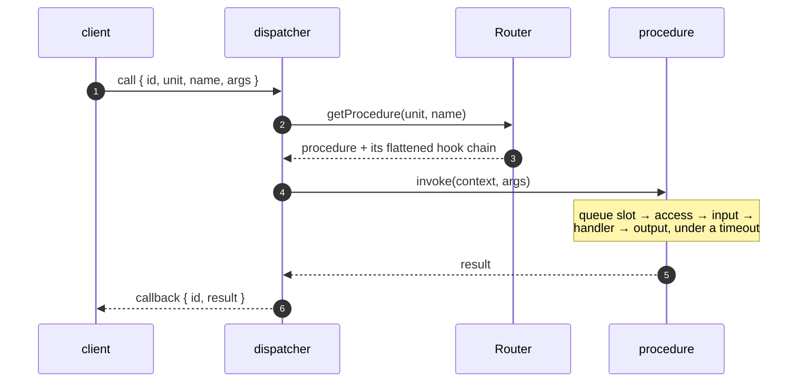

# Router & procedures

A router is a plain object of units, each holding procedures. It is the one
thing the server needs to know, and the thing `system/introspect` describes to
clients.

```js
const { defineRouter, procedure } = require('@alexify/wrpc');

const router = defineRouter({
  chat: {
    send: procedure({
      access: 'session',
      input: (args) => {
        if (typeof args?.text !== 'string') throw new Error('text is required');
      },
      handler: async (context, { text }) => ({ id: await store.append(text) }),
    }),
  },
  'auth.1': {
    signIn: procedure({ access: 'public', handler: async (context, args) => { /* ... */ } }),
  },
});
```

## A call, end to end



A failure takes the same path back: the procedure throws, and the client
receives `callback { id, error: { code, message } }` with the error's numeric
`code`. Nothing about that shape depends on the transport — the same exchange
happens over [HTTP](./server), [SSE](./sse) and a Service Worker port.

## Procedures

`procedure(options)` builds one. Everything but `handler` is optional:

| Option | Default | Meaning |
| --- | --- | --- |
| `handler` | — | `(context, args, subscription) => result`. Required. |
| `access` | `'session'` | `'public'` is callable by anyone. **Any other value requires a session.** |
| `input` | — | Validates/coerces the arguments. Failure is code `400`. |
| `output` | — | Validates/coerces the result. Failure is code `500`. |
| `timeout` | `0` | Milliseconds; exceeding it fails the call with code `408`. |
| `queue` | — | `{ concurrency, size, timeout }`; overflow fails with code `503`. |
| `meta` | `{}` | Free-form; surfaced by introspection. `meta.description` becomes a doc comment in generated types. |
| `signature` | — | A descriptor for [codegen](./cli), not validation. |
| `kind` | inferred | `'call'` or `'subscription'`; an async generator handler is detected. |

Three spellings are accepted wherever a procedure goes, so the simple case
stays simple:

```js
defineRouter({
  math: {
    double: procedure({ access: 'public', handler: async (ctx, { n }) => n * 2 }),
    triple: { access: 'public', handler: async (ctx, { n }) => n * 3 },  // options object
    quadruple: async (ctx, { n }) => n * 4,                              // bare function
  },
});
```

A bare function gets the defaults — which means `access: 'session'`. That is
deliberate: forgetting to declare access should close a procedure, not open it.

### Access

The dispatcher's rule is exactly one line: a client with no session may call
`access: 'public'` and nothing else. Any other string — `'admin'`,
`'internal'` — behaves like `'session'` at that gate and is carried through
introspection for your own layer to interpret. Fine-grained authorization is
not wrpc's job; do it in the handler, or with a policy engine.

### Validators

An `input`/`output` validator is either a plain function or a
[Standard Schema](https://standardschema.dev) object — which means Zod, Valibot,
ArkType and friends plug in **without wrpc depending on any of them**:

```js
const { z } = require('zod');

procedure({
  input: z.object({ text: z.string().min(1) }),
  output: z.object({ id: z.string() }),
  handler: async (context, { text }) => ({ id: '1' }),
});
```

A function validator returns the (possibly coerced) value, or throws.
Returning `undefined` keeps the original — so a pure assertion needs no
`return`:

```js
procedure({
  input: (args) => {
    if (!args?.room) throw new Error('room is required');
  },
  handler,
});
```

On a subscription, `output` validates **each yielded value**, and it sees the
payload rather than the [`tracked()`](./subscriptions#resuming) wrapper: a
schema describes what the client receives, not how it is labelled.

### Timeouts and queues

```js
procedure({
  timeout: 5000,
  queue: { concurrency: 10, size: 100, timeout: 1000 },
  handler: async (context, args) => expensive(args),
});
```

`timeout` rejects the **caller** with code `408`. It does not cancel the
handler — nothing in JavaScript can — so a handler that should stop when
nobody is listening must watch `context.signal`.

`queue` is a semaphore: `concurrency` run at once, up to `size` wait, and a
waiter gives up after `timeout`. Both overflow and starvation fail with code
`503`. The slot is held until the handler settles, not until the caller is
answered, so a timed-out call still occupies its slot — anything else would
break the concurrency guarantee it exists to provide.

Neither is available on a subscription: a feed lives until it is cancelled, so
both would have to mean something else, and quietly meaning something else is
worse than refusing. `procedure.subscription({ timeout })` throws.

## The context

Every handler's first argument:

| Member | What it is |
| --- | --- |
| `context.client` | The [`Client`](./rooms#the-client) — rooms, events, streams, sessions. |
| `context.session` | The [`Session`](./sessions), or `null`. |
| `context.server` | The `RpcServer` this call arrived on — how a handler reaches rooms. |
| `context.signal` | Aborted on cancel, unsubscribe or disconnect. |
| `context.state` | A per-call scratch object. |
| `context.uuid` | The call id. |

Use `context.server` rather than closing over the server you created: the
router is usually defined before the server that serves it exists.

```js
handler: async (context, { room, text }) => {
  const sent = context.server.to(room).except(context.client).emit('chat/message', { text });
  return { sent };
},
```

## Units and versions

A unit key is `unit` or `unit.version`. Both live side by side, and a client
loads whichever it wants:

```js
defineRouter({
  auth: { signIn: procedure({ /* the default version */ }) },
  'auth.1': { signIn: procedure({ /* the pinned one */ }) },
});
```

```js
await client.load('auth');    // the default version
await client.load('auth.1');  // the pinned one
```

On the wire that is the `method` string: `auth/signIn` or `auth.1/signIn`.
`'unit.1.2'` is rejected outright rather than silently truncated.

`on` is **reserved** inside a unit — it holds the unit's inbound event
handlers, so no method may be called `on`. `hooks` is reserved too: the
unit's slice of the [lifecycle pipeline](./hooks). Neither is usable as a
method name:

```js
defineRouter({
  chat: {
    send: procedure({ /* ... */ }),
    on: {
      typing: procedure({ access: 'session', handler: async (context, data) => { /* ... */ } }),
    },
  },
});
```

Event handlers are procedures too, so `access`, `input` and `queue` all apply.
An event never answers, though — a rejected one is logged, not reported. See
[the protocol reference](../reference/protocol#event-both-directions).

## Composing routers

`merge()` returns a **new** router; on a collision the other router's procedure
wins:

```js
const router = defineRouter(core).merge(defineRouter(plugins));
```

That is also how `system/introspect` gets there: the server merges it in unless
your router already defines one, so you can replace it (to hide units from
anonymous clients, say) simply by declaring `system.introspect` yourself.

## Introspection

`router.introspect(units?)` is what `load()` and `wrpc types` consume:

```jsonc
{
  "chat": {
    "send":      { "access": "session", "meta": { "description": "Post a message" } },
    "onMessage": { "access": "session", "kind": "subscription" }
  },
  "auth.1": { "signIn": { "access": "public" } }
}
```

`kind` appears only on subscriptions — a client scaffolds a call unless told
otherwise. The full shape, including the `signature` descriptor, is in
[the protocol reference](../reference/protocol#introspection).
