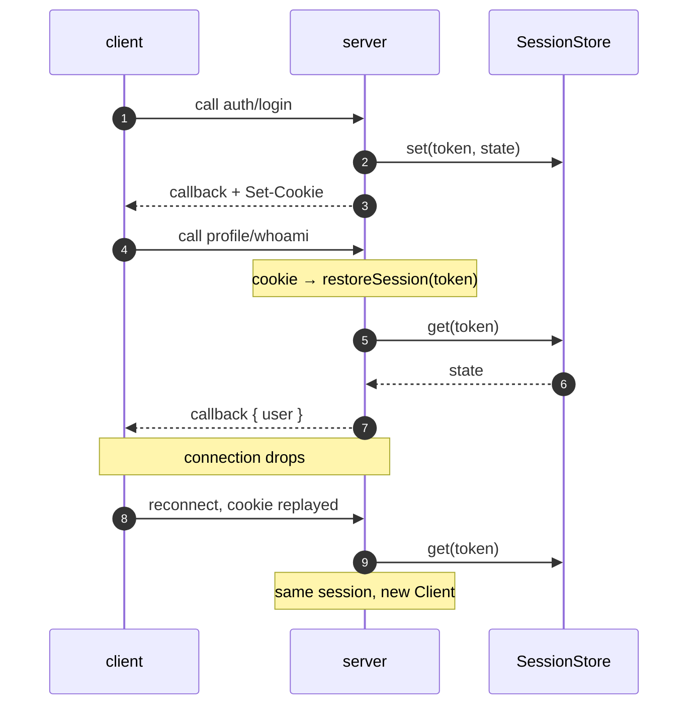

# Sessions

A session is a **token** plus a **state object** held in a store. The token
travels in a cookie; the state is whatever your handlers put there.

```js
defineRouter({
  auth: {
    login: procedure({
      access: 'public',
      handler: async (context, { user, password }) => {
        await verify(user, password);
        context.client.startSession(undefined, { user });
        return { ok: true };
      },
    }),
    logout: procedure({
      access: 'session',
      handler: async (context) => context.client.finalizeSession(),
    }),
  },
  profile: {
    whoami: procedure({
      access: 'session',
      handler: async (context) => ({ user: context.session.state.user }),
    }),
  },
});
```

## Reading and writing state

`context.session.state` is a proxy: assigning to it persists to the store, with
no `save()` call to forget.

```js
handler: async (context) => {
  context.session.state.lastSeen = Date.now();   // written through to the store
},
```

The write is fire-and-forget — a store error is logged, not thrown at the
handler. Mutating a nested object (`state.prefs.theme = 'dark'`) does **not**
trigger a save, because only the top level is proxied; reassign the whole
branch instead.

## The client API

These live on `context.client`:

| Method | What it does |
| --- | --- |
| `startSession(token?, data?)` | Creates a session **and** sends the cookie. What a login calls. |
| `initializeSession(token?, data?)` | Creates it without touching cookies. |
| `restoreSession(token)` | Loads one from the store. `false` if it is gone. |
| `finalizeSession()` | Deletes it from the store and drops it. `false` if there was none. |

`token` defaults to a freshly generated one; pass your own to adopt an existing
identifier.

::: warning A login over WebSocket sets no cookie
A `Set-Cookie` header needs a response, and an open socket has none.
`startSession` therefore only emits the cookie on HTTP transports; over a
WebSocket it creates the session for that connection alone. If you want the
session to survive a reconnect, log in over HTTP (the browser stores the
cookie) and let the WebSocket upgrade restore it — which it does, from the same
cookie.

The counterpart for everything the cookie cannot reach: the client's
[`authenticate` hook](./client#authenticating) re-presents the credential on
every reconnect, *before* the subscriptions are re-opened and the units
re-loaded. On a Node client — whose `WebSocket` sends no cookies at all — it
is the **only** way a session survives a reconnect.
:::

A dropped connection never deletes the session from the store. That is exactly
what makes a reconnect cheap: sessions end through `finalizeSession()` or
store-side expiry, and nothing else.

## The lifecycle



A reconnect is a **new server-side client** carrying the **same session**: the
cookie is what survives the socket. That is why room membership has to be
re-applied by hand ([rooms](./rooms#rooms-and-reconnects)) while session state
simply reappears.

## Cookies

```js
new Server({
  router,
  sessions: {
    cookie: { name: 'token', path: '/', httpOnly: true, secure: true, sameSite: 'Lax', maxAge: null },
  },
});
```

Those are the defaults. `maxAge: null` makes it a session cookie — gone when
the browser closes. The cookie is read back on **both** an HTTP request and the
WebSocket upgrade, which is what restores a session without a round trip.

::: tip `secure: true` and localhost
Browsers refuse a `Secure` cookie over plain `http://` — except on
`localhost`, which they treat as a secure context. So the default works in
development and stays correct in production. If you terminate TLS at a proxy
and genuinely serve plain HTTP on a real hostname, you will need
`secure: false`, and you should understand what you are giving up.
:::

### The cross-site GET gate

A `SameSite=Lax` cookie rides along on cross-site **navigation**. That is
convenient for ordinary web pages and dangerous for an RPC endpoint: an
attacker's page could point a browser at
`{basePath}/account/deleteEverything` and the cookie would come along.

So in [REST mode](./server#what-it-serves), a `GET`/`HEAD` request only gets its
cookie-restored session when the request proves same-origin intent through
`Sec-Fetch-Site`. A cross-site one runs anonymously — public procedures only,
`403` for the rest. Packet-mode `POST`s are unaffected, and non-browser peers
(curl, server-to-server), which send no Fetch metadata at all, keep their
session.

## Stores

The store contract is structural — three async methods, no base class to
extend:

```js
const store = {
  async get(token) { /* -> state | null */ },
  async set(token, state) {},
  async delete(token) {},
};

new Server({ router, sessions: { store } });
```

Which is how Redis, a database table, or a signed-cookie store plug in
**without wrpc depending on any of them**. The default is
`MemorySessionStore`, bounded on both axes:

```js
const { MemorySessionStore } = require('@alexify/wrpc');

new Server({
  router,
  sessions: { store: new MemorySessionStore({ maxSessions: 10000, ttl: 24 * 60 * 60 * 1000 }) },
});
```

LRU eviction past `maxSessions`, expiry after `ttl` (`0` disables either).
It is a real store, not a stub — but it lives in one process, so a second
instance shares nothing with it. Anything running more than one process wants
an injected store.

## Tokens

```js
new Server({ router, sessions: { generateToken: () => myUlid() } });
```

The default is a v4 UUID from `node:crypto` (or `globalThis.crypto` in a
browser build). Whatever you substitute must be unguessable: it is the whole
credential.

## Pluggable token carriers

*Where* the token lives on the wire is an injection like the store —
`sessions.transport`, structural (`isTokenTransport`), with the cookie
behaviour as the byte-identical default:

```js
// { read({ headers, url, declared, meta }) -> token | null,
//   write(token) -> Set-Cookie-style header value | null,
//   ambient?: boolean }
new Server({ router, sessions: { transport: myTransport } });
```

Besides the raw `headers`/`url`, `read()` receives what the core already
parsed: `declared` — the merged declared+observed header bag (the ws
`wrpc_h` query included, capped on the configurable `metaMaxBytes`) — and
`meta`, the sanitized connection-metadata bag with **both** `x-wrpc-meta`
spellings merged and keys kebab-normalized. Prefer them over re-parsing the
wire: a strategy with its own parser can silently drift from the core's.
(Both are absent on the SSE channel-key path, so keep a raw-header fallback
for the names you read.)

Two ready-made strategies ship in the **`@alexify/wrpc/auth`** subpath —
deliberately outside the base bundle, like the rooms backplane in
`./scaling`:

```js
const { bearerTransport, payloadTransport } = require('@alexify/wrpc/auth');
new Server({ router, sessions: { transport: bearerTransport() } });
```

- **`bearerTransport()`** reads `Authorization: Bearer <token>` — the real
  header where the transport can send one (http/sse, curl); on browser ws,
  where the WebSocket constructor cannot set headers, the client offers the
  token as a **`wrpc.bearer.<token>` subprotocol** next to the wire
  revision, so the credential travels as a real upgrade header and **never
  lands in the connect URL** (URLs end up in proxy access logs — see the
  [metadata caveat](./metadata#declared-headers-the-headers-client-option)). A token
  outside the RFC 7230 token charset (spaces, `=` padding) cannot ride a
  subprotocol and falls back to the declared-headers query, with a warning.
- **`payloadTransport({ field })`** reads a field of the client's declared
  `meta` — for apps that keep `authorization` semantics out of it. Both
  `x-wrpc-meta` spellings are read, the canonical JSON header and the
  per-key `x-wrpc-meta-<field>` form.

Two asymmetries every non-cookie strategy inherits, both by construction:

- **The server cannot *send* `Authorization`.** `write()` returns null; the
  `signIn` handler hands the token pair back **in its result**, the client
  stores it (see the client half below) and presents it on the next
  connection. Neither half works alone — the pair is the strategy.
- **The safe-method CSRF rule does not apply.** That rule guards *ambient*
  authority — a cookie the browser attaches without script. A bearer
  credential is script-attached, so a non-ambient transport
  (`ambient: false`) restores on safe methods too, cross-site fetch headers
  or not.

### The client half: stores and `bearerAuth()`

The same subpath carries the client side: token **stores**
(`get`/`set`/`delete`, sync or async — a `Map` already qualifies) and
`bearerAuth()`, which composes a store with your `signIn`/`refresh` calls
into the three [client options](./client#authenticating) that make the
strategy work end to end:

```js
const { bearerAuth, webStorage } = require('@alexify/wrpc/auth');

const client = await connect(url, {
  ...bearerAuth({
    store: webStorage(localStorage), // or memoryStore(), cookieStorage(document), your IndexedDB wrapper
    signIn: (c) => c.call('auth/signIn', credentials()),
    refresh: (c, tokens) => c.call('auth/refresh', { token: tokens.access }),
  }),
});
```

`headers` presents the stored token on **every** open (so the reconnect's
upgrade restores the session before the re-subscribe), `authenticate` signs
in only when the store is empty, and `refresh` is single-flight with a
one-shot retry. The server-side `auth/refresh` handler re-binds the **live**
connection with `context.client.startSession(...)` and returns the rotated
pair — that is what heals a token expiring mid-socket without a reconnect.
