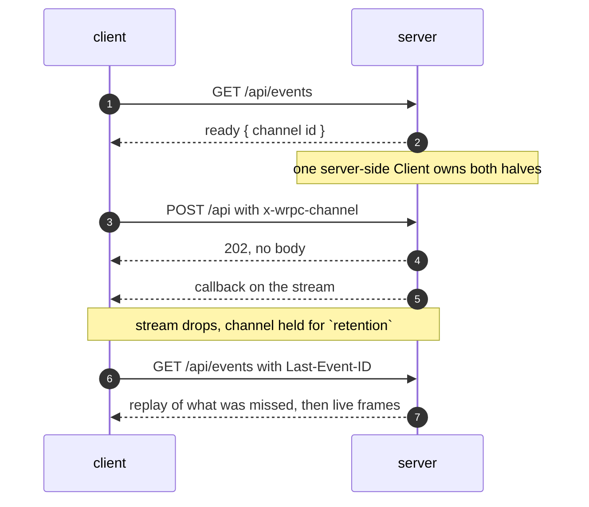

# Server-Sent Events

Some places will not give you a WebSocket: a serverless platform with no
upgrade path, a corporate proxy that strips one, an edge runtime that only
speaks HTTP. `@alexify/wrpc/sse` is a full wrpc transport built out of nothing
but HTTP requests — calls, events, subscriptions and cancellation all work, and
the packets are identical.

## Using it

The server half is built into `RpcServer` and configured through its `sse`
option; it is on by default. On the client, requiring the subpath registers the
transport:

```js
require('@alexify/wrpc/sse');

const client = await WrpcClient.connect('https://host/api', { transport: 'sse' });
await client.load('chat');

await client.api.chat.send({ text: 'hi' });
client.api.chat.on('message', render);
for await (const message of client.api.chat.onMessage.iterate({ room: 'a' })) {}
```

In a browser bundle the subpath resolves to the client half alone — the channel
registry never ships to a browser.

## How a channel works

SSE is one-way, so a channel is two halves that find each other by id:

```
GET  {basePath}/events                        opens a NEW channel
GET  {basePath}/events  x-wrpc-channel: <id>  re-attaches to an existing one
POST {basePath}         x-wrpc-channel: <id>  client -> server
```



**The server mints the id** and hands it out exactly once, in the `ready`
frame that opens every stream — a client never proposes its own. The channel
is bound to the cookie identity of the GET that created it, and every
re-attach and POST must present the same one: a request naming a live id
without it is refused with `403`, so a leaked id (URLs end up in logs) is
not a bearer token for the channel's session. An id the server no longer
holds answers `409` — the built-in transport reacts by starting a fresh
channel and letting the client re-load and re-subscribe.

Both halves belong to **one** server-side `Client`, which is what lets a
subscription opened by a POST deliver its values down the stream. A POST
answers `202` with no body: every reply, callbacks included, travels on the
stream — the same shape the Service Worker port transport has.

Each frame carries the channel's own monotonic `id:`, and a dropped stream does
**not** destroy the channel. It is held for `retention` (30 s by default), so a
reconnect with `Last-Event-ID` re-attaches and replays what it missed instead of
starting over — subscriptions and all.

## Options

```js
new Server({
  router,
  sse: { retention: 30_000, replay: 100, heartbeat: 15_000, retry: 2000 },
});
```

| Option | Default | Meaning |
| --- | --- | --- |
| `retention` | `30000` | How long a channel outlives its stream, in ms. |
| `replay` | `100` | Outbound frames kept for `Last-Event-ID` replay. |
| `replayBytes` | 1 MiB | Byte budget for that buffer; evicts oldest first. |
| `heartbeat` | `15000` | Comment-frame interval in ms; `0` disables. |
| `retry` | `2000` | The `retry:` value handed to the peer. |
| `maxChannels` | `10000` | Live channels per server; past it a new GET is `503`. |
| `maxChannelsPerAddress` | `100` | Live channels per remote address; past it `429`. **Behind a proxy this counts the proxy**, not your users — see the warning below. |
| `clientAddress` | socket peer | `(call) => string` — what the per-address cap counts by. Inject a reader for your proxy's client header. |

::: warning Behind a load balancer, set `clientAddress`
The per-address cap defaults to the TCP peer address. Behind nginx/ALB that
is ONE address for every real client, so the 101st user through the proxy
is refused `429` while the node idles at 1% of `maxChannels`. Either inject
`sse: { clientAddress: (call) => firstForwardedFor(call.headers) }` (trust
your proxy's header only when the proxy is yours), set
`maxChannelsPerAddress: 0`, or on the express adapter enable
`app.set('trust proxy', ...)` — its `req.ip` is what wrpc receives there.
:::


`sse: false` removes the endpoint entirely.

## Replay is honest

A reconnect with `Last-Event-ID` replays exactly what the buffer still
holds. When the id is OLDER than the buffer — the outage outlived
`replay`/`replayBytes` — the server does **not** silently replay a
truncated history: it answers with an `event: gap` frame, and the built-in
transport reacts by dropping the channel and starting a fresh one. The
client re-loads and re-subscribes, and every subscription then resumes
from its own `lastEventId` (or takes a snapshot when its
[event log](./subscriptions#resume) answers `null`).

## Multiple instances need sticky routing

A channel lives in the memory of the ONE instance that created it: the GET
and every POST of that channel must reach the same instance. Behind a load
balancer this means **sticky sessions** (cookie affinity is the usual
choice — the session cookie is already there). A POST or a re-attaching
GET that lands on the wrong instance answers `409 Unknown channel`; the
built-in transport recovers by starting a fresh channel — correct, but a
reconnect-and-reload on every misrouted request is not a routing strategy.
See [Scaling](./scaling) for the same rule stated from the deployment side.

Comment frames (`: ping`) keep proxies from deciding an idle response is a dead
one, and `X-Accel-Buffering: no` keeps nginx from buffering the stream into
oblivion.

## What it cannot do

**Binary streams.** SSE frames are text, so wrpc's binary streams are *refused*
on this transport rather than silently corrupted — `client.binary` is `false`
server-side, and `createStream`/`getStream` throw. Use a WebSocket for those.

That is the only functional difference. Calls, events, subscriptions with
resume, cancellation and batching all work.

## Not `EventSource`

The client half is a `fetch`-based transport with its own incremental SSE
parser, deliberately not the browser's `EventSource`, which cannot set headers,
cannot be aborted cleanly, and reconnects on its own schedule instead of the
client's. The parser handles fields split across chunks, CRLF/CR/LF line
endings, comments and multi-line data; `SseParser` is exported if you want to
feed it yourself.

## CORS

Two of the headers this transport sends — `x-wrpc-channel` and
`last-event-id` — are not CORS-safelisted, so cross-origin SSE needs them
allowed. They are in the default `Access-Control-Allow-Headers`; if you
**replace** `cors.headers`, put them back:

```js
new Server({ router, cors: { origins: [...], headers: 'Content-Type, x-wrpc-channel, last-event-id, x-wrpc-meta' } });
```

## Hosting it yourself

The endpoint needs a host that can keep a response open. That is the optional
`call.stream({ status, headers })` on the abstract HTTP call — `nodeStream()`
in `src/adapters/common.js` implements it for every host that hands over a node
`ServerResponse`, which covers the built-in `Server` and the
[fastify](./adapters/fastify) and [express](./adapters/express) adapters. A
host that cannot stream simply omits it, and the events endpoint answers an
honest `501` instead of a response that never arrives.

If you are driving the machinery yourself, `RpcServer` exposes it:

```js
rpc.eventsPath;   // `${basePath}/events`
rpc.sse;          // the SseChannels registry, or null when sse: false
```
