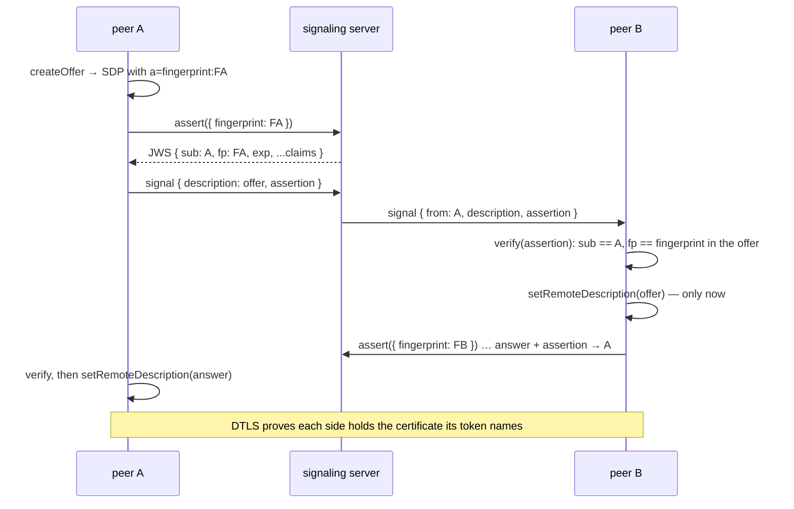

# WebRTC: identity and trust

Two questions every peer-to-peer link raises, and how the
[WebRTC layer](./webrtc) answers them:

- **Who is this peer?** An id the application chose and can address — a
  user id, a device id — that stays the same when the signaling connection
  behind it comes and goes. That is [Identity](./webrtc#identity), decided
  by the signaling server's `identity` strategy and carried as a stable
  peer id with an `instance` per incarnation.
- **Can I believe it?** With the default `trust: 'link'`, "there is a link"
  means "the signaling server admitted both of us" — and nothing more. A
  peer that wants proof, end to end and without trusting the relay in
  between, turns on **trust assertions**: the server signs a token for every
  peer, bound to the certificate that peer dials with, and every other peer
  verifies it with the server's public key before the link is allowed.
  That is this page.

## The model



An assertion is a [JWS](../reference/protocol#webrtc-assertions) — compact
serialization, `ES256`, the one algorithm every WebCrypto ships — whose
payload binds a **peer id** (`sub`) to the **fingerprint of the DTLS
certificate** (`fp`) of the peer connection it was issued for, with an
expiry and whatever claims the server adds. The binding is what makes it
more than a signed name: the fingerprint travels in the SDP the peer sends
(`a=fingerprint:`), the verifier checks the token names *that* fingerprint,
and the DTLS handshake proves the far end holds the certificate. A token
copied from one peer cannot be replayed from another connection — the
identity binding of RFC 8827, without the identity provider.

Verification happens in `WrpcPeer`, **before** a description reaches the
`RtcLink` and before your `accept` hook runs. A description with no token,
a bad signature, another peer's `sub`, a fingerprint that is not the
description's, an expired `exp` or an unexpected `iss` ends the link with a
goodbye and a `rtc.peer.refused` log line naming the reason.

## Server side

```js
const { createSignalingUnit, createSignalingHooks, generateAssertionKeys } = require('@alexify/wrpc/webrtc');

const keys = await generateAssertionKeys({ kid: '2026-09' }); // or load a stable pair from your secret store

defineRouter(
  {
    ...createSignalingUnit({
      identity: (context) => context.session.data.userId,
      assertions: {
        key: keys.privateKey,          // a private EC P-256 JWK, or a { privateKey, publicKey } CryptoKey pair
        ttl: 300,                      // seconds a token is valid (the default)
        issuer: 'signaling.example',   // the `iss` claim, when peers should insist on it
        claims: (context) => ({ role: context.session.data.role }),   // signed into every token
      },
    }),
  },
  { hooks: createSignalingHooks() },
);
```

With `assertions` configured the unit gains two methods. `assert({
fingerprint })` answers `{ assertion, iat, exp }` for the calling
connection's peer id — it runs your `claims` hook, refuses a replaced
connection with `409`, and never signs a fingerprint that does not look
like one. `keys()` answers `{ keys: [JWK] }` and is **`access: 'public'`**
on purpose: a peer fetches the keys before it has a session, and they are
public keys.

Rotation is a `kid`: sign with a new key while `keys()` publishes both,
and a verifier that meets an unknown `kid` asks for the keys once more
before it refuses. The `iat`/`exp` in the answer are also how peers learn
the server's clock — each peer measures the offset from its own tokens
and checks every `exp` against the server's time, so two peers with
drifting clocks agree on what "expired" means (a minute of skew is
tolerated on top).

## Peer side

```js
const peer = new WrpcPeer({
  router,
  signaler: wrpcSignaler(client, { identity: 'alice' }),
  assertions: { issuer: 'signaling.example' },   // keys come from signaler.keys()
  host: { trust: 'assertion' },
  accept: (from, room, { instance, claims }) => claims?.role !== 'banned',
});
```

`assertions` turns both halves on. Outbound, every description this peer
sends — the offer of a dial, the answer to one, the offer of a redial —
first fetches a token for the certificate it declares: one round trip to
the signaling server per dial. Candidates that gather meanwhile wait their
turn behind the description they belong to. Inbound, every description is
verified as above; once a link's certificate is pinned, later descriptions
on the same pc (ICE restarts) are a string compare, and a redial onto a
fresh pc — a new certificate — is verified anew.

`keys` defaults to the signaler's `keys()`; a static `keys: [jwk]` serves a
hand-rolled signaler, or a deployment that ships the public key with the
page. `issuer` makes an `iss` mandatory.

The verified claims are the link's: `link.claims` (`sub`, `iat`, `exp`,
`fp`, `iss`, and whatever the server added), the third argument of
`accept` for an offer (a knock carries no description, so its claims arrive
with the answer — before the host half attaches), and, with
**`host: { trust: 'assertion' }`**, the session your handlers run with:

```js
context.session;                // { token: '<peer id>', data: { peer, room, ...rosterData, claims } }
context.session.data.claims;    // { sub: 'alice', role: 'host', exp, fp, iss }
```

Under `trust: 'assertion'` a `PeerHost` refuses to attach a peer without
verified claims, and the claims come **after** the roster data in
`session.data`, so nothing a peer said about itself at `join` can shadow
what the server signed. `trust: 'link'` with `assertions` on is allowed
too — verification still runs, the claims are simply optional in the
session — and a peer **without** `assertions` ignores the tokens attached
to what it receives. Turn it on for everyone in a room or for nobody: a
peer with assertions refuses a description that carries none.

## Your own signaler

A [hand-rolled signaler](./webrtc#your-own) takes part by adding two
methods, checked structurally by `hasAssertions`:

```ts
interface AssertingSignaler extends Signaler {
  assert({ fingerprint }): Promise<{ assertion, iat?, exp? }>;   // a token for one of MY certificates
  keys?(): Promise<Array<JsonWebKey>>;                            // the server's public keys
}
```

Whatever issues the tokens — the wrpc unit, or any service that can sign a
JWS — must produce the [format](../reference/protocol#webrtc-assertions)
the verifier expects; `createAssertionIssuer` and `createAssertionVerifier`
are exported for both sides, and work in Node and in a page alike.

## What this is not

- **Not a session.** The claims are the signaling server's word about the
  peer at issue time; a peer that is banned an hour later still holds its
  open links. Revocation is the signaling layer's: drop the connection,
  and the roster says so.
- **Not encryption of the relay.** Signaling still travels through the
  server in the clear (over whatever TLS the transport has). Assertions
  make a lying relay *detectable*; they do not hide anything from it.
- **Not a knock's proof.** A `connect` knock carries no description. The
  initiator dials and asks the server for a token before anything is
  proven — bounded to the peers the server admitted, which is the same
  population `trust: 'link'` trusts outright.
