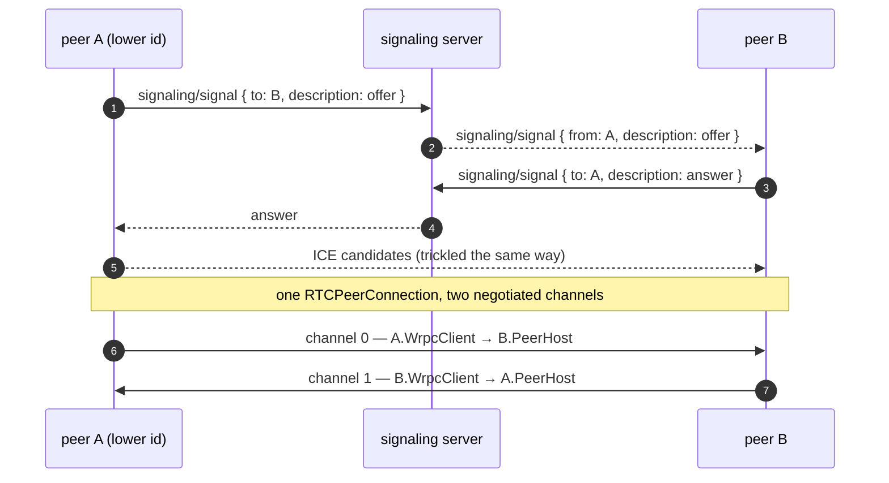

# WebRTC

Two browsers can talk wrpc to each other directly, with no server in the
data path. `@alexify/wrpc/webrtc` puts a full wrpc endpoint on each end of a
WebRTC data channel: every peer serves a router and calls the other's — calls,
events, ask/respond, subscriptions with resume, binary streams with
backpressure, heartbeat and reconnect — over the same packets a WebSocket
carries. A wrpc server is still involved once, for **signaling**: peers find
each other and exchange connection descriptions through it, and it can be
any wrpc server, on any transport.

## Using it

On the server, spread the built-in signaling unit into your router and add
its disconnect hook. Any wrpc server will do — the built-in `Server`, a
fastify or express host, a cluster of them:

```js
const { Server, defineRouter } = require('@alexify/wrpc');
const { createSignalingUnit, createSignalingHooks } = require('@alexify/wrpc/webrtc');

const router = defineRouter(
  { ...createSignalingUnit(), ...myUnits },
  { hooks: createSignalingHooks() },
);
new Server({ router, port: 8000 }).listen();
```

In the browser, a peer is a router, a signaler over an ordinary client, and
the native `RTCPeerConnection`:

```js
import { connect } from '@alexify/wrpc';
import { WrpcPeer, wrpcSignaler, defineRouter, procedure } from '@alexify/wrpc/webrtc';

const router = defineRouter({
  chat: {
    hello: procedure({ handler: async (context) => `hi, ${context.session.data.peer}` }),
  },
});

const client = await connect('wss://host/api');
const peer = new WrpcPeer({ router, signaler: wrpcSignaler(client) });

const mesh = peer.join('lobby', { data: { name: 'ada' } });
mesh.on('join', async ({ id, data }) => {
  const link = mesh.link(id);
  await link.load('chat');
  console.log(data.name, 'says', await link.api.chat.hello());
});
```

The webrtc browser entry exports `defineRouter`, `procedure`, `tracked` and
`createEventLog` — a browser peer defines its router with them; the main
browser entry leaves them out to stay under its [16 KB budget](./browser#bundle-size).

### Node as a peer

The core binds to **no** Node WebRTC package. It talks to a small
W3C-shaped structural contract (`RtcAdapter`: `createPeerConnection()`
returning something with `createDataChannel`, `createOffer`,
`setLocalDescription`, ...), which a browser satisfies natively and which
you satisfy in Node by injection. Anything W3C-shaped is one line:

```js
const { createW3cAdapter, WrpcPeer } = require('@alexify/wrpc/webrtc');
const peer = new WrpcPeer({
  router,
  signaler: wrpcSignaler(client),
  rtc: createW3cAdapter(require('node-datachannel/polyfill')),
});
```

A library with its own event API (werift, say) needs a wrapper that presents
the contract — `isRtcAdapter`, `isRtcPeerConnection` and `isRtcDataChannel`
are exported so a wrapper can check itself. The repo runs the shared port
contract against node-datachannel by hand
(`WRPC_RTC=node-datachannel node --test tests/webrtc/node-datachannel.integration.test.js`);
it is a devDependency there and nowhere else.

## How a link works

One `RTCPeerConnection` per pair of peers, carrying **two negotiated data
channels** — one per client→host direction. That is what lets the ordinary
`WrpcClient` and the ordinary server dispatcher speak across the link
unchanged: each channel is a plain ordered wire with one client on one end
and one host on the other, so there is never any doubt whose callback an id
belongs to, and the "stream packet, then its chunks" ordering holds.



**Roles are decided by id order alone.** The peer with the lower id is the
*initiator*: it makes the offer, it restarts ICE, it redials after a failure.
The other is the polite responder of the
[perfect negotiation](https://developer.mozilla.org/en-US/docs/Web/API/WebRTC_API/Perfect_negotiation)
pattern. `peer.connect(id)` works from either side — a responder that wants a
link sends the initiator a `connect` knock over signaling and the initiator
dials — so two peers can never glare on simultaneous offers, and a responder
recovering from a failed link asks the same way.

Negotiated channels are never described in SDP, so **both peers must
configure the same channel ids**. The defaults are `0` and `1` with the
label `wrpc`; an application that keeps its own channels on the same
connection moves them with `channels: { initiator, responder, label }` — on
both sides, or the link never opens and fails on `connectTimeout`.

### Framing

A data channel has a message-size limit (16 KiB is the only value every
implementation agrees on; the negotiated `sctp.maxMessageSize` is used up to
a 256 KiB ceiling), and wrpc packets — a batch of calls, a 64 KiB stream
chunk — exceed it. Every message therefore travels as binary behind a
**one-byte header**: a kind bit (text packet or binary chunk), a FIN bit,
six reserved bits. Fragments of one message are sent back to back on the
ordered channel, so no message id is needed. The
[protocol reference](../reference/protocol#webrtc) has the exact layout.

## Symmetric peers

A `PeerLink` is one connected peer, **both directions**:

| Member | Which direction | What it is |
| --- | --- | --- |
| `link.remote` | this peer → the other | A `WrpcClient` over channel *mine*: `load()`, `api`, `call()`, `respond()` — everything a client does against a server. |
| `link.client` | the other → this peer | The server-side `Client` this router made for the peer: `send()`, `ask()`, `createStream()`, rooms — everything a server does to a client. |

`link.api`, `link.load()`, `link.call()`, `link.respond()` delegate to
`remote`; `link.send()`, `link.ask()`, `link.createStream()` address the peer
through `client`. So "call the other peer" is `link.api.chat.hello()`, and
"push the other peer a file" is `link.createStream(name, size)`.

Events keep the same two directions they have between a client and a
server. `link.remote.sendEvent('chat/ping', data)` reaches the other peer's
router — its unit's reserved `on` map. `link.send('chat/note', data)` (and
`mesh.broadcast`) goes host → remote and arrives on the other peer's
**unit emitter**, `link.api.chat.on('note', handler)` after `load()`, exactly
where a server's events reach a client. A peer that wants to *receive*
broadcasts therefore listens on each link's `api`, not in its router.

Handlers run on a `PeerHost`: a router, the dispatcher and one `Client` per
attached peer — the pieces of `RpcServer` a peer needs, with no sessions,
cluster or HTTP, and browser-safe. It satisfies the same `ClientHost`
contract a handler sees as `context.server`, so `context.server.to(room)`
works on a peer exactly as on a server.

### Trust

wrpc procedures default to `access: 'session'`, and there is no session
manager in a browser. Under the default `trust: 'link'`, every attached
`Client` gets a frozen pseudo-session:

```js
context.session;              // { token: '<peer id>', data: { peer, room, ...rosterData } }
context.session.data.peer;    // who is calling
```

The reasoning: a link only exists because the signaling server admitted
both peers (its unit is `access: 'session'` by default, and it runs your
`authorize` hook), and because this peer's `accept` hook let the link in.
So "there is a link" already means "the server vouched for this peer", and
server routers move to a peer unchanged. `startSession` and friends are
refused with a coded `400` on a peer. `trust: 'none'` leaves `session` null,
in which case peer procedures must be `access: 'public'` and authorize
themselves in hooks from `context.meta.data.peer`.

## Signaling

### The built-in unit

`createSignalingUnit()` is a router fragment: `whoami`, `join`, `leave`,
`members`, and the inbound `signal` event, relayed with `RpcServer.sendTo`.
A peer's id **is** its signaling client id — server-issued, so nobody can
claim another's; instance-prefixed, so the relay is one addressed cluster
command with no extra state. Stable application identity (a user id, a
display name) travels as the `data` given to `join`, which every other
member receives with the roster and the `join` notification.

| Option | Default | Meaning |
| --- | --- | --- |
| `name` | `'signaling'` | The unit name; the client helper must agree. |
| `access` | `'session'` | Applied to every method and the event. |
| `authorize` | — | `(context, { action: 'join' \| 'signal', room, ... })`: return `false` to refuse with `403`, or throw a coded error of your own. |
| `relay` | `'room'` | A signal reaches `to` only while both peers share the room; `'any'` relays to any connected id. |
| `prefix` | `'rtc:'` | Signaling rooms live under it in the room registry, apart from your own rooms. |

`createSignalingHooks()` returns the router-level `onDisconnect` that
announces a dropped signaling connection's leave to the rooms it was in.
When a signaling connection reconnects it comes back as a **new** client,
so a new id: the client helper re-identifies, re-joins its rooms and emits
`reset`, and a `Mesh` rebuilds its links under the new id. Open links do
not need signaling to keep working — only to be (re)negotiated.

### Your own

`WrpcPeer` takes anything with the shape:

```ts
interface Signaler {
  readonly id: string | null;
  ready(): Promise<string>;                          // this peer's id
  send(to, message, { room? }): void | Promise<void>;
  on('signal', ({ from, room, message }) => void);   // an inbound one
  off(event, handler);
}
interface RosterSignaler extends Signaler {          // what Mesh needs on top
  join(room, data?): Promise<Array<{ id, data }>>;   // the other members
  leave(room): Promise<void>;
  on('join' | 'leave' | 'reset', handler);
}
```

A `message` is `{ type: 'description', description }`, `{ type: 'candidate',
candidate }`, `{ type: 'close' }` or `{ type: 'connect' }` — opaque to the
signaler, which only moves it. `isSignaler` / `hasRoster` check the shape.
A hand-rolled one over socket.io, a hosted signaling service, or a
`MessagePort` between two tabs of one browser all qualify.

## Your own connection

Everything above sits on three levels, and you can enter at any of them:

| Level | wrpc owns | You own |
| --- | --- | --- |
| `WrpcPeer` / `Mesh` | The peer connection, negotiation, ICE restart, redial, both directions, the roster | A router and a signaler |
| `RtcLink` | One `RTCPeerConnection`, perfect negotiation, ICE restart, two channels | Signaling and the decision to redial |
| **A data channel** | The wire: framing, packets, streams, heartbeat | The peer connection, signaling, recovery |

The lowest level is the `event` transport's arrangement: you already have an
`RTCDataChannel` — negotiated by your own signaling, perhaps next to your
game's or media's channels on the same connection — and wrpc speaks on it.
On the client, `channel` takes the place of `link`:

```js
import { connect } from '@alexify/wrpc';
import '@alexify/wrpc/webrtc';                       // registers the transport

const pc = new RTCPeerConnection(config);
const dc = pc.createDataChannel('wrpc', { negotiated: true, id: 0 });
// ... your offer/answer exchange ...
const client = await connect('webrtc:server', { transport: 'webrtc', channel: dc, reconnect: false });
```

The other end is whoever holds the pair of that channel. A Node process
attaches it to an ordinary `RpcServer` — sessions, rooms, cluster and all —
the way it attaches a `MessagePort`:

```js
import { attachChannel } from '@alexify/wrpc/webrtc';
attachChannel(rpc, dc, { peer: 'browser-7', headers, data });   // the attachPort of WebRTC
```

A browser answers with a `PeerHost` over the host half of the transport:

```js
import { PeerHost, RtcPeerTransport } from '@alexify/wrpc/webrtc';
host.attach(new RtcPeerTransport(dc, { peer: 'other' }), { peer: 'other' });
```

What the level does **not** do is what a link would: no ICE restart, no
redial. A static channel is one connection — when it closes, the client's
`open()` refuses it, so pass `reconnect: false` and rebuild the client when
you have a new one. To plug your own recovery into the client's reconnect
cycle instead, hand over a **factory**: every (re)open asks it for the next
channel, and subscriptions resume with their `lastEventId` as on any other
transport.

```js
const client = await connect('webrtc:server', {
  transport: 'webrtc',
  channel: async () => {
    const pc = await renegotiate();                  // your signaling, again
    return pc.createDataChannel('wrpc', { negotiated: true, id: 0 });
  },
});
```

Two more differences from the link level. The transport cannot see the peer
connection, so it fragments at the 16 KiB interop floor unless told
otherwise — pass `maxMessageSize: negotiateMessageSize(pc.sctp)` (on the
client through `connect()`'s options, on the server through
`attachChannel()`'s) once the connection is up to use what it really allows;
each side fragments independently, so the two need not agree. And a raw
channel carries no request, so `attachChannel` starts the client
with no session, exactly as `attachPort` does: the default `access:
'session'` answers 403 until the application establishes one, and what it
knows about the peer goes in `headers` / `data`, where handlers read it from
`context.meta`. (A `PeerHost` keeps its `trust: 'link'` pseudo-session either
way.)

`RpcServer.attach(transport)` is the seam under `attachChannel`: any
persistent transport that announces inbound text as `'packet'` and bytes as
`'chunk'` events is a client, WebRTC or not. That is also why `attachChannel`
lives in this subpath and not on the server — the core knows no framing;
the function builds an `RtcPeerTransport` over the channel and hands it to
`attach`.

## Mesh

`peer.join(room)` links this peer with everyone in a signaling room, as
they come and go:

```js
const mesh = peer.join('lobby', { data: { name: 'ada' } });
mesh.on('join', ({ id, data }) => {});    // once the link is open
mesh.on('leave', ({ id }) => {});

mesh.broadcast('chat/note', { text });    // one event to every open member
const { answers, errors } = await mesh.ask('poll', { q }, { timeout: 2000 });
mesh.respond('poll', async (data) => vote(data));   // members present and future
await mesh.leave();
```

Every member link's host-side `Client` is kept in the room `mesh:<room>`
on this peer's `PeerHost`, which is what makes `broadcast()` and `ask()` one
`Broadcast` fan-out — the payload is encoded once, `ask` aggregates
`{ answers, errors, expected, incomplete }` — rather than a loop over links.
A link shared by two meshes (the same two peers in two rooms) survives
leaving one of them.

## Failure and recovery

Three layers, each owning one kind of failure:

- **ICE**: when a network changes underfoot, the link restarts ICE (only the
  initiator does, so the two sides never race) and the channels survive it.
  A restart that does not reconnect within `restartTimeout` fails the link.
- **The link**: on `failed` the initiator redials with backoff and the
  responder knocks with backoff, up to `redial.retries` (5), then the
  `PeerLink` closes. A redial is a fresh `RTCPeerConnection`: the host-side
  `Client` is recreated, and the client-side `WrpcClient` runs its ordinary
  reconnect cycle, whose `open()` simply waits for the link — so it
  re-`load()`s its units and re-subscribes with `lastEventId` exactly as it
  would on a WebSocket.
- **The heartbeat**: a path can die silently, with ICE none the wiser for a
  while. The app-level ping/pong is on by default; a heartbeat timeout asks
  the link for an ICE restart, and from there the layers above take over.

`link.close()` (or `peer.close()`) is a goodbye: the other side is told, both
directions end, nobody redials.

## Options

```js
new WrpcPeer({
  router,                    // what others can call; null makes a client-only peer
  signaler,                  // required
  rtc: createW3cAdapter(),   // the RTC implementation (this is the default)
  iceServers: [{ urls: 'stun:stun.l.google.com:19302' }],   // or a full `configuration`
  channels: { initiator: 0, responder: 1, label: 'wrpc' },  // the same on both peers
  client: { heartbeat: { interval: 30_000, timeout: 10_000 }, codec },   // every link's WrpcClient
  host: { trust: 'link', maxCalls: 64, highWaterMark: 1 << 20 },       // the PeerHost, plus water marks
  framing: { maxReassembly: 16 << 20 },
  connectTimeout: 30_000,
  restartTimeout: 15_000,
  redial: { retries: 5, minDelay: 500, maxDelay: 10_000 },
  accept: async (from, room) => allowed(from),   // gates incoming links
  telemetry: { api: otel },   // the peer's server half and its links; see below
});
```

The link's `write()` answers `false` above `highWaterMark` (1 MiB of
`bufferedAmount`) and `drain` fires at `lowWaterMark` (256 KiB), so a stream
producer on either end sees the same backpressure it does on a socket.

## Telemetry

A peer is a server too, so it takes the same [telemetry](./telemetry)
injection a server does and emits the same things: a SERVER span for every
call, subscription and inbound event it answers (under `wrpc.transport:
'webrtc'`), and `wrpc.server.connections` for its links. The calling peer's
client half takes its own through `client.telemetry`, and with a propagator
injected on both the client span parents the server span across the
link — one trace end to end, exactly as between a client and a server.

```js
new WrpcPeer({
  router,
  signaler,
  telemetry: { api: otel },            // the host half: spans, gauges, the rtc instruments
  client: { telemetry: { api: otel } }, // each link's client half: CLIENT spans, reconnects
});
```

Three instruments are the peer layer's own: `wrpc.rtc.links` (open links,
by `wrpc.rtc.role`), `wrpc.rtc.redials` (redials and knocks after a failure,
by role) and `wrpc.rtc.ice_restarts` (by `wrpc.rtc.outcome`: `requested`,
`recovered`, `failed`) — the rate of the last two is what an operator alerts
on. A client-only peer (no router) still counts its links.

## What it cannot do

- **Receive-side backpressure.** A data channel has no `pause()`: a fast
  peer streaming a large file to a slow consumer accumulates in the
  receiving `WrpcReadable`. Size uploads accordingly, or ask before sending.
- **Real sessions.** A browser cannot verify another peer's token without a
  secret. `trust: 'link'` is the honest substitute; server-signed assertions
  are a possible later addition.
- **Identity across signaling reconnects.** A peer's id is its signaling
  connection's. A reconnect is a `leave` + `join` under a new id (a `Mesh`
  handles it); pin stable identity in the join `data`.
- **The worker proxy.** `WrpcClientProxy` connects to a URL (its `url`
  option, or one built from the worker's location); a data channel cannot
  be reached through it.

## Bundle size

A peer is a client **and** a server, so the webrtc browser entry is heavier
than the main one: the client core plus the router, dispatcher, per-peer
`Client`, rooms and `Broadcast`, the link, framing, peer, mesh and signaler
halves, and the server telemetry writer — about 40 KB min+gzip against a
41 KB budget in `pnpm size`. You
pay it only when you import the subpath; the main entry is untouched.
