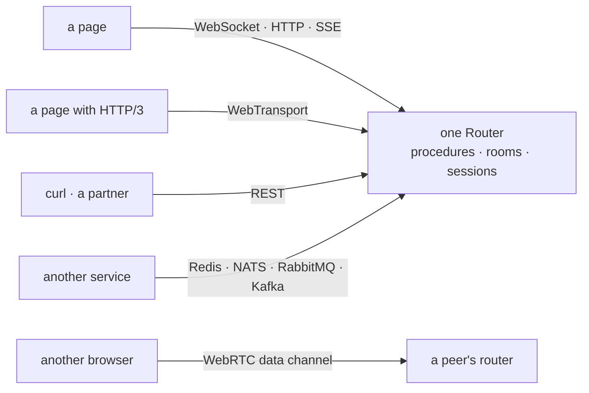

# Why wRPC?

wRPC — Web RPC — is one router of procedures, served over every transport the
web platform has: a WebSocket, plain HTTP and REST, Server-Sent Events,
WebTransport over HTTP/3, and WebRTC data channels between browsers — and,
between services, Redis, NATS, RabbitMQ or Kafka. And it has **no runtime
dependencies at all**: `package.json` has no `dependencies` field, and no
`peerDependencies` or `optionalDependencies` either, because those are
dependencies with extra steps.

That constraint is the design, not a boast. It is what forces every
integration — uWebSockets.js, Redis, Kafka, a WebRTC or HTTP/3 stack,
Fastify, Express, TanStack Query, OpenTelemetry, Pino — to be **injected** and
duck-typed at the boundary rather than imported. The integrations you do not
use cost you nothing, and the ones you do use run on your version, not ours.

## One router, every transport

A procedure is written once. Which wire a call arrived on is the client's
choice, not the handler's:

The same `chat/send` answers a browser on a WebSocket, a page behind a proxy
that only speaks HTTP, a phone on HTTP/3, and a billing service on the other
end of a Kafka topic — with the same hooks, validators, access rules, rooms
and sessions in front of it. A client names a fallback list
(`transport: ['wt', 'ws']`), an app talks to [several
backends](./multiple-backends) at once, and two browsers can serve routers
to each other with no server in the data path. [Client ›
Transports](./client#transports) is the matrix of what each one carries.

## What you get, on whichever transport

Most stacks make you choose a lane: an RPC layer *or* a realtime layer, typed
calls *or* binary transfer, browser *or* service-to-service. wRPC puts them
behind one router and one protocol:

| | |
| --- | --- |
| [Calls](./router) | Router of procedures, access levels, Standard Schema validators, timeouts, queues. |
| [Events & rooms](./rooms) | Fire-and-forget in both directions, plus acks when you need an answer. |
| [Subscriptions](./subscriptions) | Async-generator feeds with real backpressure and **resume after reconnect** — on any instance, over a [broker feed](./brokers/feeds). |
| [Bytes](./streams) | Binary streams interleaved with everything else, backpressure into TCP; a `Uint8Array` inside a call travels as bytes. |
| [Scaling](./scaling) & [cluster](./cluster) | Rooms across instances over any pub/sub; presence, introspection, commands. |
| [REST](./rest) | Declare `http: { method, path, status }` on a procedure: real endpoints, `/vN` version paths, fastify schemas, OpenAPI via the CLI. |
| [Transports](./client#transports) | WebSocket, HTTP, SSE, a worker port — and [WebTransport](./wt), [WebRTC](./webrtc), a [message broker](./brokers/rpc). |
| [Message brokers](./brokers) | Durable feeds, queue consumers with retry and dead letters, RPC between services — Redis, NATS, RabbitMQ, Kafka, every client injected. |
| [Hooks](./hooks) | Named lifecycle phases at router, unit and procedure level — no `(ctx, next)` middleware. |
| [Sessions & auth](./sessions) | Cookie or bearer, pluggable stores and carriers, restored on reconnect; `authenticate`/`refresh` client hooks. |
| [Compression](./compression) | Off by default; deflate, Brotli or zstd per wire, negotiated as a preference list; a preset dictionary from the router. |
| [Encryption](./encryption) | Where TLS ends before the data does: sealed backplane and broker messages, a sealed session store, Noise sessions, HPKE per request, end-to-end helpers. |
| [Types](./typed-client) | A contract you declare or [generate](./cli) — no build step, no TypeScript at runtime; typed server→client events. |
| [Protocol](../reference/protocol) | A versioned reference, revision 2, negotiated with a 1.0 peer per connection. |

## Fast where it counts

wRPC is not the fastest way to echo one message over a bare socket —
nothing with a router, an access check and a correlation ID between the
wire and your handler can be. It's fast at the things that are actually
hard to make fast:

- **Broadcasting.** A room's update is serialized, framed and compressed
  **once per emit**, not once per member, so throughput climbs with the
  room instead of collapsing under it — compressed fan-out that used to
  cost one `deflateRaw` per recipient now costs one per emit, a ~34×
  difference on the same room.
- **Payloads that aren't toy-sized.** Bare-socket benchmarks favor tiny
  messages; at 10 KB, wRPC is at or ahead of every raw WebSocket library
  measured against it, because the send path never re-encodes or
  re-copies what it already built.
- **A call that does not wait behind an upload.** Over WebTransport every
  binary stream has a QUIC stream of its own: from Chrome, a small call made
  while uploads saturate the connection answers in 9 ms at the median, against
  46 ms over a WebSocket. And on every transport the stack, not wRPC, sets the
  ceiling — over WebTransport and WebRTC, wRPC's calls run at 87–102% of a raw
  echo over the same stack.
- **Failure.** An instance can die with clients on it and, with a shared
  session store and any pub/sub as a backplane, those clients reconnect,
  re-authenticate and rejoin their rooms inside a single browser repaint
  — no sticky load balancer, no manual failover choreography.

None of that needed a flag. The knobs that trade memory or latency for
more — context takeover, async compression, client-side batching, the uws
engine — are opt-in on purpose: the right default for a chat app is not
the right default for a market-data feed, and a library that picks one
universal "fast" setting is guessing on your behalf. See
[Performance](./performance) for the full picture — the numbers, what they
mean in practice, [each transport](./performance#across-transports) measured,
and which knob to reach for and when.

## Secure in layers

TLS comes first and is not wRPC's to replace: `protocol: 'https'`, or a proxy
that terminates it. What wRPC adds sits on either side of it:

- **Defaults that refuse.** Prototype-pollution defences on every
  peer-controlled object, caps on what one connection may hold open, a deny
  list for headers a peer may not declare, 5xx messages masked —
  [Security](./security) is the checklist.
- **Encryption where TLS ends before the data does** — a backplane, a broker's
  log, a session store, a proxy you do not run: sealed envelopes under a
  rotating keyring, a canonical Noise handshake on WebSocket and WebTransport,
  HPKE per request on HTTP and SSE, and end-to-end helpers for data no server
  should read. Opt-in, experimental, platform crypto only, checked against
  the published test vectors — [Encryption](./encryption).

## Upgrade without a flag day

The wire protocol is a [versioned reference](../reference/protocol), not an
implementation detail. Revision 2 — bytes that travel as bytes — is
negotiated per connection, so a 2.x client or server speaks revision 1 to a
1.0 peer with nothing to configure, and clients and servers upgrade in any
order. CI runs the published 1.0 against this tree, both ways, on every
change. Every section 2.0 added is badged `since 2.0` with a row saying what
an older peer does with it, and [Stability](../reference/stability) spells
out what 2.x promises — and which subpaths are still experimental.

## Against the alternatives

Five projects sit near wRPC, in two families: the frameworks a browser app
reaches for when it wants calls and realtime together, and the schema-first
RPC systems built around an IDL. Every cell below was checked against the
project's own documentation, source or npm entry in October 2026; the
sources are at the end of the section. "—" means the project documents
nothing of the kind, not that nobody has built it on top.

::: info Which wRPC?
Two unrelated projects share the name. **wRPC by the Bytecode Alliance** is a
WIT-based RPC framework for WebAssembly components, in Rust and Go. This
site's **wRPC** is `@alexify/wrpc` — JavaScript and TypeScript, for Node.js
and the browser, one router over every web transport. **webrpc**, with an
`e`, is a third: schema-first code generation over HTTP and JSON. All three
are compared below.
:::

### Realtime frameworks

| | **wRPC** (`@alexify/wrpc`) | **tRPC** v11 | **Socket.IO** v4 |
| --- | --- | --- | --- |
| Transports | WebSocket, HTTP + REST, SSE (full duplex, resume), WebTransport, WebRTC, worker port, message broker | HTTP (batching, JSONL streaming), SSE (subscriptions), WebSocket | WebSocket, HTTP long-polling; WebTransport since 4.7, opt-in |
| In the browser | official client, under 28 KB min+gzip (a CI budget) | official client | official client, 14.7 KB min+gzip (published) |
| Peer to peer | WebRTC data channels: symmetric peers, mesh, signaling | — | — (`socket.io-p2p`, last released 2016) |
| Types | contract-first + codegen, no build step; typed server→client events | inferred from the server's router | hand-written event-map generics |
| Realtime | subscriptions with resume, events both ways, rooms, acks | subscriptions with resume (`tracked()`); no rooms, no acks | events, rooms, broadcast, acks; no subscription primitive |
| HTTP/REST surface | declared per procedure: verbs, `/vN` paths, schemas, `--openapi` | GET/POST per procedure; OpenAPI via `@trpc/openapi` (alpha) or third-party `trpc-to-openapi` | — |
| Binary | bytes in any packet; streams with backpressure | binary inputs over `httpLink`; JSON answers | bytes in any event (1 MB cap by default); no streams |
| Scaling | rooms backplane over any pub/sub or broker | your own | adapters: Redis, Postgres, MongoDB, cluster, cloud queues |
| Message brokers | durable feeds, queue consumers, RPC between services (experimental) | — | a broadcast backplane only |
| Compression | off by default; deflate, Brotli or zstd per wire, negotiated | — (the host's middleware) | permessage-deflate off by default; HTTP compression on |
| Encryption beyond TLS | sealed envelopes, Noise sessions, HPKE, end-to-end helpers (experimental) | — | — |
| Observability | structured logging + OTel spans/metrics built in (SDK injected) | `onError`, `loggerLink` | `debug`, Admin UI; OTel through `@opentelemetry/instrumentation-socket.io` |
| Cross-cutting | named lifecycle hooks | `(opts) => opts.next()` middleware | `io.use` / `socket.use` middleware |
| Runtime deps | **0** | **0** (TypeScript as a peer) | 6 (server), 4 (client) |
| Needs TypeScript | ❌ | effectively yes (TypeScript ≥ 5.7) | ❌ |
| Protocol evolution | a versioned reference; the revision negotiated per connection, 1.0 ↔ 2.x tested both ways | no wire-compatibility promise documented | protocol revision 5; v3 and v4 interoperate, v2 with `allowEIO3` |

### Schema-first RPC

| | **wRPC** (`@alexify/wrpc`) | **gRPC / Connect** | **wRPC** (Bytecode Alliance) | **webrpc** |
| --- | --- | --- | --- | --- |
| Contract | a router in JavaScript; the client's contract declared, or generated from a running server | Protocol Buffers (`.proto`) | WIT (WebAssembly Interface Types) | RIDL or a JSON schema |
| Codegen | TypeScript `.d.ts` and OpenAPI from a running server (`wrpc types`) | gRPC: 13 languages; Connect: Go, TS/JS, Swift, Kotlin, Python, Dart | `wit-bindgen-wrpc` for Rust and Go | Go, TS, JS (client and server); Kotlin, Dart, Swift (clients); OpenAPI |
| Wire encoding | JSON packets + binary frames; a pluggable codec | binary protobuf (JSON on Connect) | component-model value encoding | JSON |
| Transports | WebSocket, HTTP + REST, SSE, WebTransport, WebRTC, worker port, message broker | gRPC: HTTP/2 (gRPC-Web through a proxy); Connect: HTTP/1.1, HTTP/2, HTTP/3 | TCP, Unix sockets, QUIC, WebTransport (release 0.17); WebSocket and HTTP on `main` | HTTP POST |
| In the browser | official client, under 28 KB min+gzip | gRPC-Web, Connect-Web: unary and server-streaming | `@bytecodealliance/wrpc` 0.0.0 on npm, types written by hand | generated TS/JS client over `fetch` |
| Streaming | subscriptions, events both ways, binary streams both ways | all four kinds; server-streaming only from a browser | `stream<T>` / `future<T>`, both directions | server-streaming (NDJSON), since v0.17 |
| Server push beyond streams | events, rooms, acks, resume after reconnect | — | — | — |
| Peer to peer | WebRTC data channels | — | — | — |
| Message brokers | feeds, consumers, RPC over Redis, NATS, RabbitMQ, Kafka (experimental) | — | a NATS transport in 0.17, removed on `main` | — |
| Protocol evolution | the revision negotiated per connection; the published 1.0 tested against 2.x | field numbers never reused; unknown fields tolerated | WIT package versions and `@since` gates; no wire policy stated | a schema `version` and a `Webrpc` header a server may check |
| JS runtime deps | **0** | `@connectrpc/connect`: 0, with `@bufbuild/protobuf` as a peer; `@grpc/grpc-js`: 2 | 0 | 0 (generated code over `fetch`) |
| Polyglot | JavaScript only | the point of it | Rust, Go and a JS package | Go, TS, JS, Kotlin, Dart, Swift |
| Maturity | 2.0; WebTransport, brokers and encryption experimental | gRPC: CNCF incubating; Connect: CNCF sandbox, stable | spec v0.0.1-draft.1, crate 0.17 | pre-1.0 (v0.47) |

The short reading: the schema-first systems are built for **many languages
agreeing on one contract**, and wRPC is not — it is one language, both ends,
every transport a browser has. The realtime frameworks share wRPC's ground,
and differ in how much of it they cover: rooms and acks without
subscriptions or REST, or subscriptions and inference without rooms,
brokers or a transport beyond HTTP and the WebSocket.

<small>Sources, checked October 2026: tRPC — [links](https://trpc.io/docs/client/links), [subscriptions](https://trpc.io/docs/server/subscriptions), [non-JSON content](https://trpc.io/docs/server/non-json-content-types), [OpenAPI](https://trpc.io/docs/openapi), [middlewares](https://trpc.io/docs/server/middlewares), [npm](https://registry.npmjs.org/@trpc/server/latest); Socket.IO — [overview](https://socket.io/docs/v4/), [4.7.0](https://socket.io/docs/v4/changelog/4.7.0), [client installation](https://socket.io/docs/v4/client-installation/), [adapters](https://socket.io/docs/v4/adapter/), [server options](https://socket.io/docs/v4/server-options/), [protocol](https://socket.io/docs/v4/socket-io-protocol/), [npm](https://registry.npmjs.org/socket.io/latest); gRPC — [core concepts](https://grpc.io/docs/what-is-grpc/core-concepts/), [languages](https://grpc.io/docs/languages/), [gRPC-Web](https://github.com/grpc/grpc-web); Connect — [introduction](https://connectrpc.com/docs/introduction), [FAQ](https://connectrpc.com/docs/faq/); protobuf — [proto3 guide](https://protobuf.dev/programming-guides/proto3/); wRPC (Bytecode Alliance) — [repository](https://github.com/bytecodealliance/wrpc), [npm](https://www.npmjs.com/package/@bytecodealliance/wrpc); webrpc — [repository](https://github.com/webrpc/webrpc).</small>

See [Performance](./performance) for the receipts on speed — the comparison
table against raw sockets, socket.io and tRPC, the honest footnotes (tRPC's
sequential row is a flush-timer artifact, not throughput), each transport
measured, and how to reproduce every number on your own hardware.

## When **not** to use wRPC

An honest list is more useful than a feature grid.

- **You want an API wRPC does not shape.** A procedure can declare a real
  [REST mapping](./rest) — proper verb, path and status, `/vN` version
  paths, fastify-shaped schemas, `wrpc types --openapi` — but the URL
  surface follows your router, and content negotiation, HATEOAS and
  non-JSON payloads are out of scope. The caveat that remains is about the
  *conventional* `/:unit/:method` fallback: that one is a convenience for
  reaching procedures, not an API design. If the HTTP contract itself is
  the product, design it first.
- **Your stack is polyglot.** The [protocol](../reference/protocol) is
  documented and small enough to reimplement, but the only implementation
  today is JavaScript. For services in several languages, gRPC or Connect
  (protobuf contracts, many languages) and webrpc (a schema, generated
  clients and servers) are built for it; for WebAssembly components, the
  Bytecode Alliance's wRPC is.
- **You need delivery guarantees from rooms.** Rooms are at-most-once fan-out,
  not a queue. [Subscriptions](./subscriptions#resuming) with `tracked()`
  values and an event log let a client catch up, and the
  [broker family](./brokers) adds at-least-once queue consumers and durable
  feeds (experimental) — but exactly-once processing, or a transaction across
  a broker and a database, is the broker's and your application's to build.
- **You need audio or video.** wRPC's WebRTC layer moves data over data
  channels; media tracks, an SFU and simulcast are a different stack.
- **You want end-to-end type inference from server code.** tRPC's model — where
  the client's types come from the server's implementation with nothing written
  twice — is genuinely nicer if your whole stack is TypeScript. wRPC's contract
  is declared or generated, deliberately, because it must also work for
  JavaScript users and across a network boundary the compiler cannot see.
- **You need every part frozen today.** WebTransport, the broker family and
  encryption are `@experimental`: they may change in a minor release until
  real deployments have reviewed them ([Stability](../reference/stability)).

## The other constraints worth knowing up front

- **CommonJS, shipped as-is.** No build step, no transpile; `src/` is what
  installs. `require()` and `import` both work.
- **Node.js ≥ 22** on the server; any modern browser through a bundler on the
  client. Other runtimes, honestly: the **client** (and the `query`/`auth`/
  `sse` browser halves) runs anywhere `WebSocket` and `fetch` exist — Bun,
  Deno, workers included; the **server** targets Node — `src/websocket/` is
  written against `node:net` — and `@alexify/wrpc/engine` is the documented
  seam for a `Bun.serve`/`Deno.serve` engine, with
  `tests/engine/engineContract.js` as the conformance suite a contributor
  would run. WebTransport and WebRTC have no Node implementation in the
  standard library: in Node, inject one — an HTTP/3 host such as
  `@fails-components/webtransport`, a WebRTC stack such as `node-datachannel`.
- **One protocol implementation, both sides.** The browser build contains zero
  Node builtins, so the client talking to your server is the same code, not a
  reimplementation.

Convinced enough to try it? [Getting Started](./getting-started) is a working
server and client in about thirty lines.
